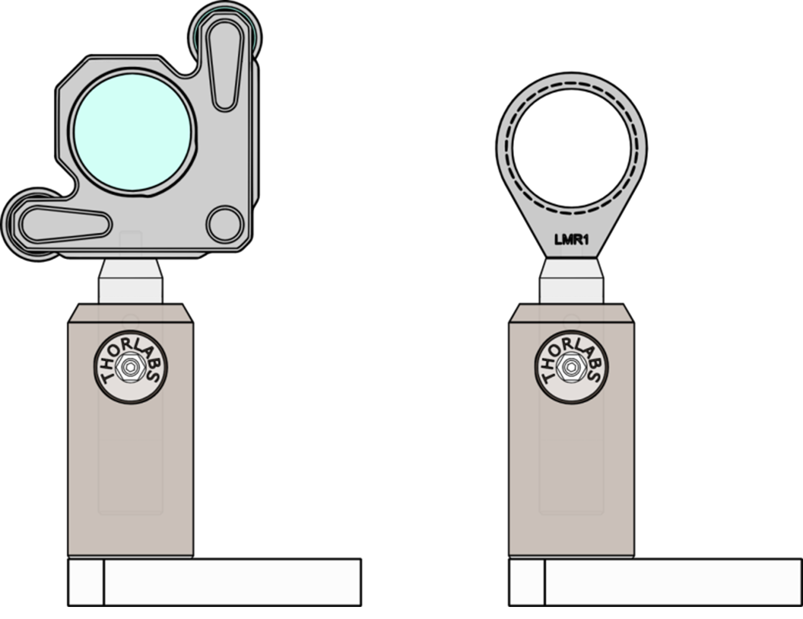

# Where We Are in the Sequence

**Week 1 of 4: Foundations**

This week you build the foundational skills for the entire Gaussian Beams sequence: optical alignment, photodetector operation, and beam width measurement. The calibration data and measurement techniques you develop this week will be used directly in Weeks 2-4.

**This week:** Align optics → Calibrate photodetector → Measure beam width

**Next week:** Learn data acquisition → Characterize noise → Choose optimal gain setting

# Learning Goals

After completing this week's lab, you will be able to:

1. Mount and align optical components (mirrors, lenses) using standard optomechanical hardware.
2. Walk a laser beam to achieve parallel propagation using two mirrors.
3. Explain how a photodiode converts photons to current via the photoelectric effect.
4. Calculate expected photodetector output voltage given incident power, responsivity, and gain setting.
5. Calibrate a photodetector's offset and gain and compare to manufacturer specifications.
6. Estimate measurement uncertainty using statistical sampling and explain why repeated measurements improve precision.
7. Set up a knife-edge measurement and derive the theoretical model (error function).
8. *(If time permits)* Apply a curve fit to test data to verify your analysis code is ready for real measurements.

# Overview of Your Work

This week you'll build the foundation for the entire lab sequence. Your work centers on three activities:

**1. Build and align your optical setup.** You'll mount a laser and mirrors, then use the "walking the beam" technique to achieve parallel propagation. Document your setup with a diagram—you'll refer back to this in later weeks.

**2. Understand and calibrate your photodetector.** Before you can trust voltage readings, you need to know how the detector behaves. You'll measure offset voltages at each gain setting and verify that gain ratios match the datasheet. This calibration enables you to combine measurements taken at different gain settings.

**3. Characterize measurement uncertainty.** You'll observe voltage fluctuations, identify their character (random noise vs. drift), and make decisions about your measurement strategy for beam profiling.

**If time permits:** Begin knife-edge beam width measurements. If not, you'll complete this in Week 3.

*See the detailed deliverables checklist at the end of this guide.*

# Python Preparation

This lab sequence uses Python for data acquisition, analysis, and visualization. The following skills will be introduced as you progress through the weeks:

| Week | Python Skills | Resources |
|------|---------------|-----------|
| Week 1 | NumPy basics, Matplotlib plotting, file I/O | [Data Analysis](/PHYS-4430/python-analysis) |
| Week 2 | Curve fitting with SciPy, NI-DAQmx | [Data Analysis](/PHYS-4430/python-analysis), [NI-DAQmx](/PHYS-4430/python-nidaqmx) |
| Week 3 | Error propagation, motor control | [Data Analysis](/PHYS-4430/python-analysis), [Thorlabs Motors](/PHYS-4430/python-thorlabs) |
| Week 4 | Integrated automation | All above |

**Before Week 2**, ensure you are comfortable with:
- NumPy array operations
- Basic plotting with Matplotlib
- Loading data with `np.loadtxt()`

If you need to review these skills, see the [Python Resources](/PHYS-4430/python-resources) page.

# Lab Notebook

Your lab notebook will play an important role in this course. You will use your notebook for keeping records of many things including:

- Answering prelab questions from the lab guides
- Answering in-lab question from the lab guides
- Recording data
- Including plots of data
- Analysis and results
- Diagrams and pictures
- Procedures of experiments that you design

The lab notebook will be an important part of your grade because learning to keep a good lab notebook is an important part of your professional development. 

# Definitions

**Optic** – Any optical component that manipulates the light in some way. Examples include lenses, mirrors, polarizing filters, beam splitters, etc.

**Optomechanics** – This category includes optics mounts and the components to align them. Examples in the lab include post, post holders, bases, lens mounts, adjustable mirror mounts, rotation mounts, and translation stages.

# Setting up the Laser and Mounting Optics

Your group should find an empty optical breadboard workstation in one of the five color coded optics bays in G-214. Spend some time to explore the space and familiarize yourself with the components. The shelf above the breadboard should have:

- An oscilloscope
- A waveform generator
- Triple output DC Power Supply
- Set of ball drivers
- Optics caddy to hold optics already mounted on 0.5" posts
- Set of 1/4-20 and 8-32 screws, setscrews, washers, and nuts

## Cleaning and handling of optical components

It's very important that you **do not handle optical components** (lenses, mirrors, polarizers, wave plates, beam splitters, etc.) **with your bare hands**. The oils on your skin can damage the optics and degrade the light in your experiment. Always handle these components while using **latex/nitrile gloves or finger cots**, which can be found on the top of the tool cabinets in your optics bay, or on top of the black drawer cabinets in the main lab. This [technical note](https://www.newport.com/n/how-to-clean-optics) from Newport discusses how to go about cleaning dirty optics, and is also demonstrated in [this video](https://www.youtube.com/watch?v=9Pq4SeNmFYw). For a more in-depth treatment on cleaning optics, we have a copy of ["The Proper Care of Optics: Cleaning, Handling, Storage, and Shipping" by Robert Schalck](https://spie.org/Publications/Book/2518746?SSO=1) for reference in the lab (it should be located on top of the black tool cabinets in the main lab).

## Mounting your optomech: bases, post holders, and posts

The two videos linked below provide information and tips on how to use and mount components on the optical breadboards that we have in the lab. Please watch these before proceeding.

[Mounting Your Optomech: Bases, Post Holders, and Posts | Thorlabs Insights](https://www.youtube.com/watch?v=4xZmGyMsQNo)

[Tips for Bolting Post Holders to Optical Tables, Bases, and Breadboards | Thorlabs Insights](https://www.youtube.com/watch?v=HyUXsH1zuIk)

Now, we will begin assembling the components.

1.  Get a laser and power supply from the "He-Ne Laser" drawer in the colored drawer cabinet found in your chosen or assigned optics bay. You'll also need two sets of 3D-printed laser tube mounts which you can find in the same drawer (see Figure @fig:tube-mount). The bottom mount first gets mounted to an optical post and then the top of the mount can be assembled with ¼-20 socket head cap screw and nut. After both sets of tube mounts are attached to the laser, insert the optical posts into post holders and attach the assembly to the optical table. We recommend placing the laser towards the rear of the optical table (under the shelf), oriented so the beam travels along the length of the table (parallel to the shelf). This layout leaves the front of the table clear for mounting the photodetector and translation stage you'll add later.
2. Each person in your group is responsible for assembling a mirror as shown in Figure @fig:mount-assembley. In the end, you will need at least 2 mirrors to complete the next task. **Remember to wear latex/nitrile gloves or finger cots while handling optical components.** Mount one mirror at the far end of the table (opposite the laser) and the second closer to you, so that the laser beam propagates across the table and gives you plenty of space to mount additional components.

*As you are mounting the optics, choose the heights so that the laser hits the center of each optic and the beam is parallel to the table.*

{#fig:tube-mount width="15cm"}

## Walking a beam {#sec:walkingbeam}

Next, you will align your laser such that beam is aligned parallel to the table. You will do this by using two mirrors and a technique that is called "walking a beam". [This video](https://www.youtube.com/watch?v=qzxILY6nOmA&t=249s) provides an overview on how to do so. The most relevant information for our lab starts at 4:09 (which the above link should take you to). Also, we have 3D printed beam alignment tools that are used in place of the iris in the video (these can be found in the colored drawer cabinet in your optics bay).

1. Mount two 3D printed beam alignment discs onto the optical table at the same height above the table. 
2. Use only two mirrors to get the beam to pass through the center of each disc. Having two mirrors allows you to independently adjust the angle and position of your beam.
3. Draw a diagram in your lab notebook of the configuration of your laser, mirrors, and alignment discs.

{#fig:mount-assembley width="15cm"}

# Modeling Characteristics of the Photodetector

The goal of this part of the lab is to understand a lot about the specifications given on the datasheet for the Thorlabs [PDA36A](../resources/lab-guides/gaussian-laser-beams/PDA36A-Manual.pdf) (or [PDA36A2](../resources/lab-guides/gaussian-laser-beams/PDA36A2-Manual.pdf)) Switchable Gain Amplified Photodetectors (we have both in the lab, so check the model number to know which one you are using). It is important to realize that data sheets (also called spec sheets or specification sheets) provide a model for the realistic behavior of the device. This model can be tested and improved, a process more commonly called "calibration." Note that there are **two** power switches, one on the power supply and one on the photodetector. The photodetector will respond to light with the power off but it won't work well and changing the gain will have little effect.

## Basic function of the amplified photodetector

1. Spend a few minutes (no more than 10) to write an explanation using words and diagrams to explain the physical mechanism for how the photodetector converts light into voltage. You may use the manufacturer’s specifications sheet (linked to in the section above), trustworthy online resources, a book, etc.
2. Use the data sheet to estimate the conversion of watts of light into amps of current for Helium-Neon red wavelength (632.8 nm) and for the frequency doubled Nd:YAG laser (Green laser pointer wavelength, 532 nm).
   1. How would you convert “amps per watt” into “electrons per photon”? 
   2. What is the electron/photon conversion efficiency for the red HeNe laser and green doubled Nd:YAG lasers?
   3. Is this number less than, equal to, or greater than one? What does this number tell you about how the photodiode works?


## Calibrating the photodetector offset and gain

Calibrating the photodetector is essential when working with multiple gain settings. Imagine you're measuring beam width later today (or in Week 4's automated measurements): at one position the signal saturates at 40 dB gain, but gives good readings at 30 dB. How would you combine these measurements onto a single scale? That's what calibration enables—it lets you stitch data from different gain settings together accurately.

1. The photodetector gain is specified in **decibels (dB)**, a logarithmic scale commonly used in electronics. Here's how it works:

   **The definition:** For voltage gain,
   $$dB = 20 \times \log_{10}\left(\frac{V_{out}}{V_{in}}\right)$$

   **What does log₁₀ mean?** The function $\log_{10}(x)$ asks: "10 raised to what power equals $x$?" For example:
   - $\log_{10}(10) = 1$ because $10^1 = 10$
   - $\log_{10}(100) = 2$ because $10^2 = 100$
   - $\log_{10}(1000) = 3$ because $10^3 = 1000$

   <br>

   **Converting dB to linear gain:** To find the actual gain from a dB value, invert the formula:
   $$\text{voltage gain} = 10^{dB/20}$$

   For example, 20 dB corresponds to $10^{20/20} = 10^1 = 10\times$ gain.

   **Important: What "0 dB" means on the PDA36A.** On this photodetector, "0 dB" does *not* mean "no amplification." The 0 dB setting has a transimpedance gain of 1.51 × 10³ V/A—this is the baseline. The dB labels indicate gain *relative to this baseline*: the 20 dB setting has 10× more gain than 0 dB, the 40 dB setting has 100× more, and so on.

   **Build your intuition:** Predict the linear gain for 40 dB before moving the slider below, then check your answer. Try a few values until the conversion feels natural.

<div id="db-gain-interactive" style="background: #f8f9fa; border: 1px solid #dee2e6; border-radius: 8px; padding: 20px; margin: 20px auto; font-family: -apple-system, BlinkMacSystemFont, 'Segoe UI', Roboto, sans-serif; max-width: 400px;">
<div style="margin-bottom: 15px;">
<label for="db-slider" style="font-weight: bold; display: block; margin-bottom: 8px;">Gain Setting: <span id="db-value">20</span> dB</label>
<input type="range" id="db-slider" min="0" max="70" value="20" step="10" style="width: 100%; cursor: pointer;">
<div style="display: flex; justify-content: space-between; font-size: 12px; color: #666; margin-top: 4px;">
<span>0 dB</span>
<span>70 dB</span>
</div>
</div>
<div style="background: #e7f3ff; padding: 15px; border-radius: 6px; text-align: center; margin-bottom: 12px;">
<div style="font-size: 14px; color: #666; margin-bottom: 5px;">Voltage Gain</div>
<div id="voltage-gain" style="font-size: 28px; font-weight: bold; color: #0066cc;">10×</div>
</div>
<div style="background: #fff; padding: 10px; border-radius: 6px; border: 1px solid #ddd; font-size: 13px;">
<div id="calculation" style="color: #666; font-family: monospace;">20 dB → 10^(20/20) = 10×</div>
</div>
</div>

<script>
(function() {
    var slider = document.getElementById('db-slider');
    var dbValue = document.getElementById('db-value');
    var voltageGain = document.getElementById('voltage-gain');
    var calculation = document.getElementById('calculation');
    function formatGain(value) {
        if (value >= 1000) return Math.round(value).toLocaleString() + '×';
        if (value >= 100) return Math.round(value) + '×';
        if (value >= 10) return value.toFixed(1) + '×';
        return value.toFixed(2) + '×';
    }
    function updateDisplay() {
        var db = parseFloat(slider.value);
        var vGain = Math.pow(10, db / 20);
        dbValue.textContent = db;
        voltageGain.textContent = formatGain(vGain);
        var vStr = vGain >= 100 ? Math.round(vGain) : vGain.toFixed(1);
        calculation.textContent = db + ' dB → 10^(' + db + '/20) = ' + vStr + '×';
    }
    slider.addEventListener('input', updateDisplay);
    updateDisplay();
})();
</script>

   **Think about it:** The dB scale can also be defined for power: $dB = 10 \times \log_{10}(P_{out}/P_{in})$. Notice the factor is 10 instead of 20. Why does this make sense? *(Hint: How is power related to voltage in a resistive circuit?)*

   *You might not get this immediately—that's fine. Discuss with your partner or revisit after completing the calibration.*

2. Calibrating the offset voltage.

   The offset voltage is the photodetector's output when no light is incident on the sensor. You'll need to subtract this from your measurements to get accurate readings.

   1. **Measure the offset:** Block all light from reaching the detector and record the output voltage at each gain setting (0, 10, 20, ... 70 dB). How does the offset change with gain?

   2. **Compare to datasheet:** The datasheet specifies typical and maximum offset values for each gain setting. Are your measured values within the specified range?

   3. **Eliminating stray light:** What steps did you take to ensure no light reached the detector? How confident are you that stray light isn't affecting your offset measurements?
3. Calibrating the gain.

   1. **Absolute vs. relative gain:** The datasheet specifies gain in V/A (volts out per amp of photocurrent in). Can you measure this absolute gain with the equipment available, or can you only measure how gain *changes* between settings (relative gain)? Explain your reasoning. *(Note: This lab only requires relative gain.)*

   2. **Measure relative gain:** Choose a light level where the detector doesn't saturate at your highest gain setting—you may need to partially block the beam. Then measure output voltage at several gain settings (e.g., 0, 10, 20, 30, 40 dB) without changing anything else. Calculate the gain ratio between adjacent settings.
      - If you need to block the beam partway through your measurements, how can you account for this change? *(Hint: repeat one gain setting before and after blocking.)*
      - What systematic errors could affect your measurements?

   3. **Compare to datasheet:** The datasheet lists expected gain ratios between settings (each 10 dB step should be ~3.16×, each 20 dB step should be ~10×). How do your measured ratios compare? Are any discrepancies within reasonable experimental uncertainty?

   4. **Estimate laser power:** Using the datasheet values for responsivity (at 632.8 nm) and the 0 dB transimpedance gain, estimate your laser's output power from your measured voltage. Does this agree with the power labeled on the laser? If not, what might explain the difference?

   5. **Thinking further:** If you had access to a calibrated optical power meter, how would you use it to measure the *absolute* transimpedance gain at each setting?

## Follow up

**Write the conversion equations:** Express the relationship between incident optical power $P_{in}$ and photodetector output voltage $V$. Your equations should include:

- Responsivity $R(\lambda)$ in A/W
- Transimpedance gain $G$ in V/A (or the dB setting)
- Offset voltage $V_{offset}$

Write both directions: (1) $P_{in} \rightarrow V$ and (2) $V \rightarrow P_{in}$.

## Reflection: Using Your Calibration

You'll use this photodetector throughout the lab sequence—for beam width measurements today and for automated profiling in Week 4. Before moving on, consider how you will use your calibration results:

1. **Datasheet vs. measured values:** Based on your calibration, would you trust the datasheet gain values, or would you use your measured values? Under what conditions might the datasheet values be inadequate?

2. **Handling discrepancies:** If your measured offset voltage differed significantly from the datasheet (say, by more than 50%), what would you do before proceeding?
   - (a) Repeat the measurement
   - (b) Accept the datasheet value
   - (c) Investigate the cause of the discrepancy
   - (d) Use your measured value and note the discrepancy

   There is no single correct answer—justify your choice in 2-3 sentences.

3. **Choosing a gain setting:** For most measurements, you'll use this photodetector at a single gain setting. Which setting would you tentatively choose based on your calibration? (You will refine this choice in Week 2 after characterizing noise.) 

# Understanding Measurement Uncertainty

You've just calibrated your photodetector and recorded voltage values. But how confident should you be in those numbers? You've encountered measurement uncertainty in previous courses—this section gives you hands-on practice applying those concepts to real-time optical measurements, a skill you'll use throughout this lab sequence.

**Make sure that your laser has been turned on for at least 5 minutes so it has had the opportunity to warm up.**

## Characterizing Your Signal

Connect your photodetector to the oscilloscope and observe the voltage signal from the laser.

**1. Observe the temporal structure**

Watch the signal for 30 seconds or more. The key question isn't just "how much does it fluctuate?" but "*what kind* of fluctuations do you see?"

- **Random noise:** Rapid, unpredictable fluctuations with no pattern
- **Drift:** Slow, systematic changes in one direction
- **Periodic signals:** Regular oscillations (often from 60 Hz interference or optical feedback)

Record what you observe in your notebook. Do you see primarily random noise, drift, periodic components, or some combination?

**2. Quantify the fluctuations**

Take 10 voltage readings and calculate:

- Mean: $\overline{V} = \frac{1}{N}\sum V_i$
- Standard deviation: $\sigma_V = \sqrt{\frac{1}{N-1}\sum(V_i - \overline{V})^2}$
- Standard deviation of the mean: $\sigma_{\overline{V}} = \sigma_V/\sqrt{N}$

**3. Make experimental decisions**

Based on your observations, answer these questions in your notebook:

1. **Does σ capture your uncertainty?** If you observed drift, the standard deviation of random samples may not accurately represent your measurement uncertainty. Why not?

2. **How many measurements do you need?** Calculate how many measurements would give you 1% relative uncertainty in the mean (i.e., $\sigma_{\overline{V}}/\overline{V} = 0.01$). Is this practical for your beam width measurements?

3. **What's your measurement strategy?** For the knife-edge scan, will you record single readings at each position or average multiple readings? What's the trade-off between speed and precision?

## Connecting to Your Experiment

These decisions matter for your beam width measurement. If drift is present during a knife-edge scan, it could systematically bias your fitted beam width. If you're averaging at each position, you're trading measurement time for precision.

In Week 2, you'll characterize noise more systematically and learn to make these trade-offs quantitatively.

# Measuring the Beam Width

The goal of this section is to develop a measurement technique and analysis scheme to measure the width of a laser beam. The scheme will let you measure the width in one dimension. The technique is most useful for beams that have an approximately Gaussian intensity profile. You will improve and refine this technique in the upcoming weeks of this lab.

**Time management note:** This section has multiple parts with different priorities:

1. **Essential (must complete):** Derive the error function model and answer the required questions in "Before you take data." This theoretical understanding is critical preparation for Week 2.

2. **Important (complete if time allows):** Build the setup and take data. If you don't finish in Week 1, you will complete this in Week 3.

3. **Optional (good practice):** Try the curve fitting practice exercise with test data. This prepares you for Week 2, but fitting is covered in detail in Week 2's prelab.

The basic scheme involves measuring the power in the laser beam as the beam is gradually blocked by a knife edge (razor blade) using a setup similar to Figure @fig:knife-assembley.

{#fig:knife-assembley width="15cm"}

1. Suppose a laser beam has a Gaussian intensity profile $I(x,y) = I_{max}e^{-2(x^2+y^2)/w^2}$, and is incident upon a photodiode. What is the expression for the power hitting the photodiode when a portion of the beam is blocked by a razor blade?
   1. Draw a diagram showing the beam and the razor.
   2. Using the above expression for $I(x,y)$, write the mathematical expression for the power incident on the photodiode as a function of razor position. Note, to address this question, you will need to become familiar with the Error Function, $erf(x)$. What assumptions, if any, did you need to make in evaluating the integral? Hint: if you are moving in the $x$ direction, what is going on in the $y$ direction?

## Before you take data: prepare for analysis {#sec:analysis}

*Note: Nonlinear least squares fitting is covered in detail in Week 2's prelab. This section prepares you to understand what you'll be fitting.*

**Required (answer in your notebook):**

1. What is the functional form for your fit function? (You derived this from the Gaussian integral above.)
2. Is it a linear or nonlinear fit function? Why?
3. What are the fit parameters? Why do you need this many?
4. How do the fit parameters relate to the beam width?

**Optional practice (if time permits):**

If you want to get a head start on curve fitting, you can practice with test data. See the [Python Resources](/PHYS-4430/python-resources) page for a guide to curve fitting with `scipy.optimize.curve_fit`. Week 2's prelab covers this in detail, so don't worry if you don't complete this now.

5. Download [this data set](../resources/lab-guides/gaussian-laser-beams/Test_Profile_Data.csv).
   1. Make a plot of the data.
   2. Make a fit and plot it with the data.
   3. Check that the fit looks good and you get a beam width of $w=4.52 \times 10^{-4}\ m$. If you get a different value, check with your instructor to understand the problem. What is the uncertainty on your measurement?

## Build your setup for measuring the beam width of your laser

1. Draw a detailed schematic of the setup (from the laser all the way to the photodetector).
2. After assembling your experiment, but prior to taking a lot of data, how can you quickly determine if the measurement is working?
3. Is it preferable to use a digital multimeter or oscilloscope? Why?
4. Use the measurement scheme to take data of incident power on the photodiode vs. position of the razor. Pay attention to the units of the translation stage. Pick a position where your beam has a measurable width and measure it. Justify your choice. 

## Analysis of the random uncertainty sources

1. What are possible sources of random uncertainty in the photodetector voltage?
2. How would you estimate the uncertainty in the photodetector voltage measurement?
3. What is the largest source of uncertainty? Why?

## Analysis of the real data

1. Use the analysis procedures verified in section @sec:analysis to find the beam width for your data. Be sure to include the uncertainty.
2. Plot your fit together with your data to make sure it is good.

# Preparation for Week 2

Before Week 2, complete the following to ensure you're ready for the curve fitting and data acquisition work ahead. This is not busywork—Week 2's prelab assumes you can confidently work with NumPy arrays and Matplotlib. Use this exercise to honestly assess your readiness and identify gaps.

## Step 1: Predict Before You Run

**Download** the test data: [Test_Profile_Data.csv](../resources/lab-guides/gaussian-laser-beams/Test_Profile_Data.csv)

Open the file in a text editor or spreadsheet to see its structure. Then, **before running any code**, answer these questions in your notebook:

1. The file has two columns (position and voltage) and about 30 rows of data. After running `data = np.loadtxt('Test_Profile_Data.csv', delimiter=',', skiprows=1)`, what will `data.shape` return?

2. The code below uses `data[:, 0]` and `data[:, 1]`. In plain English, what does the `:` mean? What does the `0` mean?

3. The plot command uses `position * 1000`. What unit conversion is this performing, and why might it be useful?

## Step 2: Run and Verify

Now run the code and check your predictions:

```python
import numpy as np
import matplotlib.pyplot as plt

# Load the data
data = np.loadtxt('Test_Profile_Data.csv', delimiter=',', skiprows=1)
print(f"Data shape: {data.shape}")  # Check your prediction!

position = data[:, 0]  # meters
voltage = data[:, 1]   # volts

# Create a plot
plt.figure(figsize=(8, 5))
plt.plot(position * 1000, voltage, 'bo', markersize=4)
plt.xlabel('Position (mm)')
plt.ylabel('Voltage (V)')
plt.title('Beam Profile Test Data')
plt.grid(True, alpha=0.3)
plt.savefig('week1_python_check.png', dpi=150)
plt.show()
```

**In your notebook:** Were your predictions correct? If not, make sure you understand why before proceeding.

## Step 3: Modify to Demonstrate Understanding

Running code proves you can execute it. *Modifying* code proves you understand it. Make these changes:

1. **Change units:** Display position in micrometers (μm) instead of millimeters. Update both the data conversion and the axis label.

2. **Change appearance:** Change the markers from blue circles to red squares. (Hint: look up Matplotlib marker styles, or ask an AI assistant—the skill is knowing *what* to ask.)

3. **Add information:** Add a horizontal dashed line at the mean voltage value. (Hint: `plt.axhline()`)

Save your modified plot as `week1_python_modified.png`.

## Step 4: Honest Self-Assessment

For each skill below, rate yourself honestly. This is not graded—it's for *you* to identify gaps before Week 2.

| Skill | A: Confident | B: Could figure out | C: Would struggle |
|-------|--------------|---------------------|-------------------|
| Extract a specific column from a 2D NumPy array | | | |
| Create a plot with title and labeled axes | | | |
| Read a Python error message and identify which line caused it | | | |
| Modify code to change units or appearance | | | |
| Save a figure to a file | | | |

**If you rated yourself "C" on any skill:** Before Week 2, work through the relevant sections of [Python Resources](/PHYS-4430/python-resources). Budget 1-2 hours. It's much better to address gaps now than to struggle during the Week 2 prelab.

## Why This Matters for Week 2

In Week 2, you'll encounter code like this:

```python
def beam_profile(x, amplitude, center, width, offset):
    return amplitude * erf(np.sqrt(2) * (x - center) / width) + offset

popt, pcov = curve_fit(beam_profile, x_data, y_data, p0=[1.4, 0.01, 0.0005, 1.4])
print(f"Beam width: {popt[2]:.4f} m")
```

You don't need to understand `curve_fit` yet—that's Week 2's content. But you *do* need to understand:
- What `x_data` and `y_data` are (arrays you loaded from a file)
- How to extract `popt[2]` (the third element) from the result
- How to plot the fit curve over your data points

If the exercises above felt confusing, address that gap now. Week 2 builds directly on these skills, and struggling with Python basics will distract you from learning the physics.

# Deliverables and Assessment

Your lab notebook should include the following for this week:

## In-Lab Documentation (recorded during lab)

1. **Optical setup diagram** showing laser, mirrors, alignment discs, and photodetector positions
2. **Photodetector calibration data**: offset voltage vs. gain setting, relative gain measurements
3. **Uncertainty mini-lesson**: 10 voltage measurements, calculated statistics (mean, σ, σ_mean), and answers to the reflection questions
4. **Knife-edge measurement data**: position vs. voltage (if completed)

## Analysis and Questions (can be completed after lab)

1. **Photodetector physics explanation**: diagram and written explanation of how the photodetector converts light to voltage
2. **Calibration comparison**: quantitative comparison of your measurements to datasheet values
3. **Beam width measurement** (if completed): fit plot, extracted beam width with uncertainty

## Preparation for Week 2 (required before next lab)

1. **Prediction questions** (Step 1): Written answers to the three prediction questions about `data.shape`, array indexing, and unit conversion

2. **Prediction verification** (Step 2): Note whether your predictions were correct, and if not, what you learned

3. **Modified plot** (Step 3): Your customized plot showing position in μm, red square markers, and mean voltage line (`week1_python_modified.png`)

4. **Self-assessment** (Step 4): Completed skill rating table with honest A/B/C ratings

5. **Reflection questions** (answer in your notebook):

   a. Your photodetector offset voltage differs from the datasheet by 15%. What would you do before using this detector for precision measurements?
      - Options: (a) Repeat the measurement, (b) Accept the datasheet value, (c) Investigate the cause, (d) Use your measured value
      - Justify your choice in 2-3 sentences.

   b. You took 10 measurements and calculated both σ (standard deviation) and σ_mean (standard deviation of the mean). Which would you report as the uncertainty in your voltage measurement? Why? 
