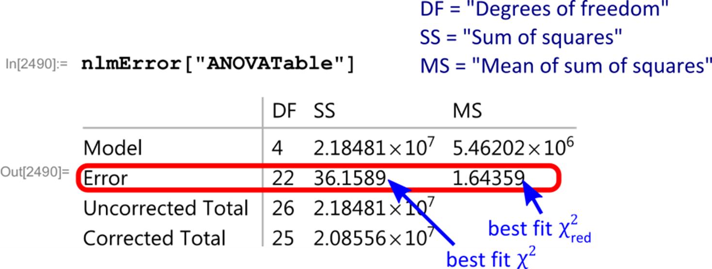

# Overview

The second week of the Gaussian Beams lab is intended to introduce you to LabVIEW and guide you though interfacing LabVIEW with the instrumentation and data acquisition systems that we use in this course. 

This week's lab is divided into two parts. In part 1, you are guided through the LabVIEW Environment and will get to see many useful features that can be realized throughout this course. In part 2, you begin to see the power of using LabVIEW to interface with your lab experiment by acquiring data through a standard National Instrument data acquisition device, [NI USB-6009](http://sine.ni.com/nips/cds/view/p/lang/en/nid/201987). This multifunction USB powered device has 4 (differential) analog inputs (14-bit, 48 kS/s), 2 analog outputs (12-bit, 150 S/s), 12 digital I/O channels, and a 32-bit counter.

## What is LabVIEW?

LabVIEW is a graphical programing language designed for scientists and engineers for experimental control and data acquisition. Many table-top research labs use LabVIEW to communicate with their commercial equipment (e.g., frequency synthesizers, oscilloscopes) and for acquiring data. It has advantages over basic languages such as C++. The graphical environment is intuitive and easy to learn. Also, since it is so widely used, almost all commercial test and measurement equipment comes with LabVIEW drivers and example programs.

You can choose to use LabVIEW on the lab laptops. You can also install LabVIEW on your own laptop. The student edition of LabVIEW can be obtained through [CU Boulder's OIT](http://www.colorado.edu/oit/software-hardware/site-licenses/labview). In addition, you will also eventually need to download the [NI-DAQmx](https://www.ni.com/en-us/support/downloads/drivers/download.ni-daq-mx.html) data acquisition drivers (if installing on your own laptop) .

## Learning Goals

After completing the first part of this week's lab, you will be:

1. …able to create simple LabVIEW Virtual Instruments (VIs) that include controls, indicators, simple math, arrays, and loops.
2. …able to customize the user interface of a VI.
3. …able to use the Error List created by LabVIEW to find and correct coding errors.
4. … able to use various types of data types and convert between them.
5. …able to use context help to determine the function of a subVI or a function and the inputs and outputs.

After completing the second part of this week's lab you will be:

1. …able connect an USB DAQ-Device to a computer and confirm the analog inputs are working correctly.
2. …able to configure the DAQ Assistant to take a series of analog voltage measurements.
3. …able to generate an analog voltage signal using the DAQ-Device.
4. …able to filter and perform spectral measurements on an acquired signal using built-in Vis.
5. …able to use text-based programming to more easily code simply mathematical formulas.
6. …able to save acquired data to a file.
7. …able to use charts and graph indicators for the appropriate application.

# Prelab

This week's prelab will be a continuation of the measurement uncertainty and error analysis exploration that was covered in last week's lab. This is a “user’s guide” to least-squares fitting and to determining the goodness of your fits. It doesn’t derive many results. There are good textbooks listed in the references. At the end of the prelab you will be able to:

1. Explain why we minimize the sum of squares to get the best fit.
2. Carry out a least-squares minimization graphically.
3. Plot residuals to visually inspect the goodness of a fit.
4. Be able to interpret the uncertainty in fit parameters that Mathematica’s fit routines output.
5. Be able to compute $\chi^2$ for a fit and use it to determine if a fit is “good”.

## Useful readings

1. Taylor, J. R. (1997). *An Introduction to Error Analysis: The Study of Uncertainties in Physical Measurements* (p. 327). University Science Books. This is the standard undergraduate text for measurement and uncertainty.
2. Bevington, P. R., & Robinson, K. D. (2003). *Data Reduction and Error Analysis for the Physical Sciences* Third Edition (3rd ed.). New York: McGraw-Hill. Great for advanced undergrad error analysis. Professional physicists use it too.

## Why do we minimize the sum of squares?

**Question:** Why do we call it “least-squares” fitting? 

**Answer:** Because the best fit is determined by minimizing the weighted sum of squares of the deviation between the data and the fit. Properly speaking this “sum of squares” is called “chi-squared” and is given by 

$$\chi^2 = {\displaystyle \sum_{i=1}^{N}}\frac{1}{\sigma_i^2}(y_i-y(x_i,a,b,c, \ ... \ ))^2\text{,}$$ {#eq:1}

where there are where $N$ data points, $(x_i,y_i )$, and the fit function is given by $y(x_i,a,b,c, \ … \ )$ where $a, b,$ etc. are the fit parameters.

**Question:** What assumptions are made for the method to be valid?

**Answer:** The two assumptions are:

1. **Gaussian distributed.** The random fluctuations in each data point $y_i$ are Gaussian distributed with standard deviation $\sigma_i$.
2. **Uncorrelated.** The random fluctuations in any one data point are uncorrelated with those in another data point.

**Question:** Why does minimizing the sum of squares give us the best fit?

**Answer:** Given the two above assumptions, the fit that minimizes the sum of squares is the ***most likely*** function to produce the observed data. This can be proven using a little calculus and probability. A more detailed explanation is found in Taylor’s *Introduction to Error Analysis* Sec. 5.5 “Justification of the Mean as Best Estimate” or Bevington and Robinson’s *Data Reduction* Sec. 4.1 “Method of Least-Squares".

## Minimizing $\chi^2$ graphically {#sec:min-graph}

*You will rarely minimize $\chi^2$ graphically in a lab. However, this exercise will help you better understand what the fitting routines in Mathematica actually do to find the best fit. [This video](https://www.youtube.com/watch?v=KolZZm8If9Q) can be reviewed if you need a reminder on how to fit data in Mathematica.*

1. Import and plot [this data set](../resources/lab-guides/gaussian-laser-beams/profile_data_without_errors.csv). It was generated by inserting a razor blade into path of a laser beam and measuring the photodetector voltage of the laser light. The $x$ column is the micrometer (razor) position in meters and the $y$ column is the photodetector voltage in volts.

	`Import`
	`["profile_data_without_errors",”CSV”]`

2. Define the same fit function as:

   $$y(x,a,b,c,w) = a \ Erf\left(\frac{\sqrt{2}}{w}(x-b)\right)+c$$

3. Reduce the fit to two free parameters. This step is only necessary because it is hard to visualize more than 3 dimensions. Assume $a_{fit}=(V_{max}-V_{min})/2 = 1.4375$ and $c_{fit} =(V_{max}+V_{min})/2 = 1.45195$. These were determined by averaging the first 6 data points to get $V_{min}$ and the last 5 to get $V_{max}$. 

4. Use Equation @eq:1 to write an expression for $\chi^2$ in terms of your $w$ and $c$ parameters, and the $x$ (position) data and $y$ (voltage) data. Since you don’t have any estimate for the uncertainties $\sigma_i$, do what Mathematica does and assume they are all unity so $\sigma_i=1$.

5. Make a contour plot of $\chi^2(w,b)$ and tweak the plot range until you see the minimum. Just like with `NonlinearModelFit`, it will help to have a good initial guess for your fit parameters. You can iteratively improve the plot range of your plot to zoom in on the parameter values that minimize $\chi^2$. You should get a plot kind of like Figure @fig:contour.

{#fig:contour width="15cm"}

6. Graphically determine the best fit parameters to 3 significant digits.
7. Compare with the best fit result from `NonlinearModelFit` (allow all 4 parameters to vary). Do the fits agree for those three digits of precision?

## Uncertainty in the fit parameters

**Question:** Where does the uncertainty in the fit parameters come from?

**Answer:** The optimal fit parameters depend on the data points $(x_i,y_i)$. The uncertainty, $\sigma_i$, in the $y_i$ means there is a propagated uncertainty in the calculation of the fit parameters. The error propagation calculation is explained in detail in the references, especially Bevington and Robinson.

**Question:** How does Mathematica calculate the uncertainty in the fit parameters when no error estimate for the $\sigma_i$ is provided?

**Answer:** Mathematica (and other programs) estimate the uncertainty in the data $\sigma_y^2$ using the "residuals" of the best fit:

$$\sigma_y^2 = \frac{1}{N-n}{\displaystyle \sum_{i=1}^{N}}(y_i-y(x_i,a_0,b_0,c_0, \ ... \ ))^2\text{,}\quad\quad$$ {#eq:2}

where there are $N$ data points $y_i$ and the best fit value at each point is given by $y$, which depends on $x_i$ and the $n$ best fit parameters $a_0,b_0,c_0, \ ... \ $. It is very similar to how you would estimate the standard deviation of a repeated measurement, which for comparison’s sake is given by:

$$\sigma_y^2 = \frac{1}{N-n}{\displaystyle \sum_{i=1}^{N}}(y_i-\overline{y})^2\text{.}$$ {#eq:3}

## Estimating the uncertainty in the data

1. Use Equation @eq:2 and your best fit parameters to estimate $\sigma_y^2$, the random error of each data point given by your data.
2. Compare your result with Mathematica’s `NonlinearModelFit`, which can also output this estimate of the random error. If `nlm` is the `NonlinearModelFit` output, the estimate of $\sigma_y^2$ is given by `nlm[“EstimatedVariance”]`.
3. Do the estimates agree? Why or why not?

## Goodness of fit

This section covers two ways to analyze if a fit is good.

1. Plotting the residuals.
2. Doing a $\chi^2$ test.

### Plotting the fit residuals {#sec:plot-res}

The first step is to look at the residuals. The residuals, $r_i$, are defined as the difference between the data and the fit. 

$$r_i=y_i-y(x_i,a,b,c, \ ... \ )$$

1. Make a `ListPlot` of the residuals. If `nlm` is the `NonlinearModelFi`t output, the list of residuals is given by `nlm[“FitResiduals”]`.
2. Since we didn’t provide any estimates of the uncertainties, Mathematica assumed the uncertainty of every point is the same. Based on the plot of residuals, was this a good assumption?
3. Do the residuals look randomly scattered about zero or do you notice any systematic error sources?
4. Is the distribution of residuals scattered evenly around zero? Or is there a particular range of $x$ values where the residuals are larger than others?
5. What is the most likely source of the large uncertainty as the beam is cut near the center of the beam?

### "Chi by eye" - eyeballing the goodness of fit

**Question:** If I have a good fit, should every data point lie within an error bar?

**Answer:** No. Most should, but we wouldn’t expect every data point to lie within an error bar. If the uncertainty is Gaussian distributed with a standard deviation $\sigma_i$ for each data point, $y_i$, then we expect roughly 68% of the data points to lie within their error bar. This is because 68% of the probability in a Gaussian distribution lies within one standard deviation of the mean. 

### $\chi^2$ and $\chi_{red}^2$ for testing the "goodness" of fit

This section answers the question “What should $\chi^2$ be for a good fit?" 

Suppose the only uncertainty in the data is statistical (i.e., random) error, with a known standard deviation $\sigma_i$, then on average each term in the sum is

$$\frac{1}{\sigma_i^2}(y_i-y(x_i,a,b,c, \ ... \ ))^2 \approx 1\text{,}$$ {#eq:4}

and the full $\chi^2$ sum of squares is approximately

$$\chi^2 = {\displaystyle \sum_{i=1}^{N}}\frac{1}{\sigma_i^2}(y_i-y(x_i,a,b,c, \ ... \ ))^2\approx N-n\text{.}\quad\quad$$ {#eq:5}

So a good fit has

$$\chi_{red}^2 \equiv \frac{\chi^2}{N-n}\approx 1\text{.}$$ {#eq:6}

1. **Fact: To find the goodness of fit test, you must first estimate the uncertainties on the data points that you are fitting.** How would you explain the reason for this in your own words?

### Choosing a strategy to estimate the uncertainty

1. Considering your answers from Section @sec:plot-res (especially @sec:plot-res\.5), which method would give you the best estimate of the uncertainty for each data point, and why?

   - Eyeballing the fluctuations in each data point.

   - Taking $N$ measurements at each razor position and then going to the next position.

   - Taking the entire data set $N$ times.

### Weighted best fits in Mathematica

When you have estimated the uncertainty $\sigma_i$ of each data point $y_i$ you would like to use this information when fitting to correctly evaluate the $\chi^2$ expression in Equation @eq:1. The points with high uncertainty contribute less information when choosing the best fit parameters. If you have a list of uncertainties

`sigmalist = { sigma1, sigma2, sigma3, ...}`,

then the weights for the fit are:

`weightslist = 1/ sigmalist^2 = {1/ sigma1^2, 1/ sigma2^2, ...}`.

Add the `Weights->weightslist` option to the `LinearModelFit` or `NonlinearModelFit`. For example:

`NonlinearModelFit[data,fit[x,a,b,c],{a,b,c},x, Weights->weightslist]`

1. Import [this data set](../resources/lab-guides/gaussian-laser-beams/profile_data_with_errors.csv) for a beam width measurement with uncertainties. The first column is razor position in meters, the second column is photodetector output voltage, and the third column is the uncertainty on the photodetector output voltage.

	`Import`
	`["profile_data_with_errors.csv",,”CSV”]`

2. Do a weighted fit using the same fit function as in Section @sec:min-graph. Use the uncertainty estimates in the third column to calculate the weights.

3. Calculate $\chi^2$. You can obtain $\chi^2$ from the fit returned by Mathematica. Supposing the fit was called `nlmError`, use `nlmError[“ANOVATable”]`. For the curious, ANOVA stands for ANalysis Of VAriance.

{#fig:anova width="15cm"}

4. How close is the reduced chi-squared to 1?
5. **The “chi-squared test”.** This part helps us understand if the value of $\chi^2$ is statistically likely or not. The following graph gives the probability of exceeding a particular value of $\chi^2$ for $\nu=𝑁−𝑛=22$ degrees of freedom. It can be calculated using the Cumulative Density Function (CDF) for the chi-squared distribution. Use the graph to estimate the likelihood this value of $\chi^2$ occurred by chance.

{#fig:cdf width="15cm"}

### Why is it often bad to overestimate uncertainties?

1. Why can overestimating the uncertainty make your fit appear good (i.e., $\frac{\chi^2}{N-n}\approx 1$)?

Overestimating the uncertainties makes the fit seem good (according to a $\chi^2$ test), even when it might be obviously a bad fit. It is best to do the $\chi^2$ test using an honest estimate of your uncertainties. If the $\chi^2$ is larger than expected $(\chi^2>𝑁−𝑛)$, then you should consider both the possibility of systematic error sources and the quality of your estimates of the uncertainties. On the other hand, if the $\chi^2$ test is good $(\chi^2\approx 𝑁−𝑛)$, then it shows you have a good handle on the model of your system, and your sources of uncertainty. Finally, if $\chi^2\ll (𝑁−𝑛)$, this likely indicates overestimated uncertainties.

# LabVIEW Environment Introduction

*Check out the NI Apps YouTube channel playlist, [Getting Started with LabVIEW](https://www.youtube.com/playlist?list=PLB968815D7BB78F9C), for more helpful videos* 

Learn how to navigate LabVIEW and use the block diagram, front panel, and Functions and Controls palettes. Watch the LabVIEW Environment video: [Writing Your First LabVIEW Program](https://www.youtube.com/watch?v=ZHNlKyYzrPE&list=PLB968815D7BB78F9C&index=2).

### Create a VI that displays constants of different data types

1. Open up a new blank VI (virtual instrument).
2. Create a VI that has three types of data indicators (outputs) (i.e., string, Boolean (on/off), and numeric). 
3. Create constants of the appropriate data type for each indicator. Wire the terminals such that the indicators show the constant values when the program is run.

For additional information, you may want to review the [NI LabVIEW Environment: Detailed Explanation](http://www.ni.com/pdf/labview101/us/environment_explanation.pdf). 

## Graphical programming

Examine the basics of graphical programming and how to determine data flow and order of execution in the LabVIEW environment. Watch the Graphical Programming video: [Data Flow Programming Basics](https://www.youtube.com/watch?v=PqxStfwjQoQ&list=PLB968815D7BB78F9C&index=2).

### Create a VI that will display the energy of a photon when the user enters the wavelength

1. Create a control to be able to enter the wavelength of light.
2. Create an indicator to display the energy of the photon.
3. Wire appropriate math operators and constants to convert the entered wavelength to energy.
4. Run your program in “light bulb” mode to see the intermediate values appear on the block diagram.
5. Confirm the VI correctly calculates and displays the energy of a photon.

For additional information, you may want to review the [Graphical of Programming: Detailed Explanation](http://www.ni.com/pdf/labview101/us/gprogramming_explanation.pdf).

## Programming tools – using the tools palette

Discover how to use important tools in LabVIEW that can save you time. Watch the Programming Tools video: [Using the Tools Palette](https://www.youtube.com/watch?v=p-6w7x45Cs0&list=PLB968815D7BB78F9C&index=7).

###  Modify your photon energy VI

1. Change the labels on the control and indicator to “Wavelength (nm)” and “Energy (J)”.
2. Reposition the control and indicator on the front panel and increase their size.
3. Change the number of significant digits shown in the “Energy indicator” to three by right clicking on the indicator and choosing `Display Format`.
4. Bring up the `Tools Palette` and switch between “automatic tool selection” and “manual tool selection.”
   1. Do you like to use the automatic tool selection or tab to change tools?

For additional information, you may want to review the [Programming Tools: Detailed Explanation](http://www.ni.com/pdf/labview101/us/programming_explanation.pdf).

## Debugging and handling errors

Learn how to use key debugging and troubleshooting tools that optimize code. Watch the Debugging and Handling Errors video: [Using Debugging Tools in NI LabVIEW](https://www.youtube.com/watch?v=1Rx6AXhF31I&list=PLB968815D7BB78F9C&index=6).

### Correct errors in a previously created VI

1. Download the [Bad Photon VI](../resources/lab-guides/gaussian-laser-beams/Bad_photon.vi). Try to run the program.
3. Read the `Error List`.
4. Double click on an error to find the location in the program.
5. Fix all errors.

For additional information, you may want to review the [Debugging and Handling Errors: Detailed Explanation](http://www.ni.com/pdf/labview101/us/debugging_explanation.pdf).

## Data types and structures

Explore the different data types (e.g., integer, Boolean, string) and methods to organize and group data, controls, and indicators in LabVIEW. Watch the Data Types and Structures video: [LabVIEW Data Types](https://www.youtube.com/watch?v=dvShgNdY_GE&list=PLB968815D7BB78F9C&index=3).

### Change your photon energy VI to include arrays

1. Right click on the front panel to display the `Controls Palette`.
2. Expand the Palette by clicking on the double-down arrow.
3. Pin the `Modern Controls Palette` to the desktop.
4. Create an array control. (This creates an array with an unspecified data type.)
5. Drag your wavelength control into the array on the front panel. This sets the array data type to be the data type of the wavelength control (i.e., double-precision floating point).
6. Repeat the process to change the “Energy Indicator” from a single value to an array.
7. Go to the block diagram and fix any broken wires.
8. Run the VI and confirm correct operation.

### Change data types

1. Create a string indicator array.
2. In the block diagram, connect the wire entering the numeric indicator array to the string indicator array.
3. Notice the broken wire due to incompatible data types.
4. Insert a function to convert from numeric to string type data.
   1. Right click to display the `Function Palette`.
   2. Expand the Palette by clicking on the double-down arrow.
   3. Choose the `Programming->String->String/Numeric Conversion Palette`.
   4. Choose the function `Number to Exponential String`.
5. Wire the numeric data through the `Number to Exponential String` function to the string array.
6. Run the VI and confirm correct operation.

For additional information, you may want to review the [Data Types and Structures: Detailed Explanation](http://www.ni.com/pdf/labview101/us/datatypes_explanation.pdf).

## Loops and case structures

See how to loop code and conditionally execute code in LabVIEW using *For* Loops, *While* Loops, and *Case* structures. Watch the [Using Loops in LabVIEW](https://www.youtube.com/watch?v=hnx9WI2D9zU&list=PLB968815D7BB78F9C&index=10) and [Using LabView Case Structures](https://www.youtube.com/watch?v=cgS3u0nupfs&list=PLB968815D7BB78F9C&index=9) videos.

### Add a while loop to your VI to continuously loop until a stop button is pressed

**Goal:** Include a while loop around the code, so that the user can enter a new wavelength and not have to press run to get the updated result. 

1. Place a `While Loop` around your entire program in the block diagram.
2. Test your VI to confirm correct operation of the loop. 

### Change your VI to calculate the energy in units of either joules or eV using a case structure {#sec:photon}

**Goal:** Change your VI to calculate the energy in units of either Joules or eV using a case structure. Use the same Wavelength Control and Energy Indicator, but the numerical calculation to either Joules or eV will reside in a case structure. The case structure has two cases. In one case, place the code to convert to Joules and the other to convert to eV. A control (switch) on the front panel will determine which case is executed.

**Here are a few questions to help you get started.**

- Should your case structure be inside or outside the `While Loop`?

- Should the control and indicator be inside or outside the case structure?

- Where do you connect the Boolean switch to control which case runs?

1) Write the rest of the code to accomplish the goal outlined above.
2) Test your VI to confirm you have achieved the goal.

For additional information, you may want to review the [Execution Structures: Detailed Explanation](http://www.ni.com/pdf/labview101/us/execstructures_explanation.pdf).

# Interfacing LabVIEW with Hardware

In part 2 of this week's lab, you will learn how to connect a USB DAQ (data acquisition) device to your computer and test to see if it is working properly using the NI-DAQmx driver and NI-MAX. [This screencast](https://www.youtube.com/watch?v=IuiG1LNCrpI) might be of help. 

## Connect the USB-6009 to the computer and confirm it is working correctly

1. Download and install [NI-DAQmx](https://www.ni.com/en-us/support/downloads/drivers/download.ni-daq-mx.html) drivers if you have not already done so (this should already be installed on the lab computers).
2. Launch NI Measurement & Automation Explorer program (NI-MAX).
3. Confirm you have the DAQmx driver installed. It will appear under `My System-> Software`.
4. Connect the USB cable to your computer and the DAQ-6009.
5. Confirm DAQ-6009 is recognized by Measurement & Automation Explorer program. It will appear below Devices and Interfaces. (If you are using a lab computer, it may have connected to many of these devices, so there may be multiple boxes under Devices, but most will have an **X** and only one will be connected.)
6. Self test the DAQ-6009 by right clicking on the device. If the test fails, fix the connection before going on.
7. Open the `Test Panel` for the device to test the analog input. 
8. Connect the 5V power rail to the `AI0+` and ground to the `AI0-`. You must connect both wires, since the device measures a potential difference between the two terminals.
9. Verify `AI0` is working.

For additional information, you may want to review the [Connecting Hardware: Detailed Explanation](http://www.ni.com/pdf/labview101/us/hardware_explanation.pdf).

## Taking a measurement

This section covers how to take an analog voltage measurement by creating a LabVIEW VI with DAQ Assistant sub-VI and measuring the output of a function generator. Watch the [Taking a Measurement with your Computer](https://www.youtube.com/watch?v=ofzbA3keOYE) video.

### Use the DAQ Assistant to take an analog voltage measurement {#sec:analogmeas}

1. Open up a new blank VI.
2. Insert a DAQ assistant subVI. It is in the `Functions Palette->Input`.
3. Set up the VI to take an analog voltage measurement on channel `AI0`. You will need to set the `Samples to Read` and `Sample Rate` in the DAQ assistant. The following explains how these parameters are determined.
   - You first have to define the number of periods and number of samples per period to acquire. Then calculate `Samples to Read`:
     - (Samples to Read) = (number of periods) x (number of samples per period) *Example: 5 periods, 20 samples per period $\implies$ 100 Samples to Read*
   - To calculate the Sample Rate, you first must calculate the total time of the acquisition as follows:
     - (Total time) = (number of periods) / (frequency of sine wave) *Example: 5 periods, 1kHz frequency $\implies$ 5ms total acquisition time*
   - Now the sample rate can be calculated:
     - (Sample rate) = (Samples to Read) / (Total Time) *Example: 100 Samples to Read, 5 ms total acquisition time $\implies$ 20 kHz Sample Rate*
4. Determine appropriate values for `Samples to Read` and `Sample Rate` and enter them. Use `N Samples` for the Acquisition Mode.
5. Connect your waveform generator to both an oscilloscope and your DAQ device. Choose the frequency to be compatible with your calculation of `Samples to Read` and `Sample Rate`.
6. Wire a graph indicator to the output of the DAQ Assistant VI by right-clicking on "data" and selecting "Create" and "Graph Indicator".
7. Run the VI and compare the output with the oscilloscope output. Are they compatible? If not, understand why and adjust.
8. Double-click the DAQ assistant and change to `Continuous Sampling`. When saving, accept the option to create a loop. Check if this works.
9. Add to your notebook a printout of the LabVIEW diagram, the LabVIEW output, oscilloscope output, and the waveform generator settings. Explain how it all makes sense.

For additional information, you may want to review the [Taking a Measurement: Step by Step Procedure](http://www.ni.com/pdf/labview101/us/measurement_steps.pdf).

## Generating a signal using LabVIEW

This section covers how to create a VI to output a DC voltage from your USB DAQ device. Watch the [Generating a Signal with Your Computer](https://www.youtube.com/watch?v=XcGABamVkME&list=PLB968815D7BB78F9C&index=20) video.

*Note: The DAQ-6009 does not have the ability to create a waveform as depicted in the video. It can produce a waveform with an update rate 150 samples/sec using the example program you can find [here](http://www.ni.com/example/25646/en/).*

### Add to the VI created in section @sec:analogmeas to include an adjustable DC analog output signal

1. Use the DAQ assistant with Generation Mode set to 1 Sample (On Demand).
2. Add a control to the output generator DAQ assistant.
3. Adjust the DAQ-6009 so that `AI0` is reading from `AO0` rather than from the function generator.
4. Verify that everything works as expected. Print out your results and add them to your lab notebook. 

You can create sub Vis. Here is a video on [Creating Sub VIs in NI LabVIEW](https://www.youtube.com/watch?v=zr2qqv1F4kk&list=PLB968815D7BB78F9C&index=4). Also, you may want to review this page: [Create and Configure a LabVIEW SubVI](https://knowledge.ni.com/KnowledgeArticleDetails?id=kA03q000000YK4VCAW&l=en-US).

For additional information, you may want to review the [Generating a Signal: Step by Step Procedure](http://www.ni.com/pdf/labview101/us/generate_steps.pdf).

## Acquired signal processing and analysis

This section covers how to create a VI to filter and analyze the signal acquired by your USB DAQ device. Watch the [Real-time Signal Processing and Analysis on Measurement Data](https://www.youtube.com/watch?v=xMWIATas_e0) video.

### Create a VI that filters the acquired signal and displays a power spectrum.

**Goal:** Demonstrate the effect of a low-pass filter. Acquire a sine wave voltage signal using the DAQ device and put those data through a low pass filter. The Spectral Measurements VI can then be used to create a power spectrum of the filtered data. Display both the filtered data and power spectrum as graphs. Vary the frequency of the signal from below to above the cutoff frequency. 

**Describe the qualitative behavior of the filtered signal and the power spectrum as the frequency is varied.** 

**Here are a few questions to help you get started.**

1.  What should you set your Samples to Read and Rate values to in the DAQ Assistant VI to get about enough cycles for the power spectrum to look smooth at 500 Hz?
   1. It is quicker to connect numeric controls to the DAQ assistant for these quantities rather than opening up the VI many times.
   2. The Spectral Measurements VI performs a FFT (Fast Fourier Transform).
2. What x-scale range should you use for the graph of the Spectral Measurements?
3. Do you want to auto scale the y-axes on the graphs?

For additional information, you may want to review the [Signal Processing: Step-by-Step Procedure](http://www.ni.com/pdf/labview101/us/Signal_Processing_Step_By_Step.pdf).

## Logging data and saving it to a file

This section covers how create, save, and read a file containing data acquired from your USB DAQ device. Watch the [Logging Data with a USB Data Acquisition Device](https://www.youtube.com/watch?v=y0Ey6h0Tr64&list=PLB968815D7BB78F9C&index=14) video.

## Modify the take measurement VI to save the data to a file

Use the `Write to Measurement File VI` to save the filtered signal data. Make sure to use `Append to File` to avoid writing over your previously saved data. The Text file format is the easiest to read into Mathematica or other data processing program.

1. Run the VI to save some data and plot those data using Mathematica.
2. Do you want to include the header information? 
3. Remember the file you create is just a text file and can be manipulated using any text editor.

For additional information, you may want to review the [Adding Data Logging: Step-by-Step Procedure](http://www.ni.com/pdf/labview101/us/datalogging_steps.pdf).

## Creating graphs and charts

This section covers how to create and use various graphs and charts. [This page](https://zone.ni.com/reference/en-XX/help/371361R-01/lvhowto/graph_controls/) is very useful. Or you can watch the [Using Charts and Graphs in NI LabVIEW](https://www.youtube.com/watch?v=HtjgeoJc4zA&list=PLB968815D7BB78F9C&index=5) video.

### Modify the take measurement VI to include a waveform chart

1. Add a waveform chart to the front panel and connect the filtered data to the terminal.
2. Run the VI.
3. Describe the difference between the chart and graph displays.

For additional information, you may want to review the [Using Graphs and Charts: Step by Step Procedure](http://www.ni.com/pdf/labview101/us/graphs_steps.pdf).

## Using text-based programming within the LabVIEW Environment

This section covers how to implement formulas using formula and mathscript nodes, as well as incorporate MATLAB scripts into LabVIEW. Watch the [Integrating MATLAB code](https://www.youtube.com/watch?v=lyEPDSwf9dk) video on [text-based Programming](https://www.youtube.com/watch?v=vcktyORArtM&list=PL48D229C937DE5DD1&index=24).

### Rewrite your photon energy VI you created in section @sec:photon to include two formula nodes

**Goal:** Instead of using individual functions such as multiply, use a formula node to calculate the energy of the photon in both Joules and eV.

1. Confirm the VI correctly calculates the photon energy in both units.

For additional information, you may want to review the [Text-Based Integration: Step by Step Procedure](http://www.ni.com/pdf/labview101/us/textbased_steps.pdf).

# Getting help in Labview

Check out the NI Apps Youtube channel playlist, [Getting Started with LabVIEW](https://www.youtube.com/playlist?list=PLB968815D7BB78F9C), for more helpful videos. LabVIEW has built-in help resources that can assist in better understand concepts and coding techniques. 

## Explore Context Help

1. Turn on `Context Help` by clicking the yellow question mark in the upper right hand corner of the block diagram.
2. Place a new function on your block diagram, `Array Subset`. It is located in `Functions palette-> Programming->Array`.
3. Move your cursor over the function.
4. Click on Detailed Help. 

For additional information you may want to review the [Help Within LabVIEW: Detailed Explanation](http://www.ni.com/pdf/labview101/us/help_explanation.pdf).
