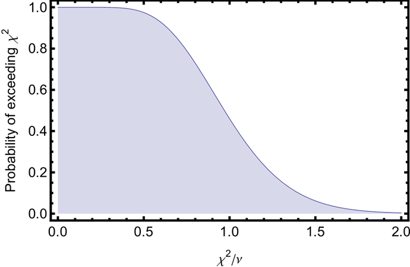

# Overview

The second week of the Gaussian Beams lab introduces you to Python for data acquisition and guides you through interfacing Python with the instrumentation and data acquisition systems used in this course.

This week's lab is divided into two parts. In part 1 (Prelab), you will learn essential curve fitting techniques that you'll use throughout this course. In part 2 (Lab), you will learn Python programming for data acquisition using a National Instruments DAQ device, the [NI USB-6009](http://sine.ni.com/nips/cds/view/p/lang/en/nid/201987). This multifunction USB powered device has 4 (differential) analog inputs (14-bit, 48 kS/s), 2 analog outputs (12-bit, 150 S/s), 12 digital I/O channels, and a 32-bit counter.

## What is Python?

Python is a versatile programming language widely used in scientific computing and data analysis. Many research labs use Python for instrument control, data acquisition, and analysis. Its advantages include:

- Free and open source
- Extensive scientific libraries (NumPy, SciPy, Matplotlib)
- Large community with excellent documentation
- Easy to learn and read
- Works on all major operating systems

You can use Python on the lab laptops where it is already installed. See the [Python Resources](/PHYS-4430/python-resources) page for installation instructions if you want to set it up on your own computer.

## Learning Goals

After completing the prelab, you will be able to:

1. Explain why we minimize the sum of squares to get the best fit.
2. Carry out a least-squares minimization graphically.
3. Plot residuals to visually inspect the goodness of a fit.
4. Interpret the uncertainty in fit parameters from `scipy.optimize.curve_fit`.
5. Compute $\chi^2$ for a fit and use it to determine if a fit is "good".

After completing the lab, you will be able to:

1. Connect a USB DAQ device to a computer and confirm the analog inputs are working correctly.
2. Write a Python script to read analog voltage measurements.
3. Configure sample rate and number of samples for data acquisition.
4. Visualize acquired data using Matplotlib.
5. Perform spectral analysis using NumPy's FFT functions.
6. Save acquired data to a CSV file.
7. Understand the basics of real-time data plotting.

# Prelab

This week's prelab continues the measurement uncertainty and error analysis exploration from last week. This is a "user's guide" to least-squares fitting and determining the goodness of your fits. At the end of the prelab you will be able to:

1. Explain why we minimize the sum of squares to get the best fit.
2. Carry out a least-squares minimization graphically.
3. Plot residuals to visually inspect the goodness of a fit.
4. Interpret the uncertainty in fit parameters.
5. Compute $\chi^2$ for a fit and use it to determine if a fit is "good".

## Useful readings

1. Taylor, J. R. (1997). *An Introduction to Error Analysis: The Study of Uncertainties in Physical Measurements* (p. 327). University Science Books. This is the standard undergraduate text for measurement and uncertainty.
2. Bevington, P. R., & Robinson, K. D. (2003). *Data Reduction and Error Analysis for the Physical Sciences* Third Edition (3rd ed.). New York: McGraw-Hill. Great for advanced undergrad error analysis. Professional physicists use it too.

## Why do we minimize the sum of squares?

**Question:** Why do we call it "least-squares" fitting?

**Answer:** Because the best fit is determined by minimizing the weighted sum of squares of the deviation between the data and the fit. Properly speaking this "sum of squares" is called "chi-squared" and is given by

$$\chi^2 = {\displaystyle \sum_{i=1}^{N}}\frac{1}{\sigma_i^2}(y_i-y(x_i,a,b,c, \ ... \ ))^2\text{,}$$ {#eq:1}

where there are where $N$ data points, $(x_i,y_i )$, and the fit function is given by $y(x_i,a,b,c, \ … \ )$ where $a, b,$ etc. are the fit parameters.

**Question:** What assumptions are made for the method to be valid?

**Answer:** The two assumptions are:

1. **Gaussian distributed.** The random fluctuations in each data point $y_i$ are Gaussian distributed with standard deviation $\sigma_i$.
2. **Uncorrelated.** The random fluctuations in any one data point are uncorrelated with those in another data point.

**Question:** Why does minimizing the sum of squares give us the best fit?

**Answer:** Given the two above assumptions, the fit that minimizes the sum of squares is the ***most likely*** function to produce the observed data. This can be proven using a little calculus and probability. A more detailed explanation is found in Taylor's *Introduction to Error Analysis* Sec. 5.5 "Justification of the Mean as Best Estimate" or Bevington and Robinson's *Data Reduction* Sec. 4.1 "Method of Least-Squares".

## Minimizing $\chi^2$ graphically {#sec:min-graph}

*You will rarely minimize $\chi^2$ graphically in a lab. However, this exercise will help you better understand what fitting routines actually do to find the best fit.*

1. Download and plot [this data set](../resources/lab-guides/gaussian-laser-beams/profile_data_without_errors.csv). It was generated by inserting a razor blade into path of a laser beam and measuring the photodetector voltage of the laser light. The $x$ column is the micrometer (razor) position in meters and the $y$ column is the photodetector voltage in volts.

   ```python
   import numpy as np
   import matplotlib.pyplot as plt

   # Load the data
   data = np.loadtxt('profile_data_without_errors.csv', delimiter=',', skiprows=1)
   x_data = data[:, 0]
   y_data = data[:, 1]

   # Plot the data
   plt.figure(figsize=(10, 6))
   plt.scatter(x_data, y_data, label='Data')
   plt.xlabel('Position (m)')
   plt.ylabel('Voltage (V)')
   plt.legend()
   plt.show()
   ```

2. Define the same fit function as:

   $$y(x,a,b,c,w) = a \ Erf\left(\frac{\sqrt{2}}{w}(x-b)\right)+c$$

   In Python, this can be written using `scipy.special.erf`:

   ```python
   from scipy.special import erf

   def beam_profile(x, a, b, c, w):
       """Error function model for knife-edge beam profile."""
       return a * erf(np.sqrt(2) * (x - b) / w) + c
   ```

3. Reduce the fit to two free parameters. This step is only necessary because it is hard to visualize more than 3 dimensions. Assume $a_{fit}=(V_{max}-V_{min})/2 = 1.4375$ and $c_{fit} =(V_{max}+V_{min})/2 = 1.45195$. These were determined by averaging the first 6 data points to get $V_{min}$ and the last 5 to get $V_{max}$.

4. Use Equation @eq:1 to write an expression for $\chi^2$ in terms of your $w$ and $b$ parameters, and the $x$ (position) data and $y$ (voltage) data. Since you don't have any estimate for the uncertainties $\sigma_i$, assume they are all unity so $\sigma_i=1$.

   ```python
   def chi_squared(w, b, x_data, y_data, a_fixed, c_fixed):
       """Calculate chi-squared for given parameters."""
       y_fit = beam_profile(x_data, a_fixed, b, c_fixed, w)
       return np.sum((y_data - y_fit)**2)
   ```

5. Make a contour plot of $\chi^2(w,b)$ and tweak the plot range until you see the minimum. It will help to have a good initial guess for your fit parameters. You can iteratively improve the plot range to zoom in on the parameter values that minimize $\chi^2$. You should get a plot kind of like Figure @fig:contour.

   ```python
   # Create a grid of w and b values
   w_range = np.linspace(0.0003, 0.0007, 100)
   b_range = np.linspace(0.009, 0.011, 100)
   W, B = np.meshgrid(w_range, b_range)

   # Calculate chi-squared for each combination
   a_fixed = 1.4375
   c_fixed = 1.45195
   Z = np.zeros_like(W)
   for i in range(len(b_range)):
       for j in range(len(w_range)):
           Z[i, j] = chi_squared(w_range[j], b_range[i], x_data, y_data,
                                 a_fixed, c_fixed)

   # Make contour plot
   plt.figure(figsize=(10, 8))
   plt.contour(W * 1000, B * 1000, Z, levels=20)
   plt.colorbar(label='$\\chi^2$')
   plt.xlabel('w (mm)')
   plt.ylabel('b (mm)')
   plt.title('$\\chi^2$ Contour Plot')
   plt.show()
   ```

{#fig:contour width="15cm"}

6. Graphically determine the best fit parameters to 3 significant digits.

7. Compare with the best fit result from `scipy.optimize.curve_fit` (allow all 4 parameters to vary). Do the fits agree for those three digits of precision?

   ```python
   from scipy.optimize import curve_fit

   # Initial guesses
   p0 = [1.4375, 0.01, 1.45195, 0.0005]

   # Perform the fit
   popt, pcov = curve_fit(beam_profile, x_data, y_data, p0=p0)

   print("Best fit parameters:")
   print(f"  a = {popt[0]:.6f}")
   print(f"  b = {popt[1]:.6f}")
   print(f"  c = {popt[2]:.6f}")
   print(f"  w = {popt[3]:.6f}")
   ```

## Uncertainty in the fit parameters

**Question:** Where does the uncertainty in the fit parameters come from?

**Answer:** The optimal fit parameters depend on the data points $(x_i,y_i)$. The uncertainty, $\sigma_i$, in the $y_i$ means there is a propagated uncertainty in the calculation of the fit parameters. The error propagation calculation is explained in detail in the references, especially Bevington and Robinson.

**Question:** How does `curve_fit` calculate the uncertainty in the fit parameters when no error estimate for the $\sigma_i$ is provided?

**Answer:** When no uncertainties are provided, `curve_fit` (and other fitting routines) estimate the uncertainty in the data $\sigma_y^2$ using the "residuals" of the best fit:

$$\sigma_y^2 = \frac{1}{N-n}{\displaystyle \sum_{i=1}^{N}}(y_i-y(x_i,a_0,b_0,c_0, \ ... \ ))^2\text{,}\quad\quad$$ {#eq:2}

where there are $N$ data points $y_i$ and the best fit value at each point is given by $y$, which depends on $x_i$ and the $n$ best fit parameters $a_0,b_0,c_0, \ ... \ $. It is very similar to how you would estimate the standard deviation of a repeated measurement, which for comparison's sake is given by:

$$\sigma_y^2 = \frac{1}{N-n}{\displaystyle \sum_{i=1}^{N}}(y_i-\overline{y})^2\text{.}$$ {#eq:3}

The parameter uncertainties are then extracted from the covariance matrix:

```python
# Get parameter uncertainties from the covariance matrix
perr = np.sqrt(np.diag(pcov))

print("Parameter uncertainties:")
print(f"  σ_a = {perr[0]:.6f}")
print(f"  σ_b = {perr[1]:.6f}")
print(f"  σ_c = {perr[2]:.6f}")
print(f"  σ_w = {perr[3]:.6f}")
```

## Estimating the uncertainty in the data

1. Use Equation @eq:2 and your best fit parameters to estimate $\sigma_y^2$, the random error of each data point given by your data.

   ```python
   # Calculate residuals
   y_fit = beam_profile(x_data, *popt)
   residuals = y_data - y_fit

   # Estimate variance (N data points, n=4 parameters)
   N = len(y_data)
   n = 4
   sigma_y_squared = np.sum(residuals**2) / (N - n)
   sigma_y = np.sqrt(sigma_y_squared)

   print(f"Estimated σ_y = {sigma_y:.6f} V")
   ```

2. Compare your result with the estimate from the fit. The estimated variance can be calculated from the residuals.

3. Do the estimates agree? Why or why not?

## Goodness of fit

This section covers two ways to analyze if a fit is good.

1. Plotting the residuals.
2. Doing a $\chi^2$ test.

### Plotting the fit residuals {#sec:plot-res}

The first step is to look at the residuals. The residuals, $r_i$, are defined as the difference between the data and the fit.

$$r_i=y_i-y(x_i,a,b,c, \ ... \ )$$

1. Make a plot of the residuals:

   ```python
   # Calculate and plot residuals
   residuals = y_data - beam_profile(x_data, *popt)

   plt.figure(figsize=(10, 4))
   plt.scatter(x_data, residuals)
   plt.axhline(y=0, color='r', linestyle='--')
   plt.xlabel('Position (m)')
   plt.ylabel('Residuals (V)')
   plt.title('Fit Residuals')
   plt.grid(True, alpha=0.3)
   plt.show()
   ```

2. Since we didn't provide any estimates of the uncertainties, the fitting assumed the uncertainty of every point is the same. Based on the plot of residuals, was this a good assumption?

3. Do the residuals look randomly scattered about zero or do you notice any systematic error sources?

4. Is the distribution of residuals scattered evenly around zero? Or is there a particular range of $x$ values where the residuals are larger than others?

5. What is the most likely source of the large uncertainty as the beam is cut near the center of the beam?

### "Chi by eye" - eyeballing the goodness of fit

**Question:** If I have a good fit, should every data point lie within an error bar?

**Answer:** No. Most should, but we wouldn't expect every data point to lie within an error bar. If the uncertainty is Gaussian distributed with a standard deviation $\sigma_i$ for each data point, $y_i$, then we expect roughly 68% of the data points to lie within their error bar. This is because 68% of the probability in a Gaussian distribution lies within one standard deviation of the mean.

### $\chi^2$ and $\chi_{red}^2$ for testing the "goodness" of fit

This section answers the question "What should $\chi^2$ be for a good fit?"

Suppose the only uncertainty in the data is statistical (i.e., random) error, with a known standard deviation $\sigma_i$, then on average each term in the sum is

$$\frac{1}{\sigma_i^2}(y_i-y(x_i,a,b,c, \ ... \ ))^2 \approx 1\text{,}$$ {#eq:4}

and the full $\chi^2$ sum of squares is approximately

$$\chi^2 = {\displaystyle \sum_{i=1}^{N}}\frac{1}{\sigma_i^2}(y_i-y(x_i,a,b,c, \ ... \ ))^2\approx N-n\text{.}\quad\quad$$ {#eq:5}


So a good fit has

$$\chi_{red}^2 \equiv \frac{\chi^2}{N-n}\approx 1\text{.}$$ {#eq:6}

1. **Fact: To find the goodness of fit test, you must first estimate the uncertainties on the data points that you are fitting.** How would you explain the reason for this in your own words?

### Choosing a strategy to estimate the uncertainty

1. Considering your answers from Section @sec:plot-res (especially @sec:plot-res\.5), which method would give you the best estimate of the uncertainty for each data point, and why?

   - Eyeballing the fluctuations in each data point.

   - Taking $N$ measurements at each razor position and then going to the next position.

   - Taking the entire data set $N$ times.


### Weighted fits

When you have estimated the uncertainty $\sigma_i$ of each data point $y_i$ you should use this information when fitting to correctly evaluate the $\chi^2$ expression in Equation @eq:1. The points with high uncertainty contribute less information when choosing the best fit parameters.

In Python's `curve_fit`, you provide uncertainties using the `sigma` parameter:

```python
# Weighted fit with known uncertainties
popt, pcov = curve_fit(
    beam_profile,
    x_data,
    y_data,
    p0=p0,
    sigma=sigma_list,        # Your uncertainty estimates
    absolute_sigma=True      # Use actual sigma values (not relative)
)
```

1. Download [this data set](../resources/lab-guides/gaussian-laser-beams/profile_data_with_errors.csv) for a beam width measurement with uncertainties. The first column is razor position in meters, the second column is photodetector output voltage, and the third column is the uncertainty on the photodetector output voltage.

   ```python
   # Load data with uncertainties
   data = np.loadtxt('profile_data_with_errors.csv', delimiter=',', skiprows=1)
   x_data = data[:, 0]
   y_data = data[:, 1]
   y_err = data[:, 2]
   ```

2. Do a weighted fit using the same fit function as in Section @sec:min-graph. Use the uncertainty estimates in the third column.

   ```python
   # Weighted fit
   popt, pcov = curve_fit(
       beam_profile, x_data, y_data,
       p0=[1.4, 0.01, 1.45, 0.0005],
       sigma=y_err,
       absolute_sigma=True
   )
   perr = np.sqrt(np.diag(pcov))
   ```

3. Calculate $\chi^2$:

   ```python
   # Calculate chi-squared
   y_fit = beam_profile(x_data, *popt)
   chi2 = np.sum(((y_data - y_fit) / y_err)**2)
   dof = len(y_data) - len(popt)  # degrees of freedom
   chi2_red = chi2 / dof

   print(f"Chi-squared: {chi2:.2f}")
   print(f"Degrees of freedom: {dof}")
   print(f"Reduced chi-squared: {chi2_red:.2f}")
   ```

4. How close is the reduced chi-squared to 1?

5. **The "chi-squared test".** This part helps us understand if the value of $\chi^2$ is statistically likely or not. The following graph gives the probability of exceeding a particular value of $\chi^2$ for $\nu=𝑁−𝑛=22$ degrees of freedom. It can be calculated using the Cumulative Density Function (CDF) for the chi-squared distribution. Use the graph to estimate the likelihood this value of $\chi^2$ occurred by chance.

   ```python
   from scipy import stats

   # Calculate p-value (probability of getting this chi2 or higher by chance)
   p_value = 1 - stats.chi2.cdf(chi2, dof)
   print(f"P-value: {p_value:.4f}")
   ```

{#fig:cdf width="15cm"}

### Why is it often bad to overestimate uncertainties?

1. Why can overestimating the uncertainty make your fit appear good (i.e., $\frac{\chi^2}{N-n}\approx 1$)?

Overestimating the uncertainties makes the fit seem good (according to a $\chi^2$ test), even when it might be obviously a bad fit. It is best to do the $\chi^2$ test using an honest estimate of your uncertainties. If the $\chi^2$ is larger than expected $(\chi^2>𝑁−𝑛)$, then you should consider both the possibility of systematic error sources and the quality of your estimates of the uncertainties. On the other hand, if the $\chi^2$ test is good $(\chi^2\approx 𝑁−𝑛)$, then it shows you have a good handle on the model of your system, and your sources of uncertainty. Finally, if $\chi^2\ll (𝑁−𝑛)$, this likely indicates overestimated uncertainties.

# Introduction to Python for Data Acquisition

In this part of the lab, you will learn to use Python for data acquisition. We'll use the `nidaqmx` library to interface with National Instruments DAQ devices.

## Development Environment

For this lab, we recommend starting with **Jupyter Notebook** for interactive exploration, then transitioning to **VS Code** or another editor for writing reusable scripts. See the [Python Resources](/PHYS-4430/python-resources) page for setup instructions.

## Connect the USB-6009 and verify it is working

1. Ensure the NI-DAQmx drivers are installed (they should already be on lab computers). If needed, download from [NI-DAQmx](https://www.ni.com/en-us/support/downloads/drivers/download.ni-daq-mx.html).

2. Connect the USB cable to your computer and the USB-6009.

3. Open NI Measurement & Automation Explorer (NI-MAX) to verify the device is recognized:
   - The device should appear under "Devices and Interfaces"
   - Right-click and run "Self-Test" to verify the connection
   - Open the "Test Panel" to test analog inputs manually

4. Use Python to list available DAQ devices:

   ```python
   import nidaqmx
   from nidaqmx.system import System

   # List all connected DAQ devices
   system = System.local()
   for device in system.devices:
       print(f"Device: {device.name}")
       print(f"  Product Type: {device.product_type}")
       print(f"  AI Channels: {[ch.name for ch in device.ai_physical_chans]}")
   ```

5. Connect the 5V power rail to `AI0+` and ground to `AI0-`. You must connect both wires since the device measures a potential difference between the two terminals.

6. Read a voltage to verify the connection:

   ```python
   with nidaqmx.Task() as task:
       task.ai_channels.add_ai_voltage_chan("Dev1/ai0")
       voltage = task.read()
       print(f"Measured voltage: {voltage:.4f} V")
   ```

## Reading Multiple Samples

To capture time-varying signals, you need to configure the sample rate and number of samples.

### Understanding Sample Rate and Samples to Read

When acquiring data, you must specify:

- **Sample Rate**: How many samples per second (Hz)
- **Samples to Read**: Total number of samples to acquire

For example, to capture 5 periods of a 1 kHz sine wave with 20 samples per period:

- Samples to Read = 5 periods × 20 samples/period = 100 samples
- Total time = 5 periods / 1000 Hz = 5 ms
- Sample Rate = 100 samples / 0.005 s = 20,000 Hz

### Acquiring Multiple Samples {#sec:analogmeas}

```python
import nidaqmx
import numpy as np
import matplotlib.pyplot as plt
from nidaqmx.constants import AcquisitionType

# Configuration
sample_rate = 20000  # Hz
samples_to_read = 100

# Acquire data
with nidaqmx.Task() as task:
    task.ai_channels.add_ai_voltage_chan("Dev1/ai0")
    task.timing.cfg_samp_clk_timing(
        rate=sample_rate,
        sample_mode=AcquisitionType.FINITE,
        samps_per_chan=samples_to_read
    )

    data = task.read(number_of_samples_per_channel=samples_to_read)

# Create time array
time = np.arange(samples_to_read) / sample_rate

# Plot the data
plt.figure(figsize=(10, 6))
plt.plot(time * 1000, data)  # Time in ms
plt.xlabel('Time (ms)')
plt.ylabel('Voltage (V)')
plt.title('Acquired Signal')
plt.grid(True, alpha=0.3)
plt.show()
```

### Exercise: Capture a Waveform

1. Connect your waveform generator to both an oscilloscope and your DAQ device.
2. Set the waveform generator to output a sine wave at a frequency compatible with your sample rate calculation.
3. Modify the sample rate and samples to read to capture approximately 5 complete periods.
4. Run the acquisition and compare the Python plot with the oscilloscope display. Are they compatible?
5. Add to your notebook: the Python code, the resulting plot, and the oscilloscope output. Explain how they all make sense together.

## Continuous Data Acquisition

For continuous monitoring, you can read data in a loop:

```python
import nidaqmx
import numpy as np
import matplotlib.pyplot as plt
from nidaqmx.constants import AcquisitionType

sample_rate = 10000
samples_per_read = 1000

plt.ion()  # Enable interactive mode
fig, ax = plt.subplots(figsize=(10, 6))
line, = ax.plot([], [])
ax.set_xlabel('Sample')
ax.set_ylabel('Voltage (V)')
ax.set_title('Continuous Acquisition')

with nidaqmx.Task() as task:
    task.ai_channels.add_ai_voltage_chan("Dev1/ai0")
    task.timing.cfg_samp_clk_timing(
        rate=sample_rate,
        sample_mode=AcquisitionType.CONTINUOUS
    )

    task.start()

    try:
        while True:
            data = task.read(number_of_samples_per_channel=samples_per_read)
            line.set_data(range(len(data)), data)
            ax.set_xlim(0, len(data))
            ax.set_ylim(min(data) - 0.1, max(data) + 0.1)
            plt.pause(0.01)
    except KeyboardInterrupt:
        print("Stopped by user")

plt.ioff()
plt.show()
```

## Spectral Analysis with FFT

Python's NumPy library provides powerful FFT (Fast Fourier Transform) functions for spectral analysis.

### Computing the Power Spectrum

```python
import numpy as np
import matplotlib.pyplot as plt

def compute_power_spectrum(data, sample_rate):
    """Compute the one-sided power spectrum."""
    n = len(data)

    # Compute FFT
    fft_result = np.fft.fft(data)

    # Get positive frequencies only
    n_unique = n // 2 + 1
    frequencies = np.fft.fftfreq(n, d=1/sample_rate)[:n_unique]
    frequencies = np.abs(frequencies)

    # Power spectrum (magnitude squared, normalized)
    power = (np.abs(fft_result[:n_unique]) / n) ** 2
    power[1:-1] *= 2  # Account for negative frequencies

    return frequencies, power
```

### Exercise: Spectral Analysis

1. Acquire a signal from your waveform generator at a known frequency (e.g., 500 Hz).
2. Compute and plot the power spectrum:

   ```python
   # Acquire data
   with nidaqmx.Task() as task:
       task.ai_channels.add_ai_voltage_chan("Dev1/ai0")
       task.timing.cfg_samp_clk_timing(
           rate=10000,
           sample_mode=AcquisitionType.FINITE,
           samps_per_chan=10000
       )
       data = task.read(number_of_samples_per_channel=10000)

   # Compute and plot spectrum
   frequencies, power = compute_power_spectrum(np.array(data), 10000)

   plt.figure(figsize=(10, 6))
   plt.plot(frequencies, power)
   plt.xlabel('Frequency (Hz)')
   plt.ylabel('Power')
   plt.title('Power Spectrum')
   plt.xlim(0, 2000)  # Show up to 2 kHz
   plt.grid(True, alpha=0.3)
   plt.show()
   ```

3. Verify that the peak in the spectrum appears at the expected frequency.
4. Try adding a second frequency component from the waveform generator and observe the spectrum.

## Saving Data to a File

Save your acquired data to a CSV file for later analysis:

```python
import numpy as np
from datetime import datetime

# After acquiring data...
# Create a timestamp for the filename
timestamp = datetime.now().strftime("%Y%m%d_%H%M%S")
filename = f"data_{timestamp}.csv"

# Create time array
time = np.arange(len(data)) / sample_rate

# Save to CSV
np.savetxt(
    filename,
    np.column_stack([time, data]),
    delimiter=',',
    header='Time (s), Voltage (V)',
    comments=''
)

print(f"Data saved to {filename}")
```

### Exercise: Save and Reload Data

1. Acquire a waveform and save it to a CSV file.
2. Load the data back and plot it:

   ```python
   # Load data
   loaded_data = np.loadtxt(filename, delimiter=',', skiprows=1)
   time_loaded = loaded_data[:, 0]
   voltage_loaded = loaded_data[:, 1]

   # Plot
   plt.figure(figsize=(10, 6))
   plt.plot(time_loaded * 1000, voltage_loaded)
   plt.xlabel('Time (ms)')
   plt.ylabel('Voltage (V)')
   plt.title('Loaded Data')
   plt.show()
   ```

3. Verify the loaded data matches your original acquisition.

## Generating an Analog Output

The USB-6009 can also generate analog voltages (though at a limited rate of 150 S/s):

```python
import nidaqmx

# Output a DC voltage
with nidaqmx.Task() as task:
    task.ao_channels.add_ao_voltage_chan("Dev1/ao0")
    task.write(2.5)  # Output 2.5 V
    print("Outputting 2.5 V on AO0")
    input("Press Enter to stop...")
```

### Exercise: Test Analog Output

1. Configure your DAQ to output a voltage on `AO0`.
2. Connect `AO0` to `AI0` (loopback test).
3. Write a script that:
   - Outputs a voltage on `AO0`
   - Reads the voltage on `AI0`
   - Verifies they match

## Error Handling

Always include error handling in your data acquisition code:

```python
import nidaqmx
from nidaqmx.errors import DaqError

try:
    with nidaqmx.Task() as task:
        task.ai_channels.add_ai_voltage_chan("Dev1/ai0")
        voltage = task.read()
        print(f"Voltage: {voltage:.4f} V")

except DaqError as e:
    print(f"DAQ Error: {e}")
    print("Check that:")
    print("  - The DAQ device is connected")
    print("  - The device name is correct (try 'Dev1', 'Dev2', etc.)")
    print("  - NI-DAQmx drivers are installed")
```

## Summary

In this lab, you learned to:

1. Connect and verify a USB DAQ device
2. Read single and multiple voltage samples
3. Configure sample rate and acquisition timing
4. Visualize data in real-time
5. Perform spectral analysis using FFT
6. Save data to CSV files
7. Generate analog output voltages
8. Handle common errors

These skills form the foundation for the automated measurements you'll perform in the coming weeks. See the [Python Resources](/PHYS-4430/python-resources) page and the example scripts in the `python/` folder for more detailed examples.
