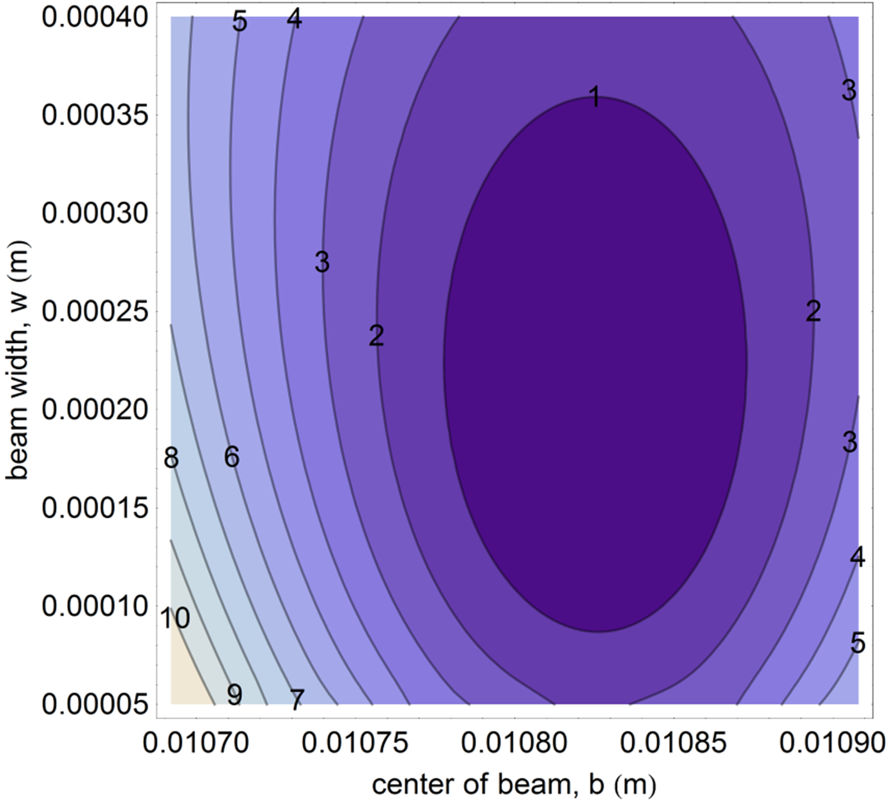

# Overview

The second week of the Gaussian Beams lab introduces you to Python for data acquisition and guides you through interfacing Python with the instrumentation and data acquisition systems used in this course. You will also learn about digital sampling theory and characterize the noise performance of your photodetector—a critical step for making informed measurement decisions in Week 4.

This week's lab is divided into two parts. In part 1 (Prelab), you will learn essential curve fitting techniques that you'll use throughout this course. In part 2 (Lab), you will learn Python programming for data acquisition using a National Instruments DAQ device, the [NI USB-6009](http://sine.ni.com/nips/cds/view/p/lang/en/nid/201987). This multifunction USB powered device has 4 (differential) analog inputs (14-bit, 48 kS/s), 2 analog outputs (12-bit, 150 S/s), 12 digital I/O channels, and a 32-bit counter. You will then apply these DAQ skills to characterize your photodetector's noise floor and make a quantitative decision about optimal gain settings.

## What is Python?

Python is a versatile programming language widely used in scientific computing and data analysis. Many research labs use Python for instrument control, data acquisition, and analysis. Its advantages include:

- Free and open source
- Extensive scientific libraries (NumPy, SciPy, Matplotlib)
- Large community with excellent documentation
- Easy to learn and read
- Works on all major operating systems

You can use Python on the lab laptops where it is already installed. See the [Python Resources](/PHYS-4430/python-resources) page for installation instructions if you want to set it up on your own computer.

## Learning Goals

After completing the prelab, you will be able to:

1. Explain why we minimize the sum of squares to get the best fit.
2. Carry out a least-squares minimization graphically.
3. Plot residuals to visually inspect the goodness of a fit.
4. Interpret the uncertainty in fit parameters from `scipy.optimize.curve_fit`.
5. Compute $\chi^2$ for a fit and use it to determine if a fit is "good".
6. Create plots with error bars using Matplotlib.

After completing the lab, you will be able to:

1. Connect a USB DAQ device to a computer and confirm the analog inputs are working correctly.
2. Write a Python script to read analog voltage measurements.
3. Configure sample rate and number of samples for data acquisition.
4. Explain Nyquist's theorem and choose appropriate sample rates.
5. Recognize aliasing and understand its causes.
6. Measure the photodetector's noise floor and compare to datasheet specifications.
7. Calculate signal-to-noise ratio and predict how it depends on gain setting.
8. Select and justify an optimal gain setting based on quantitative analysis.
9. Save acquired data to a CSV file.

# Prelab

This week's prelab continues the measurement uncertainty and error analysis exploration from last week. This is a "user's guide" to least-squares fitting and determining the goodness of your fits. At the end of the prelab you will be able to:

1. Explain why we minimize the sum of squares to get the best fit.
2. Carry out a least-squares minimization graphically.
3. Plot residuals to visually inspect the goodness of a fit.
4. Interpret the uncertainty in fit parameters.
5. Compute $\chi^2$ for a fit and use it to determine if a fit is "good".
6. Create plots with error bars using Matplotlib.

## Useful readings

1. Taylor, J. R. (1997). *An Introduction to Error Analysis: The Study of Uncertainties in Physical Measurements* (p. 327). University Science Books. This is the standard undergraduate text for measurement and uncertainty.
2. Bevington, P. R., & Robinson, K. D. (2003). *Data Reduction and Error Analysis for the Physical Sciences* Third Edition (3rd ed.). New York: McGraw-Hill. Great for advanced undergrad error analysis. Professional physicists use it too.

## Why do we minimize the sum of squares?

**Question:** Why do we call it "least-squares" fitting?

**Answer:** Because the best fit is determined by minimizing the weighted sum of squares of the deviation between the data and the fit. Properly speaking this "sum of squares" is called "chi-squared" and is given by

$$\chi^2 = {\displaystyle \sum_{i=1}^{N}}\frac{1}{\sigma_i^2}(y_i-y(x_i,a,b,c, \ ... \ ))^2\text{,}$$ {#eq:1}

where there are where $N$ data points, $(x_i,y_i )$, and the fit function is given by $y(x_i,a,b,c, \ … \ )$ where $a, b,$ etc. are the fit parameters.

**Question:** What assumptions are made for the method to be valid?

**Answer:** The two assumptions are:

1. **Gaussian distributed.** The random fluctuations in each data point $y_i$ are Gaussian distributed with standard deviation $\sigma_i$.
2. **Uncorrelated.** The random fluctuations in any one data point are uncorrelated with those in another data point.

**Question:** Why does minimizing the sum of squares give us the best fit?

**Answer:** Given the two above assumptions, the fit that minimizes the sum of squares is the ***most likely*** function to produce the observed data. This can be proven using a little calculus and probability. A more detailed explanation is found in Taylor's *Introduction to Error Analysis* Sec. 5.5 "Justification of the Mean as Best Estimate" or Bevington and Robinson's *Data Reduction* Sec. 4.1 "Method of Least-Squares".

## Minimizing $\chi^2$ graphically {#sec:min-graph}

*You will rarely minimize $\chi^2$ graphically in a lab. However, this exercise will help you better understand what fitting routines actually do to find the best fit.*

1. Download and plot [this data set](../resources/lab-guides/gaussian-laser-beams/profile_data_without_errors.csv). It was generated by inserting a razor blade into path of a laser beam and measuring the photodetector voltage of the laser light. The $x$ column is the micrometer (razor) position in meters and the $y$ column is the photodetector voltage in volts.

   ```python
   import numpy as np
   import matplotlib.pyplot as plt

   # Load the data
   data = np.loadtxt('profile_data_without_errors.csv', delimiter=',', skiprows=1)
   x_data = data[:, 0]
   y_data = data[:, 1]

   # Plot the data
   plt.figure(figsize=(10, 6))
   plt.scatter(x_data, y_data, label='Data')
   plt.xlabel('Position (m)')
   plt.ylabel('Voltage (V)')
   plt.legend()
   plt.show()
   ```

2. Define the same fit function as:

   $$y(x,a,b,c,w) = a \ Erf\left(\frac{\sqrt{2}}{w}(x-b)\right)+c$$

   In Python, this can be written using `scipy.special.erf`:

   ```python
   from scipy.special import erf

   def beam_profile(x, a, b, c, w):
       """Error function model for knife-edge beam profile."""
       return a * erf(np.sqrt(2) * (x - b) / w) + c
   ```

3. Reduce the fit to two free parameters. This step is only necessary because it is hard to visualize more than 3 dimensions. Assume $a_{fit}=(V_{max}-V_{min})/2 = 1.4375$ and $c_{fit} =(V_{max}+V_{min})/2 = 1.45195$. These were determined by averaging the first 6 data points to get $V_{min}$ and the last 5 to get $V_{max}$.

4. Use Equation @eq:1 to write an expression for $\chi^2$ in terms of your $w$ and $b$ parameters, and the $x$ (position) data and $y$ (voltage) data. Since you don't have any estimate for the uncertainties $\sigma_i$, assume they are all unity so $\sigma_i=1$.

   ```python
   def chi_squared(w, b, x_data, y_data, a_fixed, c_fixed):
       """Calculate chi-squared for given parameters."""
       y_fit = beam_profile(x_data, a_fixed, b, c_fixed, w)
       return np.sum((y_data - y_fit)**2)
   ```

5. Make a contour plot of $\chi^2(w,b)$ and tweak the plot range until you see the minimum. It will help to have a good initial guess for your fit parameters. You can iteratively improve the plot range to zoom in on the parameter values that minimize $\chi^2$. You should get a plot kind of like Figure @fig:contour.

   ```python
   # Create a grid of w and b values
   w_range = np.linspace(0.0003, 0.0007, 100)
   b_range = np.linspace(0.009, 0.011, 100)
   W, B = np.meshgrid(w_range, b_range)

   # Calculate chi-squared for each combination
   a_fixed = 1.4375
   c_fixed = 1.45195
   Z = np.zeros_like(W)
   for i in range(len(b_range)):
       for j in range(len(w_range)):
           Z[i, j] = chi_squared(w_range[j], b_range[i], x_data, y_data,
                                 a_fixed, c_fixed)

   # Make contour plot
   plt.figure(figsize=(10, 8))
   plt.contour(W * 1000, B * 1000, Z, levels=20)
   plt.colorbar(label='$\\chi^2$')
   plt.xlabel('w (mm)')
   plt.ylabel('b (mm)')
   plt.title('$\\chi^2$ Contour Plot')
   plt.show()
   ```

{#fig:contour width="15cm"}

6. Graphically determine the best fit parameters to 3 significant digits.

7. Compare with the best fit result from `scipy.optimize.curve_fit` (allow all 4 parameters to vary). Do the fits agree for those three digits of precision?

   ```python
   from scipy.optimize import curve_fit

   # Initial guesses
   p0 = [1.4375, 0.01, 1.45195, 0.0005]

   # Perform the fit
   popt, pcov = curve_fit(beam_profile, x_data, y_data, p0=p0)

   print("Best fit parameters:")
   print(f"  a = {popt[0]:.6f}")
   print(f"  b = {popt[1]:.6f}")
   print(f"  c = {popt[2]:.6f}")
   print(f"  w = {popt[3]:.6f}")
   ```

## Uncertainty in the fit parameters

**Question:** Where does the uncertainty in the fit parameters come from?

**Answer:** The optimal fit parameters depend on the data points $(x_i,y_i)$. The uncertainty, $\sigma_i$, in the $y_i$ means there is a propagated uncertainty in the calculation of the fit parameters. The error propagation calculation is explained in detail in the references, especially Bevington and Robinson.

**Question:** How does `curve_fit` calculate the uncertainty in the fit parameters when no error estimate for the $\sigma_i$ is provided?

**Answer:** When no uncertainties are provided, `curve_fit` (and other fitting routines) estimate the uncertainty in the data $\sigma_y^2$ using the "residuals" of the best fit:

$$\sigma_y^2 = \frac{1}{N-n}{\displaystyle \sum_{i=1}^{N}}(y_i-y(x_i,a_0,b_0,c_0, \ ... \ ))^2\text{,}\quad\quad$$ {#eq:2}

where there are $N$ data points $y_i$ and the best fit value at each point is given by $y$, which depends on $x_i$ and the $n$ best fit parameters $a_0,b_0,c_0, \ ... \ $. It is very similar to how you would estimate the standard deviation of a repeated measurement, which for comparison's sake is given by:

$$\sigma_y^2 = \frac{1}{N-n}{\displaystyle \sum_{i=1}^{N}}(y_i-\overline{y})^2\text{.}$$ {#eq:3}

The parameter uncertainties are then extracted from the covariance matrix:

```python
# Get parameter uncertainties from the covariance matrix
perr = np.sqrt(np.diag(pcov))

print("Parameter uncertainties:")
print(f"  σ_a = {perr[0]:.6f}")
print(f"  σ_b = {perr[1]:.6f}")
print(f"  σ_c = {perr[2]:.6f}")
print(f"  σ_w = {perr[3]:.6f}")
```

## Estimating the uncertainty in the data

1. Use Equation @eq:2 and your best fit parameters to estimate $\sigma_y^2$, the random error of each data point given by your data.

   ```python
   # Calculate residuals
   y_fit = beam_profile(x_data, *popt)
   residuals = y_data - y_fit

   # Estimate variance (N data points, n=4 parameters)
   N = len(y_data)
   n = 4
   sigma_y_squared = np.sum(residuals**2) / (N - n)
   sigma_y = np.sqrt(sigma_y_squared)

   print(f"Estimated σ_y = {sigma_y:.6f} V")
   ```

2. Compare your result with the estimate from the fit. The estimated variance can be calculated from the residuals.

3. Do the estimates agree? Why or why not?

## Goodness of fit

This section covers two ways to analyze if a fit is good.

1. Plotting the residuals.
2. Doing a $\chi^2$ test.

### Plotting the fit residuals {#sec:plot-res}

The first step is to look at the residuals. The residuals, $r_i$, are defined as the difference between the data and the fit.

$$r_i=y_i-y(x_i,a,b,c, \ ... \ )$$

1. Make a plot of the residuals:

   ```python
   # Calculate and plot residuals
   residuals = y_data - beam_profile(x_data, *popt)

   plt.figure(figsize=(10, 4))
   plt.scatter(x_data, residuals)
   plt.axhline(y=0, color='r', linestyle='--')
   plt.xlabel('Position (m)')
   plt.ylabel('Residuals (V)')
   plt.title('Fit Residuals')
   plt.grid(True, alpha=0.3)
   plt.show()
   ```

2. Since we didn't provide any estimates of the uncertainties, the fitting assumed the uncertainty of every point is the same. Based on the plot of residuals, was this a good assumption?

3. Do the residuals look randomly scattered about zero or do you notice any systematic error sources?

4. Is the distribution of residuals scattered evenly around zero? Or is there a particular range of $x$ values where the residuals are larger than others?

5. What is the most likely source of the large uncertainty as the beam is cut near the center of the beam?

### "Chi by eye" - eyeballing the goodness of fit

**Question:** If I have a good fit, should every data point lie within an error bar?

**Answer:** No. Most should, but we wouldn't expect every data point to lie within an error bar. If the uncertainty is Gaussian distributed with a standard deviation $\sigma_i$ for each data point, $y_i$, then we expect roughly 68% of the data points to lie within their error bar. This is because 68% of the probability in a Gaussian distribution lies within one standard deviation of the mean.

### $\chi^2$ and $\chi_{red}^2$ for testing the "goodness" of fit

This section answers the question "What should $\chi^2$ be for a good fit?"

Suppose the only uncertainty in the data is statistical (i.e., random) error, with a known standard deviation $\sigma_i$, then on average each term in the sum is

$$\frac{1}{\sigma_i^2}(y_i-y(x_i,a,b,c, \ ... \ ))^2 \approx 1\text{,}$$ {#eq:4}

and the full $\chi^2$ sum of squares is approximately

$$\chi^2 = {\displaystyle \sum_{i=1}^{N}}\frac{1}{\sigma_i^2}(y_i-y(x_i,a,b,c, \ ... \ ))^2\approx N-n\text{.}\quad\quad$$ {#eq:5}


So a good fit has

$$\chi_{red}^2 \equiv \frac{\chi^2}{N-n}\approx 1\text{.}$$ {#eq:6}

1. **Fact: To find the goodness of fit test, you must first estimate the uncertainties on the data points that you are fitting.** How would you explain the reason for this in your own words?

### Choosing a strategy to estimate the uncertainty

1. Considering your answers from Section @sec:plot-res (especially @sec:plot-res\.5), which method would give you the best estimate of the uncertainty for each data point, and why?

   - Eyeballing the fluctuations in each data point.

   - Taking $N$ measurements at each razor position and then going to the next position.

   - Taking the entire data set $N$ times.


### Weighted fits

When you have estimated the uncertainty $\sigma_i$ of each data point $y_i$ you should use this information when fitting to correctly evaluate the $\chi^2$ expression in Equation @eq:1. The points with high uncertainty contribute less information when choosing the best fit parameters.

In Python's `curve_fit`, you provide uncertainties using the `sigma` parameter:

```python
# Weighted fit with known uncertainties
popt, pcov = curve_fit(
    beam_profile,
    x_data,
    y_data,
    p0=p0,
    sigma=sigma_list,        # Your uncertainty estimates
    absolute_sigma=True      # Use actual sigma values (not relative)
)
```

1. Download [this data set](../resources/lab-guides/gaussian-laser-beams/profile_data_with_errors.csv) for a beam width measurement with uncertainties. The first column is razor position in meters, the second column is photodetector output voltage, and the third column is the uncertainty on the photodetector output voltage.

   ```python
   # Load data with uncertainties
   data = np.loadtxt('profile_data_with_errors.csv', delimiter=',', skiprows=1)
   x_data = data[:, 0]
   y_data = data[:, 1]
   y_err = data[:, 2]
   ```

2. Do a weighted fit using the same fit function as in Section @sec:min-graph. Use the uncertainty estimates in the third column.

   ```python
   # Weighted fit
   popt, pcov = curve_fit(
       beam_profile, x_data, y_data,
       p0=[1.4, 0.01, 1.45, 0.0005],
       sigma=y_err,
       absolute_sigma=True
   )
   perr = np.sqrt(np.diag(pcov))
   ```

3. Calculate $\chi^2$:

   ```python
   # Calculate chi-squared
   y_fit = beam_profile(x_data, *popt)
   chi2 = np.sum(((y_data - y_fit) / y_err)**2)
   dof = len(y_data) - len(popt)  # degrees of freedom
   chi2_red = chi2 / dof

   print(f"Chi-squared: {chi2:.2f}")
   print(f"Degrees of freedom: {dof}")
   print(f"Reduced chi-squared: {chi2_red:.2f}")
   ```

4. How close is the reduced chi-squared to 1?

5. **The "chi-squared test".** This part helps us understand if the value of $\chi^2$ is statistically likely or not. The following graph gives the probability of exceeding a particular value of $\chi^2$ for $\nu=𝑁−𝑛=22$ degrees of freedom. It can be calculated using the Cumulative Density Function (CDF) for the chi-squared distribution. Use the graph to estimate the likelihood this value of $\chi^2$ occurred by chance.

   ```python
   from scipy import stats

   # Calculate p-value (probability of getting this chi2 or higher by chance)
   p_value = 1 - stats.chi2.cdf(chi2, dof)
   print(f"P-value: {p_value:.4f}")
   ```

{#fig:cdf width="15cm"}

### Why is it often bad to overestimate uncertainties?

1. Why can overestimating the uncertainty make your fit appear good (i.e., $\frac{\chi^2}{N-n}\approx 1$)?

Overestimating the uncertainties makes the fit seem good (according to a $\chi^2$ test), even when it might be obviously a bad fit. It is best to do the $\chi^2$ test using an honest estimate of your uncertainties. If the $\chi^2$ is larger than expected $(\chi^2>𝑁−𝑛)$, then you should consider both the possibility of systematic error sources and the quality of your estimates of the uncertainties. On the other hand, if the $\chi^2$ test is good $(\chi^2\approx 𝑁−𝑛)$, then it shows you have a good handle on the model of your system, and your sources of uncertainty. Finally, if $\chi^2\ll (𝑁−𝑛)$, this likely indicates overestimated uncertainties.

## Error bars

The error bar is a graphical way to display the uncertainty in a measurement. In order to put error bars on a plot you must first estimate the error for each point. Anytime you include error bars in a plot you should explain how the uncertainty in each point was estimated (e.g., you "eyeballed" the uncertainty, or you sampled it $N$ times and took the standard deviation of the mean, etc.)

### Error bars in Python with Matplotlib

Creating plots with error bars in Python is straightforward using `plt.errorbar()`:

```python
import numpy as np
import matplotlib.pyplot as plt

# Load data with uncertainties
data = np.loadtxt('gaussian_data_with_errors.txt', skiprows=1)
x = data[:, 0]      # Position
y = data[:, 1]      # Voltage
y_err = data[:, 2]  # Uncertainty

# Create plot with error bars
plt.figure(figsize=(10, 6))
plt.errorbar(x, y, yerr=y_err, fmt='o', capsize=3,
             label='Data with uncertainties')
plt.xlabel('Micrometer Position (inches)')
plt.ylabel('Photodetector Voltage (V)')
plt.title('Gaussian Beam Width Measurement')
plt.legend()
plt.grid(True, alpha=0.3)
plt.show()
```

The `errorbar()` function parameters:
- `x`, `y`: Data points
- `yerr`: Uncertainty values (can also use `xerr` for horizontal error bars)
- `fmt='o'`: Marker style (circles)
- `capsize=3`: Size of error bar caps

### Example: Gaussian laser beam width measurement

Suppose you had estimated the uncertainty at every point in a width measurement of your Gaussian laser beam to be $0.04 \ V$. This error was chosen to demonstrate the mechanics of making a plot with error bars, but the uncertainty in the actual data was probably smaller than this.

<center>

| Micrometer Position (inches) | Photodetector Voltage (V) | Estimated uncertainty (V) |
| :--------------------------: | :-----------------------: | :-----------------------: |
|            0.410             |           0.015           |           0.04            |
|            0.412             |           0.016           |           0.04            |
|            0.414             |           0.017           |           0.04            |
|            0.416             |           0.026           |           0.04            |
|            0.418             |           0.060           |           0.04            |
|            0.420             |           0.176           |           0.04            |
|            0.422             |           0.460           |           0.04            |
|            0.424             |           0.849           |           0.04            |
|            0.426             |           1.364           |           0.04            |
|            0.428             |           1.971           |           0.04            |
|            0.430             |           2.410           |           0.04            |
|            0.432             |           2.703           |           0.04            |
|            0.434             |           2.795           |           0.04            |
|            0.436             |           2.861           |           0.04            |
|            0.438             |           2.879           |           0.04            |
|            0.440             |           2.884           |           0.04            |

Table: Table of data with a fixed uncertainty used to illustrate creating plots with error bars. {#tbl:example-data}

</center>

<br>

Download [this data set](../resources/lab-guides/gaussian-laser-beams/gaussian_data_with_errors.txt) and create a plot with error bars like Figure @fig:gauss-example.

```python
import numpy as np
import matplotlib.pyplot as plt

# Load data
data = np.loadtxt('gaussian_data_with_errors.txt', skiprows=1)
position = data[:, 0]
voltage = data[:, 1]
uncertainty = data[:, 2]

# Create plot
plt.figure(figsize=(10, 6))
plt.errorbar(position, voltage, yerr=uncertainty,
             fmt='o', capsize=3, markersize=5)
plt.xlabel('Position (inches)')
plt.ylabel('Photodetector Output (V)')
plt.title('Gaussian Beam Width Measurement')
plt.grid(True, alpha=0.3)
plt.tight_layout()
plt.show()
```

{#fig:gauss-example width="15cm"}

# Introduction to Python for Data Acquisition

In this part of the lab, you will learn to use Python for data acquisition. We'll use the `nidaqmx` library to interface with National Instruments DAQ devices.

## Development Environment

For this lab, we recommend starting with **Jupyter Notebook** for interactive exploration, then transitioning to **VS Code** or another editor for writing reusable scripts. See the [Python Resources](/PHYS-4430/python-resources) page for setup instructions.

## Connect the USB-6009 and verify it is working

1. Ensure the NI-DAQmx drivers are installed (they should already be on lab computers). If needed, download from [NI-DAQmx](https://www.ni.com/en-us/support/downloads/drivers/download.ni-daq-mx.html).

2. Connect the USB cable to your computer and the USB-6009.

3. Open NI Measurement & Automation Explorer (NI-MAX) to verify the device is recognized:
   - The device should appear under "Devices and Interfaces"
   - Right-click and run "Self-Test" to verify the connection
   - Open the "Test Panel" to test analog inputs manually

4. Use Python to list available DAQ devices:

   ```python
   import nidaqmx
   from nidaqmx.system import System

   # List all connected DAQ devices
   system = System.local()
   for device in system.devices:
       print(f"Device: {device.name}")
       print(f"  Product Type: {device.product_type}")
       print(f"  AI Channels: {[ch.name for ch in device.ai_physical_chans]}")
   ```

5. Connect the 5V power rail to `AI0+` and ground to `AI0-`. You must connect both wires since the device measures a potential difference between the two terminals.

6. Read a voltage to verify the connection:

   ```python
   with nidaqmx.Task() as task:
       task.ai_channels.add_ai_voltage_chan("Dev1/ai0")
       voltage = task.read()
       print(f"Measured voltage: {voltage:.4f} V")
   ```

## Reading Multiple Samples

To capture time-varying signals, you need to configure the sample rate and number of samples.

### Understanding Sample Rate and Samples to Read

When acquiring data, you must specify:

- **Sample Rate**: How many samples per second (Hz)
- **Samples to Read**: Total number of samples to acquire

For example, to capture 5 periods of a 1 kHz sine wave with 20 samples per period:

- Samples to Read = 5 periods × 20 samples/period = 100 samples
- Total time = 5 periods / 1000 Hz = 5 ms
- Sample Rate = 100 samples / 0.005 s = 20,000 Hz

### Acquiring Multiple Samples {#sec:analogmeas}

```python
import nidaqmx
import numpy as np
import matplotlib.pyplot as plt
from nidaqmx.constants import AcquisitionType

# Configuration
sample_rate = 20000  # Hz
samples_to_read = 100

# Acquire data
with nidaqmx.Task() as task:
    task.ai_channels.add_ai_voltage_chan("Dev1/ai0")
    task.timing.cfg_samp_clk_timing(
        rate=sample_rate,
        sample_mode=AcquisitionType.FINITE,
        samps_per_chan=samples_to_read
    )

    data = task.read(number_of_samples_per_channel=samples_to_read)

# Create time array
time = np.arange(samples_to_read) / sample_rate

# Plot the data
plt.figure(figsize=(10, 6))
plt.plot(time * 1000, data)  # Time in ms
plt.xlabel('Time (ms)')
plt.ylabel('Voltage (V)')
plt.title('Acquired Signal')
plt.grid(True, alpha=0.3)
plt.show()
```

### Exercise: Capture a Waveform

1. Connect your waveform generator to both an oscilloscope and your DAQ device.
2. Set the waveform generator to output a sine wave at a frequency compatible with your sample rate calculation.
3. Modify the sample rate and samples to read to capture approximately 5 complete periods.
4. Run the acquisition and compare the Python plot with the oscilloscope display. Are they compatible?
5. Add to your notebook: the Python code, the resulting plot, and the oscilloscope output. Explain how they all make sense together.

# Digital Sampling and Nyquist Frequency

Now that you can acquire data with the DAQ, it's important to understand how the choice of sample rate affects your measurements. This section explores what happens when you sample a signal too slowly.

## Exploring Sample Rate Effects

1. Modify your Python script so that the *Number of Samples* and *Sample Rate* are easily configurable variables at the top:

   ```python
   import nidaqmx
   import numpy as np
   import matplotlib.pyplot as plt
   from nidaqmx.constants import AcquisitionType

   # Configuration - easily adjustable
   SAMPLE_RATE = 500     # Samples per second
   NUM_SAMPLES = 500     # Total samples (1 second of data)
   DAQ_CHANNEL = "Dev1/ai0"

   def acquire_data(sample_rate, num_samples, channel):
       """Acquire data from DAQ with specified parameters."""
       with nidaqmx.Task() as task:
           task.ai_channels.add_ai_voltage_chan(channel)
           task.timing.cfg_samp_clk_timing(
               rate=sample_rate,
               sample_mode=AcquisitionType.FINITE,
               samps_per_chan=num_samples
           )
           data = task.read(number_of_samples_per_channel=num_samples)
       return np.array(data)
   ```

2. Set up a function generator to produce a **1 kHz sine wave**.

3. Connect the function generator's output to both the oscilloscope and the DAQ.

## Initial Measurements

1. Set the sample rate in your Python script to **500 samples per second** and the number of samples such that it records 1 second of data.

2. Record and plot a dataset with both the oscilloscope and the DAQ. Make sure that the time range on the oscilloscope is set such that it is on the same order as the data being recorded by the DAQ.

   ```python
   # Acquire and plot data
   data = acquire_data(SAMPLE_RATE, NUM_SAMPLES, DAQ_CHANNEL)
   time = np.arange(NUM_SAMPLES) / SAMPLE_RATE

   plt.figure(figsize=(10, 6))
   plt.plot(time, data)
   plt.xlabel('Time (s)')
   plt.ylabel('Voltage (V)')
   plt.title(f'Acquired Signal ({SAMPLE_RATE} Hz sample rate)')
   plt.grid(True, alpha=0.3)
   plt.show()
   ```

3. Compare the two plots. What are the major differences between the two?

4. Why might one or both of these plots be giving an incorrect result? Think about the wave you are measuring and the result you are getting. How do they relate?

## Enhanced Understanding

This section will guide you to an understanding of Nyquist's theorem and a more appropriate sample rate for digital data collection.

1. Why do you think the data from the DAQ produced a wave of lower frequency?

2. Adjust the sample rate in a way you think might provide a more accurate measurement of the wave. What do you think the measured waveform will look like this time?

3. Take a dataset, record and plot it. Did it match your predictions?

4. Now record another dataset with the function generator set to the same parameters but the sample rate set to **3000 samples per second** and the number of samples set to record 1 second of data.

5. Plot this new dataset. What is the frequency of the new dataset?

6. What are the fundamental differences between the first, second, and third datasets?

## Nyquist Frequency

The discrepancies between the sampled waveforms can be explained by **Nyquist's theorem**. It states that to accurately measure a signal by discrete sampling methods (like the DAQ) the sampling rate must be at least twice that of the measured signal. If this were not the case, a measurement might not be taken at every interval of oscillation, a situation called "undersampling." Sampling the signal at least twice as fast as the maximum frequency of interest ensures that at least two data points are recorded each period.

**Definition:**

The *Nyquist Frequency* is defined to be half the sample rate.

### Aliasing Exercises

1. **Predict** the *apparent* frequency (in Hz) of the signal recorded by the DAQ. **Observe** what really happens using your waveform generator, DAQ, and Python script. **Explain** the result. Suppose the DAQ is set to 1 kS/s sample rate in all of the cases, while the waveform generator is set to:

   1. 1000 Hz
   2. 998 Hz
   3. 1004 Hz
   4. 1500 Hz
   5. 2000 Hz
   6. 1997 Hz
   7. 2005 Hz

   In understanding what is going on, it may help to draw a few periods of the wave and then indicate where the DAQ will sample the waveform.

2. You *want* to measure the random fluctuations (noise) in a signal from 0-100 Hz.

   1. If you set the sample rate at 200 Hz, what set of frequency ranges will contribute to the noise measurement?
   2. If you set the sample rate at 1000 Hz, what set of frequency ranges will contribute to the noise measurement?
   3. How could you help achieve the desired measurement in 2.1 using a combination of changing the sample rate and adding filtering? Explain why your choice of sample rate and signal filter would work better.

3. **Undersampling on the oscilloscope.** Undersampling is an issue with any device that samples data at regular discrete time intervals. This question requires the use of a Rigol DS1052E oscilloscope and a waveform generator.

   1. Figure @fig:scope-menu is copied from the Rigol Oscilloscope manual. The Horizontal menu allows you to view the actual sample rate "Sa Rate" of the digital acquisition on the scope.
   2. Predict what should you observe if you set the waveform generator to the same frequency as the sample rate? Try it out, compare with your prediction, and explain your observations.
   3. What happens if you change the oscilloscope time scale? Or change the waveform generator frequency slightly? Try to explain what you observe.

{#fig:scope-menu width="20cm"}

# Photodetector Noise Characterization

In Week 1, you calibrated your photodetector's gain and offset at several settings. You may have noticed that at higher gain settings, the signal becomes "noisier." This is not a flaw—it's a fundamental tradeoff in amplified photodetectors.

In this section, you will:

1. Measure the noise floor at different gain settings and compare to datasheet specifications
2. Predict how signal-to-noise ratio depends on gain, then verify experimentally
3. Select and justify a gain setting for Week 4 based on quantitative analysis

This matters because in Week 4, you will measure beam profiles where the signal varies over a wide range. Choosing the right gain setting requires balancing amplification against added noise.

## Background: Noise in Amplified Photodetectors

### Sources of Noise

The photodetector datasheet specifies "Output Noise (RMS)" at each gain setting. This noise comes from several sources:

- **Shot noise**: Random arrival times of photons, proportional to √signal
- **Johnson noise**: Thermal noise in resistors, independent of signal
- **Amplifier noise**: The transimpedance amplifier adds its own noise

At low signal levels, amplifier and Johnson noise dominate. At high signal levels, shot noise becomes significant.

### The Gain-Noise Tradeoff

Higher gain amplifies your signal, but also amplifies internal noise sources.

**Important:** Your lab station has either a **PDA36A** or **PDA36A2** photodetector. These have different noise specifications! Check the label on your detector and look up the specifications in the appropriate datasheet (both are available in the lab).

**Fill in the datasheet values for YOUR detector:**

| Gain Setting | Transimpedance (V/A) | Datasheet Noise RMS | Datasheet Bandwidth |
|-------------|---------------------|---------------------|---------------------|
| 0 dB  | _______ | _______ | _______ |
| 30 dB | _______ | _______ | _______ |
| 50 dB | _______ | _______ | _______ |
| 70 dB | _______ | _______ | _______ |

**Calculate:** What is the ratio of noise at 70 dB to noise at 0 dB for your detector? _______

*Note: The PDA36A and PDA36A2 have quite different noise characteristics—the A2 version has significantly lower noise at high gain settings. The datasheet noise values assume full bandwidth at each gain setting. Higher gain settings have lower bandwidth, which actually reduces high-frequency noise. This is one reason noise doesn't scale directly with gain. For the quasi-DC measurements in this lab, bandwidth effects are negligible.*

### Signal-to-Noise Ratio (SNR)

The signal-to-noise ratio determines measurement precision:

$$\text{SNR} = \frac{V_{\text{signal}}}{V_{\text{noise, RMS}}}$$

For meaningful measurements, you generally want SNR > 10 (distinguishable from noise) or SNR > 100 (precise measurements).

**Prelab Questions:**

*Use the datasheet values you recorded in the table above.*

1. If your photodetector signal is 10 mV at 0 dB gain, what is the approximate SNR using your detector's datasheet noise value at 0 dB? *(1-2 sentences with calculation)*

2. If you increase to 30 dB gain (~32× voltage gain), predict what happens to: (a) the signal voltage, (b) the noise voltage (use your datasheet values), and (c) the SNR. Show your calculation. *(Show numerical work for each part)*

3. At what gain setting would SNR reach a maximum? What limits SNR at very high gain? *(2-3 sentences; consider what happens when signal approaches saturation)*

## Part 1: Measuring the Noise Floor

### Dark Noise Measurement

You will measure the "dark noise"—the output when no light reaches the photodetector.

1. **Block all light** from reaching the photodetector using the aperture cap. Even small amounts of ambient light will affect your measurement.

2. **Configure the oscilloscope:**
   - Connect photodetector output to CH1
   - Set vertical scale to show the noise (~1 mV/div)
   - Set horizontal scale to ~1 ms/div
   - Enable RMS measurement (Measure → Type → RMS)

3. **Measure at four gain settings:** 0 dB, 30 dB, 50 dB, and 70 dB.

**Data Table:** (Transfer your datasheet values from the Background section)

| Gain | Measured Noise RMS | Datasheet Noise | Ratio (Measured/Datasheet) |
|------|-------------------|-----------------|---------------------------|
| 0 dB  | _______ mV | _______ mV | _______ |
| 30 dB | _______ mV | _______ mV | _______ |
| 50 dB | _______ mV | _______ mV | _______ |
| 70 dB | _______ mV | _______ mV | _______ |

**In-Lab Questions:**

1. How do your measured values compare to the datasheet? If they differ by more than 50%, identify possible reasons (ambient light leaks? ground loops? cable quality?).

2. What noise ratio (70 dB / 0 dB) did you measure? How does this compare to the datasheet ratio you calculated earlier? What does this tell you about the dominant noise source?

## Part 2: Signal-to-Noise Measurement

Now add a known optical signal and measure how SNR changes with gain.

### Setup

Use your Week 1 laser alignment. Insert a neutral density filter (ND 1.0 or ND 2.0) to attenuate the beam so you get a moderate signal (~0.5 V above offset at 30 dB).

### Prediction

Before measuring, predict the SNR at each gain setting. Use your prelab calculations and Week 1 calibration data.

| Gain | Predicted Signal (V) | Predicted Noise (mV) | Predicted SNR |
|------|---------------------|---------------------|---------------|
| 0 dB  | _______ | _______ | _______ |
| 30 dB | _______ | _______ | _______ |
| 50 dB | _______ | _______ | _______ |
| 70 dB | _______ | _______ | _______ |

### Measurement

Now measure and compare to your predictions:

| Gain | Measured Signal (V) | Measured Noise (mV) | Measured SNR | Prediction Correct? |
|------|--------------------|--------------------|--------------|---------------------|
| 0 dB  | _______ | _______ | _______ | _______ |
| 30 dB | _______ | _______ | _______ | _______ |
| 50 dB | _______ | _______ | _______ | _______ |
| 70 dB | _______ | _______ | _______ | _______ |

**Important:** If your predictions and measurements disagree, do NOT adjust your analysis to force agreement. Discrepancies are scientifically valuable—they reveal either a gap in your understanding or an uncontrolled variable in your experiment. Report your actual measurements honestly and investigate the cause of any disagreement.

**In-Lab Questions:**

1. At which gain setting did you measure the highest SNR? Does this match your prediction?

2. Did any measurements saturate (signal > 4.5 V)? How does saturation affect your gain choice?

3. If your predictions were wrong, identify the source of the discrepancy.

## Part 3: Automating Noise Measurements

You will write Python code to automate noise measurements using the DAQ. This uses the same DAQ you will use in Week 4, so your noise characterization will directly apply.

### Design Decisions

Before writing code, answer these questions:

1. **Sampling parameters:** How many samples do you need to get a reliable RMS estimate? What sample rate should you use? (Hint: consider the Nyquist criterion and the noise frequencies you want to capture.)

2. **Measurement statistics:** If you take N samples, what is the uncertainty in your RMS estimate? How does this scale with N?

3. **What to measure:** The DAQ returns raw voltage samples. How will you compute: (a) the DC level, and (b) the RMS noise?

### Code Framework

Write a function that measures noise using the DAQ. Your function should:

```python
import nidaqmx
import numpy as np

def measure_noise(channel="Dev1/ai0", num_samples=???, sample_rate=???):
    """
    Measure DC level and RMS noise from the photodetector.

    Parameters:
        channel: DAQ channel connected to photodetector
        num_samples: Number of samples to acquire (you decide)
        sample_rate: Sampling rate in Hz (you decide)

    Returns:
        dc_level: Mean voltage (V)
        noise_rms: RMS noise (V)
    """
    # Your implementation here
    #
    # Hints:
    # - Use nidaqmx.Task() context manager
    # - Configure with task.ai_channels.add_ai_voltage_chan()
    # - Set timing with task.timing.cfg_samp_clk_timing()
    # - Read data with task.read()
    # - Compute statistics with numpy

    pass
```

**Implementation Questions:**

1. What values did you choose for `num_samples` and `sample_rate`? Justify your choices.

2. Run your function with the photodetector dark (capped). Compare the DAQ noise measurement to your oscilloscope measurement from Part 1. Do they agree? If not, why might they differ?

3. **Measure the DAQ's intrinsic noise floor:** Disconnect the photodetector and short the DAQ input (connect the signal wire to ground). Measure the RMS noise. This is the DAQ's contribution, independent of the photodetector. At which photodetector gain settings does this DAQ noise become significant compared to the photodetector noise?

## Part 4: Choosing Your Week 4 Gain Setting

In Week 4, you will measure beam profiles where signal varies from near-zero (beam blocked) to maximum (full beam). You need to choose a gain setting that works across this entire range.

### Your Signal Range

From your Week 1 measurements (without ND filter):

- Maximum signal (full beam): _______ V at 0 dB gain
- This corresponds to: _______ V at 30 dB, _______ V at 50 dB, _______ V at 70 dB

### The Constraints

You face two competing constraints:

1. **Saturation limit:** Signal must stay below ~4.5 V
2. **Noise floor:** Signal must be detectable above noise (SNR > 10)

### Analysis

Answer these questions to determine your optimal gain:

1. **Saturation:** At which gain settings would your maximum signal saturate? (Show calculation.)

2. **Noise floor:** During a beam profile scan, the minimum signal occurs when the beam is nearly blocked. Estimate the smallest signal you need to measure (hint: think about the Gaussian tail at 2-3 beam widths from center). At each gain setting, would this minimum signal have SNR > 10?

3. **The tradeoff:** Based on your answers, which gain setting(s) satisfy both constraints? If multiple settings work, which would you choose and why?

4. **Propagation to beam width:** This is the critical connection. Your beam width $w$ is extracted from fitting the error function to your profile data. If your voltage measurements have uncertainty $\sigma_V$ due to noise, this propagates to uncertainty $\sigma_w$ in beam width.

   For an error function fit, the uncertainty in the width parameter scales approximately as:

   $$\sigma_w \approx \frac{\sigma_V}{|dV/dx|_{\text{max}}}$$

   where $|dV/dx|_{\text{max}}$ is the maximum slope of your profile (at the beam center).

   *Note: This approximation captures the dominant effect of noise on fit precision. A rigorous treatment would use the full covariance matrix from the least-squares fit, which accounts for the number of data points and correlations between parameters. You will encounter this in Week 3's curve fitting analysis.*

   Using your Week 1 beam width measurement (~0.5 mm) and the voltage swing across the profile, estimate $\sigma_w$ for your chosen gain setting. Is this acceptable for your Week 4 measurements?

### Your Decision

**Selected gain setting for Week 4:** _______ dB

**Justification (2-3 sentences):**

_______________________________________________

_______________________________________________

## Part 5: Week 4 Validation (To Complete in Week 4)

Before your first automated beam profile scan, validate your gain choice:

1. With the beam fully blocked, acquire 100 samples. Record the mean and RMS.

2. With the beam fully exposed, acquire 100 samples. Record the mean and RMS.

3. Calculate your actual SNR at maximum signal. Does it match your Week 2 prediction?

4. If your SNR is significantly different from predicted, identify why and decide whether to adjust your gain setting.

| Measurement | Week 2 Prediction | Week 4 Actual | Agreement? |
|-------------|------------------|---------------|------------|
| Dark noise RMS | _______ mV | _______ mV | _______ |
| Max signal | _______ V | _______ V | _______ |
| SNR at max | _______ | _______ | _______ |

**Reflection Question:** What did you learn from this predict-measure-compare cycle? Consider: Was your Week 2 prediction useful for Week 4? What would you do differently if characterizing a new piece of equipment in the future?

_______________________________________________

_______________________________________________

This validation step closes the loop on your experimental decision-making process.

## Noise Characterization Troubleshooting

**Noise much higher than datasheet:**

- Check for ambient light leaks (cap the aperture completely)
- Verify BNC cables are properly shielded
- Check for ground loops (try different USB ports, isolate equipment)

**DAQ and oscilloscope give different noise values:**

- Different input impedances (oscilloscope 1 MΩ vs DAQ variable)
- Different sampling rates capture different noise frequencies
- DAQ has its own noise floor (you measured this in Part 3)

**SNR doesn't improve at higher gain:**

- You may be in the shot-noise-limited regime (signal-dominated noise)
- This is actually good—it means the signal is strong

**Predictions don't match measurements:**

- Check that signal isn't saturating
- Verify ND filter is properly positioned
- Account for any changes in laser alignment from Week 1

# Saving Data and Additional DAQ Features

## Saving Data to a File

Save your acquired data to a CSV file for later analysis:

```python
import numpy as np
from datetime import datetime

# After acquiring data...
# Create a timestamp for the filename
timestamp = datetime.now().strftime("%Y%m%d_%H%M%S")
filename = f"data_{timestamp}.csv"

# Create time array
time = np.arange(len(data)) / sample_rate

# Save to CSV
np.savetxt(
    filename,
    np.column_stack([time, data]),
    delimiter=',',
    header='Time (s), Voltage (V)',
    comments=''
)

print(f"Data saved to {filename}")
```

### Exercise: Save and Reload Data

1. Acquire a waveform and save it to a CSV file.
2. Load the data back and plot it:

   ```python
   # Load data
   loaded_data = np.loadtxt(filename, delimiter=',', skiprows=1)
   time_loaded = loaded_data[:, 0]
   voltage_loaded = loaded_data[:, 1]

   # Plot
   plt.figure(figsize=(10, 6))
   plt.plot(time_loaded * 1000, voltage_loaded)
   plt.xlabel('Time (ms)')
   plt.ylabel('Voltage (V)')
   plt.title('Loaded Data')
   plt.show()
   ```

3. Verify the loaded data matches your original acquisition.

## Generating an Analog Output

The USB-6009 can also generate analog voltages (though at a limited rate of 150 S/s). Note that the USB-6009's analog outputs have a range of 0-5V only, so we must specify this range explicitly:

```python
import nidaqmx

# Output a DC voltage
with nidaqmx.Task() as task:
    task.ao_channels.add_ao_voltage_chan("Dev1/ao0", min_val=0.0, max_val=5.0)
    task.write(2.5, auto_start=True)  # Output 2.5 V
    print("Outputting 2.5 V on AO0")
    input("Press Enter to stop...")
```

### Exercise: Test Analog Output

1. Configure your DAQ to output a voltage on `AO0`.
2. Connect `AO0` to `AI0` (loopback test).
3. Write a script that:
   - Outputs a voltage on `AO0`
   - Reads the voltage on `AI0`
   - Verifies they match

## Error Handling

Always include error handling in your data acquisition code:

```python
import nidaqmx
from nidaqmx.errors import DaqError

try:
    with nidaqmx.Task() as task:
        task.ai_channels.add_ai_voltage_chan("Dev1/ai0")
        voltage = task.read()
        print(f"Voltage: {voltage:.4f} V")

except DaqError as e:
    print(f"DAQ Error: {e}")
    print("Check that:")
    print("  - The DAQ device is connected")
    print("  - The device name is correct (try 'Dev1', 'Dev2', etc.)")
    print("  - NI-DAQmx drivers are installed")
```

# Summary

In this lab, you learned to:

1. Connect and verify a USB DAQ device
2. Read single and multiple voltage samples
3. Configure sample rate and acquisition timing
4. Explain Nyquist's theorem and recognize aliasing
5. Choose appropriate sample rates for your signals
6. Characterize the photodetector's noise floor at different gain settings
7. Calculate and measure signal-to-noise ratio
8. Make a quantitative decision about optimal gain for Week 4 measurements
9. Save data to CSV files
10. Generate analog output voltages
11. Handle common errors

These skills form the foundation for the automated measurements you'll perform in Week 4. Your gain setting decision, based on your noise characterization, will directly impact the quality of your beam profile data. See the [Python Resources](/PHYS-4430/python-resources) page and the example scripts in the `python/` folder for more detailed examples.
