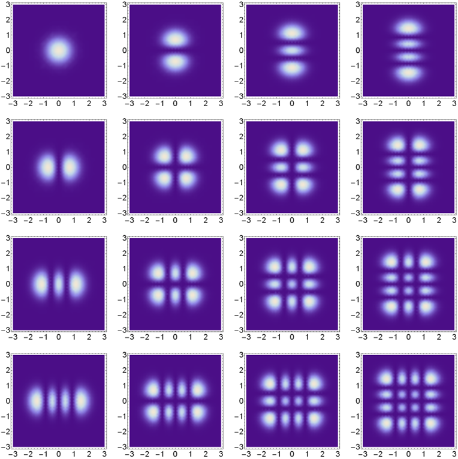

# Overview

The third week of the Gaussian Beams lab builds upon the Python data acquisition skills you developed last week. This week's prelab covers error propagation (how uncertainties in measured quantities affect derived quantities) and introduces the theoretical foundation for Gaussian laser beams, deriving the equations you'll use in Week 4's experiments. In the lab portion, you will use spectral analysis tools to perform Fourier Transforms and analyze signals in the frequency domain. Be sure to document all of your work in your lab notebook.

# Goals

In this week's prelab, you will…

1. …learn to propagate uncertainties from measured to derived quantities.
2. …derive the paraxial wave equation from Maxwell's equations.
3. …understand the Gaussian beam solution and its key parameters ($w_0$, $w(z)$, $R(z)$, $\zeta(z)$).
4. …fit Gaussian beam data to extract beam waist and position.

In this week's lab, you will…

1. …connect mathematical formalism to basic concepts of Fourier Transforms.
2. …compute Fourier Transforms using NumPy's FFT functions.
3. …build a real-time spectral analysis tool.
4. …analyze waveforms in both time and frequency domains.
5. …revisit and refine your beam width measurement from Week 1.

# Prelab

This week's prelab covers two topics: error propagation and the theoretical foundation for Gaussian laser beams.

## Error propagation - from measured to derived quantities

The quantity of interest in an experiment is often derived from other measured quantities. An example is estimating the resistance of a circuit element from measurements of current and voltage, using Ohm's law ($R=V/I$) to convert our measured quantities (voltage and current) into a derived quantity (resistance).

Error propagation comes in when we want to estimate the uncertainty in the derived quantity based on the uncertainties in the measured quantities. Keeping things general, suppose we want to derive a quantity $z$ from a set of measured quantities $a,b,c, \ ... \ $. The mathematical function which gives us $z$ is $z=z(a,b,c, \ ... \ )$. In general, any fluctuation in the measured quantities $a,b,c, \ ... \ $ will cause a fluctuation in $z$ according to

$$\delta z = \left( \frac{\partial z}{\partial a}\right)\delta a+\left( \frac{\partial z}{\partial b}\right)\delta b+\left( \frac{\partial z}{\partial c}\right)\delta c+ \ ...\text{.}\quad\quad$$

This equation comes straight from basic calculus. It's like the first term in a Taylor series. It's the linear approximation of $z(a,b,c, \ ... \ )$ near $(a_0,b_0,c_0, \ ... \ )$. However, we don't know the exact magnitude or sign of the fluctuations, rather we just can estimate the spread in $\delta a, \delta b, \delta c, \ ... \ $, which we often use the standard deviations $\sigma_a, \sigma_b, \sigma_c, \ ... \ $ In this case, the propagated uncertainty in $z$ is:

$$\sigma_z^2 = \left( \frac{\partial z}{\partial a}\right)^2\sigma_a^2+\left( \frac{\partial z}{\partial b}\right)^2\sigma_b^2+\left( \frac{\partial z}{\partial c}\right)^2\sigma_c^2+ \ ...\text{.}\quad\quad$$

There are standard equations provided in courses like the introductory physics lab for the error in the sum, difference, product, quotient. These are all easily derived from this general formula.

## Error propagation in Python

There are two main approaches to error propagation in Python:

### Approach 1: Manual calculation

For simple cases, you can compute partial derivatives manually:

```python
import numpy as np

# Example: R = V / I
# Measured values and uncertainties
V = 5.0      # Voltage (V)
sigma_V = 0.1  # Uncertainty in V
I = 0.5      # Current (A)
sigma_I = 0.02  # Uncertainty in I

# Calculate resistance
R = V / I

# Partial derivatives
dR_dV = 1 / I
dR_dI = -V / I**2

# Propagated uncertainty
sigma_R = np.sqrt((dR_dV * sigma_V)**2 + (dR_dI * sigma_I)**2)

print(f"R = {R:.2f} ± {sigma_R:.2f} Ω")
```

### Approach 2: Using the `uncertainties` package

For more complex calculations, the `uncertainties` package automatically tracks error propagation:

```python
from uncertainties import ufloat
from uncertainties.umath import sqrt  # Use umath for math functions

# Define values with uncertainties
V = ufloat(5.0, 0.1)   # 5.0 ± 0.1 V
I = ufloat(0.5, 0.02)  # 0.5 ± 0.02 A

# Calculate - uncertainty propagates automatically
R = V / I

print(f"R = {R}")  # Shows value ± uncertainty
```

### Exercise: Beam width uncertainty

Later in this prelab, we will model a Gaussian beam's width $w(z)$ as:

$$w(z) = w_0\sqrt{1+\left(\frac{z-z_0}{\pi w_0^2/\lambda}\right)^2}\text{.}$$

For the output beam of one of the lasers in the lab, a fit of beam width versus position gave the following fit parameters:

$$z_0 = -0.03 \pm 0.04 \ m$$

$$w_0=(1.90 \pm 0.09)\times 10^{-6} \ m$$

The wavelength is given by $\lambda = 632.8 \pm 0.1 \ nm$.

1. Use Python to estimate the uncertainty in the derived width $w(z)$ when $z$ is a distance of $2.000 \pm 0.005 \ m$ from the waist position.

   Using the `uncertainties` package:

   ```python
   from uncertainties import ufloat
   from uncertainties.umath import sqrt
   import numpy as np

   # Define parameters with uncertainties
   z0 = ufloat(-0.03, 0.04)           # m
   w0 = ufloat(1.90e-6, 0.09e-6)      # m
   wavelength = ufloat(632.8e-9, 0.1e-9)  # m
   z = ufloat(2.000, 0.005)           # m

   # Calculate beam width
   z_R = np.pi * w0**2 / wavelength  # Rayleigh range
   w = w0 * sqrt(1 + ((z - z0) / z_R)**2)

   print(f"w(z) = {w}")
   ```

## Gaussian beam theory

Light is a propagating oscillation of the electromagnetic field. The general principles which govern electromagnetic waves are Maxwell's equations. From these general relations, a vector wave equation can be derived.

$$ \nabla^2\vec{E}=\mu_0\epsilon_0 \frac{\partial^2\vec{E}}{\partial t^2}\text{.}$$ {#eq:1}


One of the simplest solutions is that of a plane wave propagating in the $\hat{z}$ direction:

$$\vec{E}(x,y,z,t)=E_x\hat{x}cos(kz-\omega t+\phi_x)+E_y\hat{y}cos(kz-\omega t+\phi_y)\text{.}\quad\quad$$ {#eq:2}

But as the measurements from the first week showed, our laser beams are commonly well approximated by a beam shape with a Gaussian intensity profile. Apparently, since these Gaussian profile beams exist, they must be solutions of the wave equation. The next section will discuss how we derive the Gaussian beam electric field, and give a few key results.

## Paraxial wave equation {#sec:wave-eqn}

One important thing to note about the beam output from most lasers is that the width of the beam changes very slowly compared to the wavelength of light. Assume a complex solution, where the beam is propagating in the $\hat{z}$-direction, with the electric field polarization in the $\hat{x}$-direction:

$$\vec{E}(x,y,z,t)=\hat{x}A(x,y,z)e^{kz-\omega t}\text{.}$$ {#eq:3}

The basic idea is that the spatial pattern of the beam, described by the function $A(x,y,z)$, does not change much over a wavelength. In the case of the He-Ne laser output, the function $A(x,y,z)$ is a Gaussian profile that changes its width as a function of $z$. If we substitute the trial solution in Equation @eq:3 into the wave equation in Equation @eq:1 we get

$$\hat{x} \left[ \left(\frac{\partial^2A}{\partial x^2} +\frac{\partial^2A}{\partial y^2} +\frac{\partial^2A}{\partial z^2} \right) +2ik\frac{\partial A}{\partial z} - k^2A \right]e^{i(kz-\omega t)}=\hat{x}\mu_0\epsilon_oA(-\omega^2)e^{i(kz-\omega t)}\text{.}\quad\quad$$ {#eq:4}

This can be simplified recognizing that $k^2=\omega^2/c^2=\mu_0\epsilon_0\omega^2$, where the speed of light is related to the permeability and permittivity of free space by $c=(\mu_0\epsilon_0)^{-1/2}$. Also, the $\hat{x}e^{i(kz-\omega t)}$ term is common to both sides and can be dropped, which results in

$$\left(\frac{\partial^2A}{\partial x^2} +\frac{\partial^2A}{\partial y^2} +\frac{\partial^2A}{\partial z^2} \right) +2ik\frac{\partial A}{\partial z}=0\text{.}\quad\quad$$ {#eq:5}

So far, we have made no approximation to the solution or the wave equation, but now we apply the assumption that $\partial{A}(x,y,z)/\partial{z}$ changes slowly over a wavelength $\lambda = 2\pi /k$, so we neglect the term

$$\left| \frac{\partial^2A}{\partial z^2} \right| \ll \left|2k\frac{\partial A}{\partial z}\right|\text{.}$$ {#eq:6}

Finally, we get the paraxial wave equation,

$$\frac{\partial^2A}{\partial x^2} +\frac{\partial^2A}{\partial y^2} +\frac{\partial^2A}{\partial z^2}=0\text{.}$$ {#eq:7}

One set of solutions to the paraxial wave equation are Gauss-Hermite beams, which have an intensity profiles like those shown in Figure @fig:gauss-hermite. These are the same solutions as for the quantum simple harmonic oscillator, a topic that could be further explored as a final project.

The simplest of these solutions is the Gaussian beam, which has an electric field given by

$$\vec{E}(x,y,z,t) = \vec{E}_0\frac{w_0}{w(z)}exp\left(-\frac{x^2+y^2}{w^2(z)}\right)exp\left(ik\frac{x^2+y^2}{2R(z)}\right)e^{-i\zeta(z)}e^{i(kz-\omega t)}\text{,}\quad\quad$$ {#eq:8}

where $\vec{E_0}$ is a time-independent vector (orthogonal to propagation direction $\hat{z}$) whose magnitude denotes the amplitude of the laser's electric field and the direction denotes the direction of polarization. The beam radius $w(z)$is given by

$$w(z)=w_0\sqrt{1+\left(\frac{\lambda z}{\pi w_0^2}\right)^2}\text{.}$$ {#eq:9}

$R(z)$,the radius of curvature of the wavefront, is given by

$$R(z)=z\left(1+\left(\frac{\pi w_0^2}{\lambda z}\right)^2\right)\text{,}$$ {#eq:10}

and the Gouy phase is given by

$$\zeta(z)=arctan\frac{\pi w_0^2}{\lambda z}\text{.}$$ {#eq:11}

The remarkable thing about all these equations is that only two parameters need to be specified to give the whole beam profile: the wavelength $\lambda$ and the beam waist $w_0$, which is the narrowest point in the beam profile. There is a more general set of Hermite Gaussian modes which are shown in Figure @fig:gauss-hermite. The laser cavity typically produces the (0,0) mode shown in the upper left corner, but an optical cavity can also be used to create these other modes – a topic that can be explored in the final projects.

{#fig:gauss-hermite width="20cm"}

## Trying out the Gaussian beam model

In the first week of the lab, we assumed the intensity profile of the Gaussian beam was given by $I(x,y)=I_{max}e^{-2(x^2+y^2)/w^2}$. The equation for the electric field of the Gaussian Beam in Equation @eq:8 looks substantially more complicated.

1. How are the expressions for electric field and intensity related?
2. Is Equation @eq:8 consistent with the simple expression for intensity $I(x,y)=I_{max}e^{-2(x^2+y^2)/w^2}$?

The Gaussian beam equations given in Equations @eq:8 -@eq:11 assume the beam comes to its narrowest width (called the beam waist, $w_0$) at $z=0$.

3.  How would you rewrite these four equations assuming the beam waist occurs at a different position $z=z_w$?
4.  One way to check your answer is to make sure the equations simplify to Equations @eq:8 -@eq:11 in the special case of $z_w=0$.
5.  Write a Python function to fit [this data set](../resources/lab-guides/gaussian-laser-beams/Test_beam_width_data.csv). Assume the wavelength is $\lambda=632.8\ nm$.
    1. What is the functional form for your fit function?
    2. What are the different fit parameters and what do they mean?
    3. Is it a linear or nonlinear fit function? Why?
6.  You should get that a beam waist of $w_0=(93.9\pm0.1)\times10^{-6}\ m$ and occurs at a position $z_w=0.3396\pm0.0003\ m$.

# Fourier Analysis Techniques

In Week 2, you learned about the Nyquist frequency and how sample rate affects your ability to accurately capture signals. This week, we'll analyze signals in the **frequency domain** using Fourier Transforms. This is a powerful technique used throughout physics and engineering.

## Introduction to Fourier Transforms

The discrete Fourier Transform of a set of data $\{y_0,y_1, ... , y_{N-1}\}$ is given by

$$Y_m=\displaystyle \sum_{n=0}^{N-1}y_n\cdot e^{-2\pi i \frac{m}{N}n}$$

The basic idea is that a Fourier Transform decomposes the data into a set of different frequency components, so the amplitude of $Y_m$ tells you how much of your signal was formed by an oscillation at the $m$-th frequency.

### Basic Fourier Concepts {#sec:basic-fourier}

1. How do the units of the Fourier Transform array $Y_m$ relate to the units of the data $y_n$?
2. Does the data $y_n$ have to be taken at equally spaced intervals?
3. Is it possible for two different sets of data to have the same Fourier Transform?
4. If a data set has $N$ elements, how long is the discrete Fourier Transform?

## Computing the Power Spectrum in Python

NumPy provides efficient FFT (Fast Fourier Transform) functions for spectral analysis:

```python
import numpy as np

def compute_spectrum(data, sample_rate):
    """
    Compute the one-sided power spectrum of a signal.

    Parameters:
        data: 1D array of signal values
        sample_rate: Sample rate in Hz

    Returns:
        frequencies: Array of frequency values
        power: Power spectrum (magnitude squared)
    """
    n = len(data)

    # Compute FFT
    fft_result = np.fft.fft(data)

    # Get positive frequencies only (real signal has symmetric spectrum)
    n_unique = n // 2 + 1
    frequencies = np.fft.fftfreq(n, d=1/sample_rate)[:n_unique]
    frequencies = np.abs(frequencies)

    # Power spectrum (magnitude squared, normalized)
    power = (np.abs(fft_result[:n_unique]) / n) ** 2
    power[1:-1] *= 2  # Double power for frequencies with both +/- components

    return frequencies, power
```

### Frequency Resolution and Maximum Frequency

The relationship between your acquisition parameters and the spectrum is:

```python
# Frequency resolution and maximum frequency
freq_resolution = sample_rate / num_samples  # Hz per bin
max_frequency = sample_rate / 2  # Nyquist frequency

print(f"Frequency resolution: {freq_resolution} Hz")
print(f"Maximum frequency: {max_frequency} Hz")
```

**Key relationships:**

- **Frequency resolution** = Sample Rate / Number of Samples
- **Maximum frequency** (Nyquist) = Sample Rate / 2

If the data is sampled for 2 seconds at 100 Hz sample rate:
- Number of samples = 200
- Frequency resolution = 100 Hz / 200 = 0.5 Hz
- Maximum frequency = 100 Hz / 2 = 50 Hz

## Building a Real-Time Spectral Analyzer

Create a script that acquires data and displays both time-domain and frequency-domain views simultaneously:

```python
import nidaqmx
import numpy as np
import matplotlib.pyplot as plt
from nidaqmx.constants import AcquisitionType
from IPython.display import display, clear_output

# Configuration
SAMPLE_RATE = 10000  # Hz
NUM_SAMPLES = 2000
DAQ_CHANNEL = "Dev1/ai0"

def compute_spectrum(data, sample_rate):
    """Compute one-sided power spectrum."""
    n = len(data)
    fft_result = np.fft.fft(data)
    n_unique = n // 2 + 1
    frequencies = np.abs(np.fft.fftfreq(n, d=1/sample_rate)[:n_unique])
    power = (np.abs(fft_result[:n_unique]) / n) ** 2
    power[1:-1] *= 2
    return frequencies, power

# Set up plots
fig, (ax1, ax2) = plt.subplots(2, 1, figsize=(12, 8))

# Time domain plot
line1, = ax1.plot([], [], 'b-')
ax1.set_xlabel('Time (ms)')
ax1.set_ylabel('Voltage (V)')
ax1.set_title('Time Domain')
ax1.grid(True, alpha=0.3)

# Frequency domain plot
line2, = ax2.plot([], [], 'r-')
ax2.set_xlabel('Frequency (Hz)')
ax2.set_ylabel('Power')
ax2.set_title('Frequency Domain (Power Spectrum)')
ax2.grid(True, alpha=0.3)
ax2.set_xlim(0, SAMPLE_RATE / 2)

plt.tight_layout()

last_data = None

with nidaqmx.Task() as task:
    task.ai_channels.add_ai_voltage_chan(DAQ_CHANNEL)
    task.timing.cfg_samp_clk_timing(
        rate=SAMPLE_RATE,
        sample_mode=AcquisitionType.CONTINUOUS
    )
    task.start()

    print("Acquiring data... Press Ctrl+C (or Interrupt Kernel) to stop")

    try:
        while True:
            # Drain buffer to prevent overflow
            samples_available = task.in_stream.avail_samp_per_chan
            if samples_available >= NUM_SAMPLES:
                data = task.read(number_of_samples_per_channel=samples_available)
                # Use most recent samples
                data = data[-NUM_SAMPLES:]
                last_data = np.array(data)

                # Update time domain plot
                time_ms = np.arange(len(data)) / SAMPLE_RATE * 1000
                line1.set_data(time_ms, data)
                ax1.set_xlim(0, time_ms[-1])
                ax1.set_ylim(np.min(data) - 0.1, np.max(data) + 0.1)

                # Update frequency domain plot
                frequencies, power = compute_spectrum(np.array(data), SAMPLE_RATE)
                line2.set_data(frequencies, power)
                ax2.set_ylim(0, np.max(power) * 1.1 + 0.001)

                clear_output(wait=True)
                display(fig)

    except KeyboardInterrupt:
        print("\nStopped by user")

# Save last dataset
if last_data is not None:
    np.savetxt('last_acquisition.csv',
               np.column_stack([np.arange(len(last_data))/SAMPLE_RATE, last_data]),
               delimiter=',', header='Time (s), Voltage (V)', comments='')
    print("Last dataset saved to 'last_acquisition.csv'")

plt.close(fig)
```

## Exercises: Spectral Analysis

### Understanding Frequency Resolution

1. Use a waveform generator to output a waveform of your choice at a frequency in the tens of Hz to kHz range and view the output on the oscilloscope and in your Python script.

2. Look at the spectral analysis. How do the **frequency resolution** (frequency step size between data in the spectrum) and **maximum frequency** relate to the **sample rate** and **number of samples**? Verify the algebraic relationship experimentally.

3. If the data is sampled for 2 seconds at 100 Hz sample rate, what frequency does the $m$-th component of the Fourier Transform correspond to?

4. How many points are shown in the spectral analysis plot? How does this compare to the number of points you expected in the Fourier transform (see Section @sec:basic-fourier\.4)?

   **Note**: The data acquired from the DAQ is always a sequence of real numbers $\{y_n\}$. Under the condition that the signal is only real numbers, it can be proved that $Y_m=Y_{N-M}^*$ so $|Y_M|=|Y_{N-m}|$, meaning the spectrum is symmetric about the $N/2$-th data point, which corresponds to the Nyquist frequency. For this reason, we typically only plot the first half of the Fourier spectrum up to the Nyquist frequency.

### Analyzing Different Waveforms

1. How do you expect the spectrum of a **sine wave** to look? How should it change as you vary the amplitude and frequency on the waveform generator? Try it.

2. How do you expect the spectrum of a **square wave** to look? How should it change as you vary the amplitude and frequency on the waveform generator? Try it.

   (Hint: you can look up or calculate the Fourier Series of a square wave to see if the observed amplitudes agree with the mathematical prediction.)

3. Generate a signal with **two frequencies** (if your function generator supports this, or use the sum of two signals). Can you identify both frequencies in the spectrum?

### Analyzing Saved Data

Sometimes you may want to analyze data after it is saved rather than in real-time:

```python
import numpy as np
import matplotlib.pyplot as plt

# Load saved data
data = np.loadtxt('saved_waveform.csv', delimiter=',', skiprows=1)
time = data[:, 0]
signal = data[:, 1]

# Determine sample rate from time data
sample_rate = 1 / (time[1] - time[0])

# Compute FFT
n = len(signal)
fft_result = np.fft.fft(signal)

# Create frequency axis
frequencies = np.fft.fftfreq(n, d=1/sample_rate)

# Get positive frequencies only
positive_mask = frequencies >= 0
freq_positive = frequencies[positive_mask]
magnitude = np.abs(fft_result[positive_mask]) / n

# Plot spectrum
plt.figure(figsize=(10, 6))
plt.plot(freq_positive, magnitude)
plt.xlabel('Frequency (Hz)')
plt.ylabel('Magnitude')
plt.title('Fourier Transform of Saved Data')
plt.grid(True, alpha=0.3)
plt.show()
```

### Exercises with Saved Data

1. Import any saved data set of a periodic function saved from the DAQ or the oscilloscope.

2. Use NumPy's `fft` function to compute the discrete Fourier Transform of the signal.
   1. Do you expect the FFT output to be real-valued or complex-valued?

3. Plot the output of the FFT function. Since the output is complex-valued, plot `np.abs()` or `np.abs()**2`.
   1. What is the x-axis range and step-size in the plot?
   2. What frequency range and step size should be displayed on the x-axis?

4. Make sure to add the frequency column to create a proper plot of spectrum vs. frequency:

   ```python
   # Complete example
   n = len(signal)
   sample_rate = 10000  # Adjust to your actual sample rate

   # Compute FFT and frequencies
   fft_result = np.fft.fft(signal)
   frequencies = np.fft.fftfreq(n, d=1/sample_rate)

   # One-sided spectrum (positive frequencies)
   n_half = n // 2 + 1
   freq_pos = frequencies[:n_half]
   magnitude = np.abs(fft_result[:n_half]) * 2 / n  # Normalize and account for one-sided
   magnitude[0] /= 2  # DC component doesn't double

   plt.figure(figsize=(10, 6))
   plt.plot(freq_pos, magnitude)
   plt.xlabel('Frequency (Hz)')
   plt.ylabel('Magnitude')
   plt.xlim(0, sample_rate/2)
   plt.grid(True, alpha=0.3)
   plt.show()
   ```

5. Does the spectral analysis show the same spectrum at the same frequencies that you expect from the waveform generator settings?

6. NumPy's FFT uses specific conventions. You can check the documentation with:

   ```python
   help(np.fft.fft)
   ```

   The convention used is: $Y_k = \sum_{n=0}^{N-1} y_n e^{-2\pi i k n / N}$

# Revisit Measuring the Beam Width

Next week you will be using the motor controller you set up last week to automate beam profile measurements. To be prepared for this endeavor, you should now go back and review (and complete) [section 7](/PHYS-4430/lab-guides/gaussian-beams-1#measuring-the-beam-width) from Week 1.

Make sure you can:

1. Take a complete beam profile measurement manually
2. Fit the data using the error function model
3. Extract the beam width $w$ with uncertainty
4. Create a plot showing the data and fit

This will serve as your baseline for comparison with the automated measurements next week.
