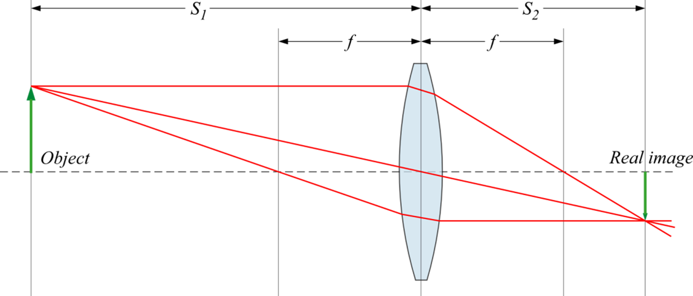

# Where We Are in the Sequence

**Week 4 of 4: Automated Measurement and Model Testing**

This is the culmination of the Gaussian Beams sequence. You've built the skills and made the decisions necessary for today's work: optical alignment (Week 1), photodetector calibration (Week 1), noise characterization and gain selection (Week 2), Gaussian beam theory (Week 3), and motor control (Week 3). Now you'll put it all together to test the Gaussian beam model quantitatively.

**Previous weeks:** Foundations → Noise characterization → Theory and motor setup
**This week:** Validate setup → Automated measurements → Test Gaussian beam model → Investigate lens effects

# Overview

In Week 1, we measured the profile of the laser and found it to be Gaussian to a good approximation. In Week 3, we derived the Gaussian beam model and learned how the profile changes as the beam propagates. This week, we will apply automation to more rapidly take data and test the model experimentally. Since you already set up and verified the motor controller in Week 3, we can focus on the physics.

# Learning Goals

After completing this week's lab, you will be able to:

1. Run automated beam profile measurements using Python to control the motor and DAQ.
2. Validate that your automated measurement system produces results consistent with manual methods.
3. Measure beam width $w(z)$ at multiple positions and fit to extract $w_0$ and $z_w$ with uncertainties.
4. Test the Gaussian beam model by comparing measured $w(z)$ to theoretical predictions.
5. Explain how a lens modifies a Gaussian beam and compare to geometric optics predictions.
6. Evaluate whether the thin lens equation accurately predicts image location for Gaussian beams.
7. Identify sources of systematic error when predictions and measurements disagree.

# Prelab

This week's prelab focuses on preparing for automated data acquisition. Review the Gaussian beam theory from Week 3's prelab, particularly the beam width equation:

$$w(z)=w_0\sqrt{1+\left(\frac{\lambda z}{\pi w_0^2}\right)^2}\text{.}$$

You will use this model to analyze your automated measurements.

# Verify Your Setup

In Week 3, you set up and verified the motor controller. In Week 2, you learned to use the DAQ and characterized your photodetector's noise. Before starting the experiments, confirm everything is still working:

1. [ ] DAQ can read voltages from the photodetector
2. [ ] Python can connect to the motor controller (check your serial number: ____________)
3. [ ] Motor moves when commanded

If you encounter issues, refer back to the troubleshooting section in Week 3's lab guide.

## Validate Your Gain Setting

Before your first automated scan, complete the **Week 4 Validation** section from Week 2's noise characterization (Part 5). This closes the loop on your photodetector characterization:

1. With the beam fully blocked, acquire 100 samples and record the mean and RMS
2. With the beam fully exposed, acquire 100 samples and record the mean and RMS
3. Calculate your actual SNR and compare to your Week 2 prediction
4. If the SNR differs significantly from your prediction, decide whether to adjust your gain setting

**Your selected gain setting from Week 2:** _______ dB

# Automation of the Measurement

Before we begin this week's lab, reflect on your experience from Week 1 (and perhaps refer to your lab notebook entry to help guide your memory).

1. In Week 1, how long did the total process of data taking through analysis take to make a measurement of the beam width $w$?
2. In this lab, you may have to take 20-30 beam profiles in order to measure $w_0$ and $z_w$. How long would this take with your manual method?
3. What are the most time-consuming portions of the process? Which parts benefit most from automation?

## Running the Beam Profiler

The automation script is available at:
`resources/lab-guides/gaussian-laser-beams/python/04_beam_profiler.py`

### Basic Usage

Navigate to the script directory and run:

```bash
python 04_beam_profiler.py
```

The script will prompt you for:

1. **Motor serial number**: Found on the KST101 display (e.g., "26004813")
2. **Step size (mm)**: How far to move between measurements (recommend 0.05 mm)
3. **Wait time (ms)**: Delay after each step (recommend 500 ms)
4. **Direction**: "forward" or "backward"

### Choosing Parameters

**Step Size**: Smaller step sizes give higher resolution but take longer:
- 0.05 mm is a good starting point for most beams
- Use smaller steps (0.02-0.03 mm) for tightly focused beams
- You can use larger steps (0.1 mm) for initial alignment

**Wait Time**: This ensures measurements are taken after vibrations settle:
- 500 ms is usually sufficient
- Increase if you see noisy data

### Output Files

The script automatically generates two files with timestamps:

1. **CSV data file**: `beam_profile_YYYYMMDD_HHMMSS.csv`
   - Two columns: Position (mm), Voltage (V)
   - Ready for analysis with your fitting code from Week 1

2. **Plot image**: `beam_profile_YYYYMMDD_HHMMSS.png`
   - Quick visualization of the measured profile

### Validating the Automation

4. Test and run the automated Python program and evaluate the result using the same Python analysis from Week 1.
5. Before you go on, make sure the automated acquisition and analysis routine gives the same result as the method you used in Week 1.
6. How long does your new measurement method take? (2-3 minutes per $w$ measurement is very good.)

## Customizing the Script (Optional)

If you need to modify the script behavior:

### Changing the DAQ Channel

If your photodetector is connected to a different channel (e.g., AI1):

```python
profiler = BeamProfiler(serial_number, daq_channel="ai1")
```

### Adding Averaging

For noisy signals, you can modify `read_voltage()` to average multiple samples:

```python
def read_voltage(self, num_samples=10):
    """Read averaged voltage from DAQ."""
    with nidaqmx.Task() as task:
        task.ai_channels.add_ai_voltage_chan(
            f"{self.daq_device}/{self.daq_channel}"
        )
        voltages = task.read(number_of_samples_per_channel=num_samples)
        return np.mean(voltages)
```

# The Experiment

The Gaussian beam model of light is useful because it often describes the beam of light created by lasers. This section will test the validity of the model for our He-Ne laser beam. Also, the effect of a lens on a Gaussian beam will be tested, and the Gaussian beam model will be compared with predictions from the simpler ray theory. Lastly, the Gaussian beam theory can be used to describe the minimum possible focus size for a beam and a lens.

## Measuring the Beam Profile Without Any Lenses

There is a straightforward reason that a He-Ne laser should produce a Gaussian beam. The laser light builds up between two mirrors, and the electromagnetic mode that best matches the shape of the mirrors is the Gaussian beam.

1. Considering the Gaussian beam equations from Week 3's prelab (the electric field, beam width $w(z)$, radius of curvature $R(z)$, and Gouy phase $\zeta(z)$), which aspects of the Gaussian beam model can you test? Are there any parts of the model you cannot test?

2. Measure the beam width $w$ at various distances from the laser. Consider carefully:
   - What distance should be varying: laser to razor, razor to photodetector, or laser to photodetector?
   - How did you decide what positions $z$ to measure the width at?
   - Use meter sticks and other measurement tools available in the lab.

3. Fit the data to $w(z)$, the predicted expression for a Gaussian beam:
   $$w(z)=w_0\sqrt{1+\left(\frac{\lambda z}{\pi w_0^2}\right)^2}$$

4. What is the value of the beam waist $w_0$ (including uncertainty)? Where does the beam waist $z_w$ occur relative to the laser?

### Tips for Good Measurements

1. **Starting Position**: Position the razor so the beam is fully unblocked. Use the manual jog controls on the KST101 to find a good starting point.

2. **Scan Range**: Make sure your scan covers the full transition from unblocked to fully blocked. Include some data before and after the transition.

3. **Real-Time Monitoring**: Watch the live plot as data comes in. You can press Ctrl+C to stop early if something looks wrong.

4. **File Organization**: Consider adding descriptive prefixes to filenames to help organize your data (e.g., "z=50cm_beam_profile_...").

### Data Quality Assessment

After your first few beam profile measurements, assess whether your data quality matches your predictions from Weeks 2 and 3:

1. **Measure actual noise**: Examine the flat regions of your beam profile data (where the beam is fully blocked or fully unblocked). Calculate the RMS scatter of points in these regions.

2. **Compare to predictions**: How does your measured RMS compare to:
   - Your Week 2 SNR predictions?
   - Your Week 3 noise spectrum prediction for averaged samples?

3. **Evaluate and adjust**:
   - If actual noise is *higher* than predicted: What could cause this? (Vibrations? Ambient light? Insufficient settling time?)
   - If actual noise is *lower* than predicted: Good! Your predictions were conservative.
   - If noise is significantly different, consider adjusting your measurement parameters (averaging, wait time) before taking more data.

This closes the loop on your noise characterization work and validates your instrumentation decisions.

## How Does a Lens Change a Gaussian Beam?

Pick a non-compound lens (not the fancy camera lenses) with focal length in the range 100-200 mm and assemble it in a lens mount with a retaining ring (see Figure @fig:mount-assembley). Recall that it's very important that you **do not handle optical components** (lenses, mirrors, polarizers, wave plates, beam splitters, etc.) **with your bare hands**. The oils on your skin can damage the optics and degrade the light in your experiment. Always handle these components while using **latex/nitrile gloves or finger cots**.

Design and carry out an experiment to quantitatively answer the questions below. Consider carefully where to put the lens. Your data for this section can be used in the next section.

1. Insert a lens (after the mirrors) into the beam path to change the divergence/convergence of the beam but keep its propagation direction the same.
2. When this condition (the beam propagation direction is unchanged) is met, where does the beam intersect the lens? *Note: This is the preferred method of adding a lens to an optical setup.*
3. Does the beam retain a Gaussian profile after the lens?
4. What is the new beam waist $w_0$ and where does it occur?
5. What factors affect the beam profile after the lens?
6. Does the measured $w(z)$ match the Gaussian beam prediction $w(z)=w_0\sqrt{1+\left(\frac{\lambda z}{\pi w_0^2}\right)^2}$?

{#fig:mount-assembley width="15cm"}

## Quantitatively Modeling the Effect of a Lens

One of the simplest ways to model the effect of a lens is the thin lens equation, which is based on a ray model of light (see Figure @fig:ray-diagram).

$$ \frac{1}{S_1}+\frac{1}{S_2}=\frac{1}{f}$$

1. Redraw Figure @fig:ray-diagram to show how it would change when the light is modeled as a Gaussian beam, rather than rays. In particular, where should the beam waists occur? What determines the relative width of the beam waist?

2. Experimentally test the accuracy of the thin lens equation for the imaging of Gaussian beams. Follow this quantitative procedure:

   1. **Predict:** Using the thin lens equation, calculate the predicted image position $S_2$ from your measured object distance $S_1$ and the lens focal length $f$. Propagate the uncertainties in $S_1$ and $f$ to get an uncertainty in $S_2$.

   2. **Measure:** From your beam width data, determine the actual position of the beam waist (image location) after the lens. Include uncertainty from your fit.

   3. **Compare:** Calculate the discrepancy between predicted and measured image positions. Is the discrepancy smaller than the combined uncertainty? If $|S_{2,predicted} - S_{2,measured}| < \sqrt{\sigma_{pred}^2 + \sigma_{meas}^2}$, the agreement is consistent with your uncertainties.

   4. **Interpret:** If they disagree beyond uncertainties, this indicates either underestimated uncertainties or systematic effects. Proceed to question 3.

3. Systematic errors: Under what conditions should the thin lens equation be most valid? How do these conditions compare to conditions of your actual measurements? Can you get better agreement?

{#fig:ray-diagram width="15cm"}

## Advanced Investigation: Minimum Spot Size

If time permits, investigate the following:

1. What determines the minimum spot size you can achieve with a lens?
2. How does this relate to the concept of the "diffraction limit"?
3. Try using a lens with shorter focal length. Does it produce a smaller spot? What are the tradeoffs?

# Appendix: Understanding the Beam Profiler Code

The beam profiler script uses a class-based structure. Understanding the code will help you modify it if needed and troubleshoot issues.

## The `BeamProfiler` Class

```python
class BeamProfiler:
    def __init__(self, serial_number, daq_device="Dev1", daq_channel="ai0"):
        """Initialize with motor serial number and DAQ settings."""

    def connect(self):
        """Connect to motor controller, configure velocity."""

    def get_position(self):
        """Read current position in mm."""

    def move_to(self, position_mm):
        """Move to absolute position."""

    def read_voltage(self):
        """Read single voltage from DAQ."""

    def run_scan(self, step_size_mm, wait_time_ms, direction, max_steps):
        """Execute the automated scan with real-time plotting."""
```

## The Main Measurement Loop

The core logic in `run_scan()` follows this pattern:

```python
for step_num in range(max_steps):
    # 1. Read current position
    position = self.get_position()

    # 2. Read photodetector voltage
    voltage = self.read_voltage()

    # 3. Save data point immediately
    writer.writerow([position, voltage])

    # 4. Update real-time plot
    # (matplotlib code)

    # 5. Move to next position
    self.move_to(position + step)

    # 6. Wait for vibrations to settle
    time.sleep(wait_time_ms / 1000)
```

This is essentially the same logic you would use when taking data manually, just automated.

## Troubleshooting

### "Device not found" Error
- Check USB connection
- Verify serial number matches the display on the KST101
- Make sure no other software (APT User, Kinesis) is using the motor

### Motor Doesn't Move
- Ensure power is connected to the KST101
- Check that the stage isn't at a travel limit
- Verify the stage type is configured correctly in Kinesis (ZST225B)

### Voltage Reads Zero
- Check photodetector power
- Verify BNC cable connections to DAQ
- Make sure the beam actually hits the photodetector

### Noisy Data
- Increase wait time between steps
- Check for mechanical vibrations in your setup
- Shield the photodetector from ambient light
- Average multiple DAQ readings per point (see "Adding Averaging" above)

# Deliverables and Assessment

Your lab notebook should include the following for this week:

## Setup Validation

1. **Week 2 noise validation** (Part 5 from Week 2):
   - Completed prediction vs. measurement table
   - Reflection on the predict-measure-compare cycle
2. **Gain setting confirmation**: your selected gain with any adjustments from Week 2

## Beam Profile Without Lenses

1. **Automated vs. manual comparison**: beam width from both methods with uncertainties
2. **Multiple position measurements**: table of $z$ positions and corresponding $w$ values
3. **Gaussian beam fit**:
   - Plot of $w(z)$ data with fit curve
   - Extracted $w_0$ and $z_w$ with uncertainties
   - Comparison to theoretical prediction

## Lens Investigation

1. **Experimental design**: description of your measurement strategy
2. **Data and analysis**:
   - Beam profiles before and after lens
   - New beam waist $w_0$ and position $z_w$
   - Test of whether beam remains Gaussian
3. **Thin lens equation test**:
   - Measured vs. predicted image position
   - Quantitative comparison with uncertainties

## Key Results Summary

| Measurement | Value | Uncertainty | Notes |
|-------------|-------|-------------|-------|
| $w_0$ (no lens) | _______ | _______ | _______ |
| $z_w$ (no lens) | _______ | _______ | _______ |
| $w_0$ (with lens) | _______ | _______ | _______ |
| $z_w$ (with lens) | _______ | _______ | _______ |

## Reflection Questions

1. Your measured beam waist occurs 5 cm from the position predicted by the thin lens equation. List three possible explanations and describe measurements that would distinguish between them.

2. You have 30 minutes remaining and want to improve your measurement of $w_0$. You could either: (a) take more beam profiles at closely spaced $z$ positions, or (b) take fewer profiles but with more averaging per profile. Which would you choose to minimize uncertainty in $w_0$? Justify your answer.

3. **Predict-measure-compare reflection**: Compare your Week 2 SNR predictions to your Week 4 measurements. What did you learn from this process? What would you do differently if characterizing a new instrument in the future?
