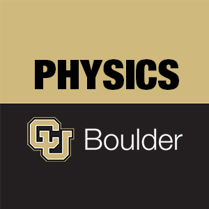

# Introduction

In the research lab it is common to design and build custom equipment to carry out the measurement.  One of the course goals for the advanced lab is to prepare you for this through the guided labs and the final project.  In this lab you will start with a basic design for and spectrometer, build it, calibrate it, and characterize its performance, and identify the aspects of the design that limit the performance most significantly.

In the second week of the lab you will redesign your week 1 setup to improve some the most significant sources of uncertainty.  The redesign gives you an opportunity for creativity guided by quantitative scientific reasoning. 

# Goals

1. You will be able to create a good model of your measurement device, which means having a good calibration fit to your data, and also a quantitative estimate of the various uncertainty sources and how they limit the resolution, precision, and accuracy of your spectrometer. 
2. You will also be able to make well-reasoned decisions about how to improve the design of your spectrometer based on your model of the spectrometer. 
3. You will be able to explain how diffraction gratings can be used to separate different colors of light using both physical ideas and mathematics. 

# Week 1

## Diffraction grating and spectrometers

A spectrometer is a device that can measure the wavelengths of light emitted from a source.  One basic requirement for a spectrometer is that it can spatially separate different wavelengths.  There are two common options for separating different wavelengths of light: prisms and diffraction gratings.  Prisms separate wavelengths because the glass has an index of refraction which depends on wavelength.  The different colors get refracted at different angles.  The diffraction grating causes different colors of light to be diffracted at different angles.  Diffraction works using interference.  The diffracted beams go off in directions where there is constructive interference between light scattering off the pattern on the grating.  

# Kinds of diffraction gratings

All diffraction gratings commonly used are reproduced from master gratings.  The master gratings have a periodic pattern which causes the light to be diffracted.  Two important distinguishing features among gratings are (1) Where does the diffracted light go? And (2) How is the master grating made? 

The two options for where the light goes are reflection gratings and transmission gratings.  Reflection gratings have a mirror surface so that the diffracted beams are reflected. Transmission gratings have some transparency so there are diffracted beams in the transmitted direction. 

The two common options for producing a master grating are ruled gratings and holographic gratings.  Ruled gratings are produced by etching grooves in a thin film of metal.  Holographic grating masters are produced by exposing photoresist to an interference pattern produced by two beams of light.  The molecular bonds in the thin layer of photoresist are altered by light allowing it to be preferentially dissolved where the light is the most intense.  

If you want to know more about gratings you might find these resources helpful. 

- A basic overview is available from the Thorlabs "grating selection guide" and "gratings tutorial" available as tabs on the product information for their diffraction gratings. http://www.thorlabs.com/NewGroupPage9.cfm?ObjectGroup_ID=25 
- In depth guide on principles and manufacturing of gratings from Thermo RGL (Richardson Grating Laboratory). http://capem.buffalo.edu/lab-manuals/dgh.pdf 

{#fig:diff-grating width="15cm"}

## Mathematical and physical understanding of diffraction

The "grating equation" gives the relationship between the incident angle of the beam $\theta_i$ and angle of the n-th order diffracted beam $\theta_{r,n}$ for a particular wavelength of light $\lambda$, and grating spacing $a$. The grating spacing $a$ is explained in Figure @fig:diff-grating. The grating equation is given in Eq. (1): 

$$a(sin \theta_{r,n} - sin \theta_i)=n\lambda$${#eq:1}

1. Figure @fig:diff-pictures shows to pictures of diffraction.
   1. Mathematically show that the diagram on the right, which uses wave vectors, predicts same "grating equation" given in Equation @eq:1.
   2. Explain the wave vector diagram in terms of constructive interference. In particular, why does the  y-component of the wave vector change in integer increments of $\delta k_y = 2\pi/a$?
2. In the basic spectrometer you will build later in the lab, a lens is used to image the light source, but a diffraction grating is placed prior to the image being formed.   
   1. Draw a diagram of how a point source of light images as it diffracts off the grating. Where do the different colors of images go? 
   2. Do the images focus the same distance away? 
3. How does the grating equation simplify when we only look for diffracted beams which return along the incident angle (i.e., $\theta_{r,n} = -\theta_i$)?

{#fig:diff-pictures width="15cm"}

## Hydrogen spectrum for calibration

In this lab, you will use the emission spectrum of hydrogen to calibrate your spectrometer. Hydrogen has a theoretically predictable spectrum given by the Rydberg equation:

$$\frac{1}{\lambda}=R_H\left(\frac{1}{n_1^2}-\frac{1}{n_2^2} \right),$${#eq:2}

where $R_H=1.0973731~\text{x}~10^7m^{-1}.$

The calibrated spectrometer will then be used to measure the wavelengths of mercury, which has no easily predictable formula for the spectral wavelengths. 

1. Using the Rydberg equation for the spectrum of hydrogen, predict the visible lines between 400 and 700 nm. 

# Simple spectrometer design

This section of the lab will ask you to construct a simple spectrometer design. Often times when designing an apparatus, it is best to start with an existing basic design, test it, understanding its limitations, and then redesign it to make improvements. In this lab you will perform the following four steps: 

- Build a basic diffraction spectrometer.
- Characterize its performance (accuracy, precision, resolution).
- Calibrate it using the hydrogen spectrum.
- Measure the mercury spectrum. 

The questions throughout the rest of this week are designed to guide you through this process in more detail. 

## Geometric imaging limit to spectrometer resolution

One limit to the resolution of the spectrometer is set by the width of the image of the lamp tube (see Figure @fig:basic-spec). If two spectral lines are very close to the same wavelength, the two images in their respective colors will overlap. This question asks you to predict the resolution limit using simple geometric optics and error propagation. 

1. For the spectrometer shown in Figure @fig:basic-spec, derive an equation for the angular width of the diffracted image of the tube.   
2. Using error propagation and the simplified grating equation derived in Equation @eq:3 to relate $\theta_i$ and $\theta_{r,n}$, how does uncertainty in the angular width propagate into uncertainty in wavelength?

## Build the spectrometer

Now, you will build the basic spectrometer shown in Figure @fig:basic-spec, and to choose some of the parameters to optimize the performance of the spectrometer. As you assemble the device consider the following questions. You might find it helpful to first assemble the spectrometer and then consider how you would answer the questions once you have a setup to play with. 

1. How will you align the laser with the spectral lamp light so that you know the angle of incidence is same for both beams? 
2. At what height should you set your optics? Why? 
3. How far should the lens be placed from the lamp to optimize the light collection and resolution?  Are the any obviously bad choices? Is there an optimal choice? 
4. How far from the lens should the diffraction grating be placed to optimize light collection and resolution? Are there any bad choices? Is there an optimal choice? 
5. Where do you want to put your detector/viewing slit?

## What detector should be used?

Try to measure spectral lines with both your photodiode and lamp. 

1. Both your eye and the photodiode are light sensors. Considering the kinds of information they can record, how are they similar and different? 
2. Which detector lets you observe more spectral lines?   
3. Is there a difference between where you would put the photodiode vs your eye? 

## Random and systematic error in the lever arm measurement of the angle

1. What are the sources of random uncertainty?  Quantitatively estimate the random uncertainty sources, and their combined error in a single measurement of the tilt of the diffraction grating.
2. Are there any sources of systematic uncertainty?  If so, describe them, and estimate the size of the systematic error source, and the error it produces in the angle.
3. What are the most significant sources of error? 

## Comparison of the uncertainty sources

Quantitatively compare the three sources of uncertainty in the measurement of diffraction angle. Are any of these the dominant source of measurement imprecision? Is there uncertainty predominantly random or systematic? 

1. Lever arm measurement of angle of diffraction grating.
2. Geometric imaging limit to spectrometer resolution (angular width of imaged tube). 
3. “Diffraction limit” i.e., Fraunhofer diffraction from the finite size of the grating causing the  image to spread out 
   1. $\frac{\Delta\lambda}{\lambda}=\frac{a}{nW_g}$, where $a$ is the grating spacing and $W_g$ is the width of the diffraction grating.
4. Size of the light detector (eye/slit/photodetector). 
5. Any other sources?

## Estimation of the total random uncertainty in angle

{#fig:basic-spec width="15cm"}
