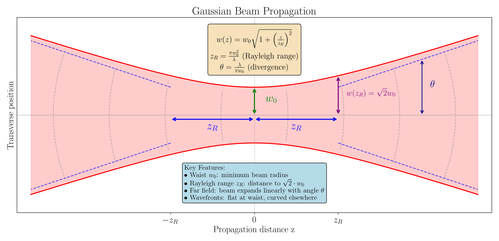
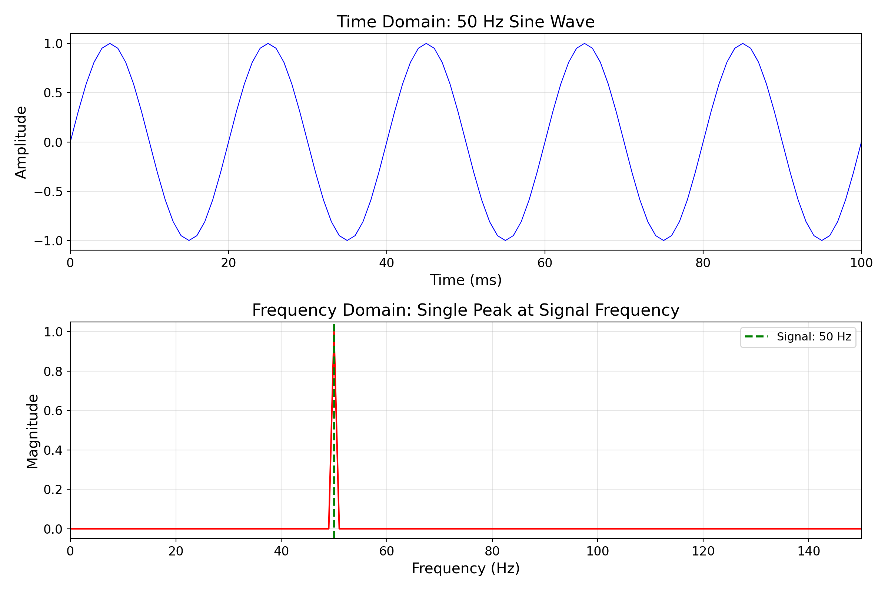
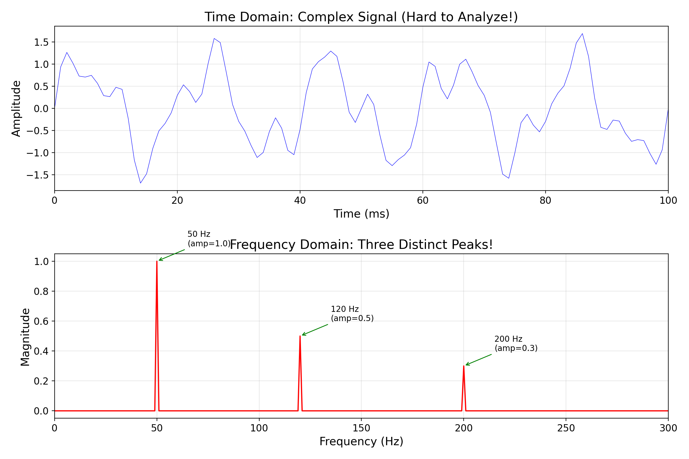
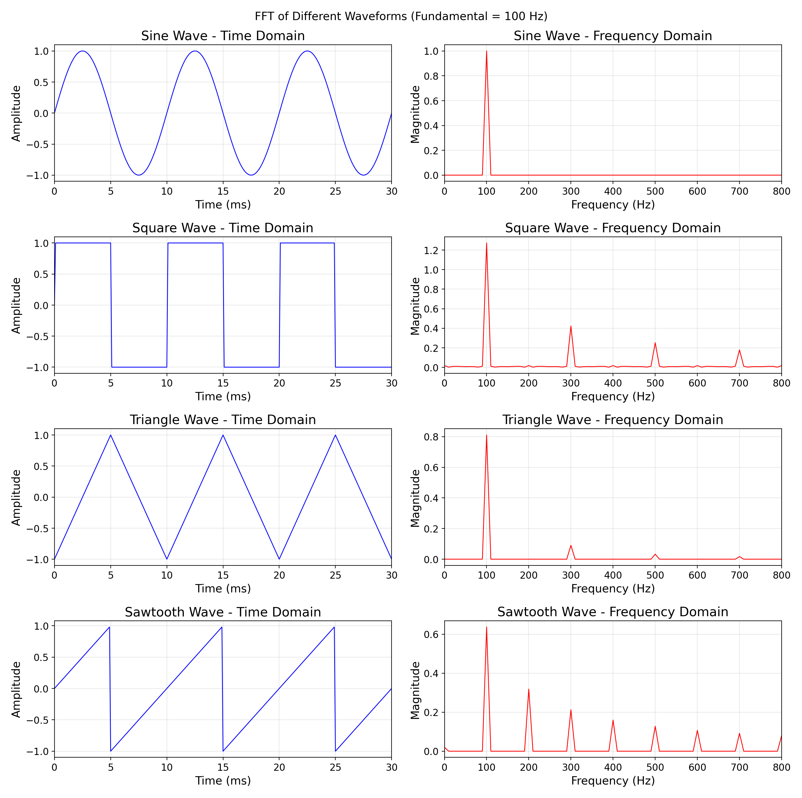
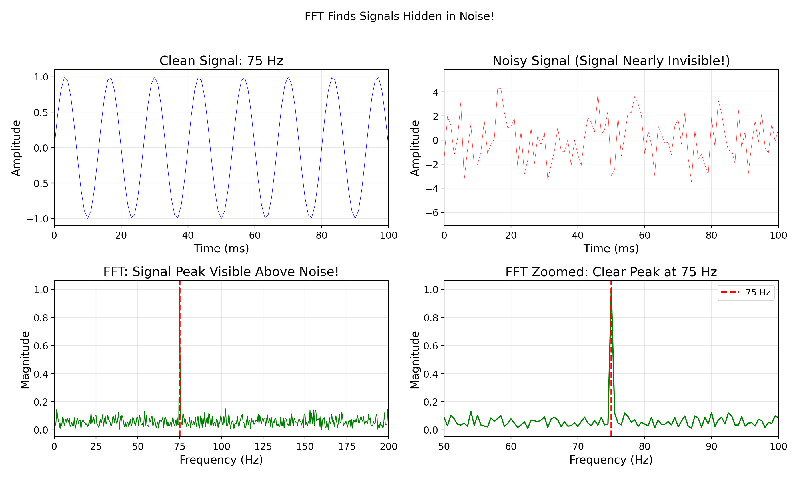

<!-- _class: title -->
<!-- _paginate: false -->

# Gaussian Beams & Fourier Analysis

## PHYS 4430 — Week 2 Thursday
January 23, 2026

<!--
Total lecture time: 50 minutes
Part 1: Gaussian beam interpretation (~20 min)
Part 2: Fourier analysis foundations (~25 min)
Part 3: Synthesis (~5 min)
-->

---

## Learning Objectives

By the end of this lecture, you will be able to:

**Gaussian Beams:**
1. Identify the four key parameters of a Gaussian beam and explain what each represents physically
2. Predict how beam width changes with position using the key relationships
3. Explain why only $w(z)$ is directly measurable with a knife-edge

**Fourier Analysis:**
4. Explain what an FFT reveals about a signal
5. Relate acquisition parameters to frequency resolution and maximum frequency
6. Identify how spectral analysis helps diagnose measurement problems

---

## Starting from Week 1

**What you measured:**

You scanned a knife-edge across the laser beam and measured how transmitted power changed with position.

**What you found:**

The intensity profile wasn't uniform — it was brightest in the center and fell off toward the edges.

**Today's question:** What mathematical shape describes this profile, and what does it tell us?

---

## The Intensity Profile Has a Name

The shape you measured is called a **Gaussian** profile:

$$I(r) = I_0 \exp\left(-\frac{2r^2}{w^2}\right)$$

- Brightest at center ($r = 0$)
- Falls off exponentially with distance from center
- $w$ defines the "width" (where intensity drops to $1/e^2 \approx 13.5\%$)

**Why Gaussian?** It turns out this is a natural solution to Maxwell's equations for a focused beam. (You'll derive this in the Week 3 prelab.)

---

## But There's More to the Story

The beam width $w$ **changes as the beam propagates**.

**Today we'll learn:**
- How does $w$ change with position along the beam?
- What other parameters describe the beam?
- What can you actually measure with your knife-edge?
- How will you use this in Weeks 3-4?

<!--
Now students have context: they measured something, it has a name (Gaussian),
and there's more structure to understand. The prelab derivation comes later.
-->

---

<!-- _class: question -->

## The Four Parameters

| Parameter | Symbol | Physical Meaning |
|-----------|--------|------------------|
| Beam waist | $w_0$ | Minimum beam radius |
| Beam width | $w(z)$ | Radius at position $z$ (1/e² intensity) |
| Radius of curvature | $R(z)$ | Wavefront curvature |
| Gouy phase | $\zeta(z)$ | Phase shift through focus |

**Key question:** Which of these can you measure with a knife-edge?

---

## What You Can Actually Measure

**Directly measurable with knife-edge:**
- $w(z)$ — beam width at a given position

**NOT directly measurable:**
- $w_0$ — must be extracted by fitting $w(z)$ data
- $R(z)$ — requires interferometry
- $\zeta(z)$ — requires interferometry

> Your knife-edge technique gives you $w(z)$. Everything else comes from fitting and theory.

<!--
This is a key insight: we measure w(z), then use the Gaussian beam model
to extract w0, z_R, and make predictions.
-->

---

## Gaussian Beam Geometry

<!--
Point out:
- Beam waist w0 at z=0
- Hyperbolic envelope (not linear!)
- w(z) = sqrt(2)*w0 at z = z_R
- Far field: linear expansion with angle theta
-->

---

## The Beam Width Equation

$$w(z) = w_0\sqrt{1 + \left(\frac{z}{z_R}\right)^2}$$

**Where:**
- $w_0$ = beam waist (minimum radius)
- $z_R$ = Rayleigh range (characteristic length)
- $z$ = distance from the waist

**At the waist ($z = 0$):** $w = w_0$
**At one Rayleigh range ($z = z_R$):** $w = \sqrt{2} \cdot w_0$

---

## The Rayleigh Range

$$z_R = \frac{\pi w_0^2}{\lambda}$$

**Physical meaning:** The distance over which the beam stays "well-collimated"

- Within $\pm z_R$: beam width stays close to $w_0$
- Beyond $z_R$: beam expands approximately linearly

**Example (He-Ne laser, $\lambda = 633$ nm):**
- If $w_0 = 0.5$ mm: $z_R = \pi (0.5)^2 / 0.000633 \approx 1.2$ m
- If $w_0 = 0.1$ mm: $z_R = \pi (0.1)^2 / 0.000633 \approx 50$ mm

---

## Far-Field Divergence

$$\theta = \frac{\lambda}{\pi w_0}$$

**The divergence angle** — how fast the beam spreads in the far field

**Notice the trade-off:**
- Small $w_0$ → large $z_R$ (tightly focused, short range)
- Small $w_0$ → large $\theta$ (diverges quickly)

> You can't have both a tight focus AND low divergence. This is a fundamental wave optics result.

---

<!-- _class: question -->

## Think-Pair-Share

**If you double the beam waist $w_0$:**

1. What happens to the Rayleigh range $z_R$?
2. What happens to the divergence angle $\theta$?

*Take 30 seconds to think, then discuss with your neighbor.*

<!--
Give students 60-90 seconds for this activity.
Walk around and listen to discussions.
-->

---

## Answer

**Doubling $w_0$:**

1. $z_R = \frac{\pi w_0^2}{\lambda}$ → **Increases by 4×** (quadratic in $w_0$)

2. $\theta = \frac{\lambda}{\pi w_0}$ → **Decreases by 2×** (inverse of $w_0$)

**Physical interpretation:**
A wider beam at the waist stays collimated longer but starts out bigger.

---

## Quick Poll

**Which diverges faster in the far field?**

A) Red light ($\lambda = 633$ nm) with $w_0 = 0.5$ mm
B) Blue light ($\lambda = 450$ nm) with $w_0 = 0.5$ mm

<!--
Answer: A (red light) - longer wavelength means larger divergence.
theta = lambda / (pi * w0), so larger lambda = larger theta

This connects wavelength to beam behavior, reinforcing the wave optics nature.
-->

---

## What You'll Measure in Weeks 3-4

**In practice, the waist might not be at your measurement location:**

$$w(z) = w_0\sqrt{1 + \left(\frac{z - z_w}{z_R}\right)^2}$$

where $z_w$ is the waist position.

**Your fitting function has three parameters:**
- $w_0$ (beam waist)
- $z_w$ (waist position)
- $z_R$ (Rayleigh range) — though this is determined by $w_0$ and $\lambda$

---

## Summary: Gaussian Beams

1. **Four parameters** describe a Gaussian beam: $w_0$, $w(z)$, $R(z)$, $\zeta(z)$
2. **Only $w(z)$** is directly measurable with knife-edge
3. **Rayleigh range** $z_R = \pi w_0^2/\lambda$ sets the length scale
4. **Trade-off:** Smaller waist → shorter $z_R$, larger divergence

**Next:** How do we diagnose measurement quality?

---

<!-- _class: title -->
<!-- _paginate: false -->

# Part 2: Fourier Analysis

## From Spatial Profiles to Frequency Content

---

## Why Frequency Domain?

**Tuesday:** You learned about noise in your measurements

**Today's question:** How do we *identify* where noise comes from?

**Applications:**
- Diagnose 60 Hz power line pickup
- Identify mechanical vibrations
- Understand your measurement bandwidth
- Foundation for later labs (lock-in detection, etc.)

---

## Two Ways to Look at Signals

**Time Domain:** How does the signal change over time?
- What you see on an oscilloscope
- Voltage vs. time

**Frequency Domain:** What frequencies are present?
- Result of Fourier Transform
- Amplitude vs. frequency

**Same information, different perspective!**

---

## Single Frequency Example

<!--
Point out:
- Time domain: 50 Hz sine wave
- Frequency domain: single peak at 50 Hz
- The FFT "decomposes" the signal into frequency components
-->

---

## Complex Signal Example

<!--
Point out:
- Time domain: complex, hard to interpret
- Frequency domain: THREE distinct peaks!
- We can identify each component: 50, 120, 200 Hz with their amplitudes
-->

---

## The FFT Concept

**FFT = Fast Fourier Transform**

Decomposes a signal into its frequency components:
- Input: Array of time-domain samples
- Output: Amplitude at each frequency

**You don't need to understand the algorithm!**
- NumPy's `np.fft.fft()` handles the math
- Your job: interpret the results

<!--
Students often get hung up on the algorithm. Emphasize that they need to
understand what it DOES and what the RESULTS mean, not HOW it works.
-->

---

## Key Practical Relationships

**Frequency Resolution:**
$$\Delta f = \frac{\text{Sample Rate}}{N} = \frac{1}{\text{Duration}}$$

**Maximum Frequency (Nyquist):**
$$f_{max} = \frac{\text{Sample Rate}}{2}$$

**Example:** 1000 samples at 1000 Hz
- Duration = 1 s
- Frequency resolution = 1 Hz
- Maximum frequency = 500 Hz

---

## Frequency Resolution in Action

**Longer measurement → Sharper peaks (better resolution)**

<!--
This shows the same 100 Hz signal with different measurement durations.
- 0.1 s: Very broad peak, 10 Hz resolution
- 2.0 s: Sharp peak, 0.5 Hz resolution
-->

---

## The Trade-off

| Want... | Need... | Cost... |
|---------|---------|---------|
| Better frequency resolution | Longer measurement | More time |
| Higher max frequency | Higher sample rate | More data |
| Both | Higher rate AND longer | Time + storage |

> **Rule of thumb:** To resolve frequencies $\Delta f$ apart, measure for at least $1/\Delta f$ seconds.

---

## Spectral Signatures

<!--
Different waveforms have characteristic spectra:
- Sine: single peak
- Square: odd harmonics (1f, 3f, 5f, ...)
- Triangle: odd harmonics, amplitude falls faster
- Sawtooth: all harmonics
-->

---

## Recognizing Waveform Signatures

**Sine wave:** Single peak at fundamental frequency

**Square wave:** Fundamental + odd harmonics (3f, 5f, 7f...)

**Why this matters:**
- Power supplies often produce 60 Hz + harmonics (120, 180, ...)
- Mechanical vibrations may show harmonic structure
- Spectrum shape helps identify the source

---

## Finding Signals in Noise

<!--
Key points:
- Top right: Signal completely hidden in time domain
- Bottom: FFT clearly shows the 75 Hz signal above the noise floor
- This is the power of spectral analysis!
-->

---

## Application: Noise Diagnosis

**Common noise sources you might see:**

| Frequency | Likely Source |
|-----------|---------------|
| 60 Hz | Power line pickup |
| 120 Hz | Rectified power, lighting |
| Low freq (< 10 Hz) | Mechanical vibration, thermal drift |
| Broadband | Johnson noise, shot noise |

**The FFT tells you WHERE to look for problems!**

---

## Example: 60 Hz Pickup

If your FFT shows a peak at 60 Hz:
- Check cable shielding
- Look for ground loops
- Move signal cables away from power cables
- Consider differential measurement mode

**Without spectral analysis:** You just see "noise"
**With spectral analysis:** You know it's 60 Hz → electromagnetic pickup

---

## Where You'll Use This

**In this course:**
- Noise characterization (today's lab optional extension)
- Identifying periodic interference
- Understanding measurement bandwidth

**In future work:**
- Lock-in amplifier signal processing
- Vibration analysis
- Signal filtering design
- Final project applications

---

<!-- _class: title -->
<!-- _paginate: false -->

# Part 3: Synthesis

## Connecting the Concepts

---

## How These Topics Connect

**Gaussian Beams:**
- Understanding what you're measuring
- Extracting physical parameters from data

**Fourier Analysis:**
- Understanding measurement quality
- Diagnosing noise sources

**Together:**
- Better measurements → better beam parameter extraction
- Understanding noise → knowing your uncertainties

---

## Key Takeaways

**Gaussian Beams:**
- Four parameters, but only $w(z)$ is directly measurable
- Rayleigh range $z_R = \pi w_0^2/\lambda$ sets the length scale
- Smaller waist ↔ shorter Rayleigh range ↔ larger divergence

**Fourier Analysis:**
- Time domain ↔ frequency domain (same info, different view)
- Frequency resolution = Sample Rate / N = 1 / Duration
- Maximum frequency = Sample Rate / 2 (Nyquist)
- Spectral analysis reveals noise sources

---

## Looking Ahead

**This Afternoon (Lab):**
- Aliasing observation with function generator
- Noise characterization at different configurations
- Optional: FFT analysis of your noise data

**Week 3 Prelab:**
- Derive the Gaussian beam equations from Maxwell's equations
- Understand *why* beams have the shape they do

**Week 3 Lab:**
- Motor controller setup
- First automated beam profile
- Apply error propagation to real data

**Week 4:**
- Multiple beam profiles at different z
- Test the Gaussian beam model
- Investigate lens effects

---

<!-- _class: title -->
<!-- _paginate: false -->

# Questions?

## We are here to help!

<!--
COMMON STUDENT QUESTIONS:

Q: Why can't we measure R(z) with the knife-edge?
A: Knife-edge measures intensity profile. R(z) describes wavefront curvature,
   which requires phase-sensitive measurement (interferometry).

Q: What's the Gouy phase and why does it matter?
A: Phase shift acquired by a beam passing through focus. Important for
   laser cavities and some precision measurements, but not for this lab.

Q: Why is frequency resolution = 1/duration?
A: To distinguish two frequencies, you need to see them beat against each other.
   The beat period is 1/(f2-f1), so you need to measure for at least that long.

Q: Will we need to code FFT calculations?
A: No, you'll use np.fft.fft(). The goal is interpretation, not implementation.

Q: How do I know if my frequency resolution is good enough?
A: If peaks look merged or very broad, you need longer measurement.
   Rule of thumb: resolution should be < 10% of the frequency you want to measure.
-->
