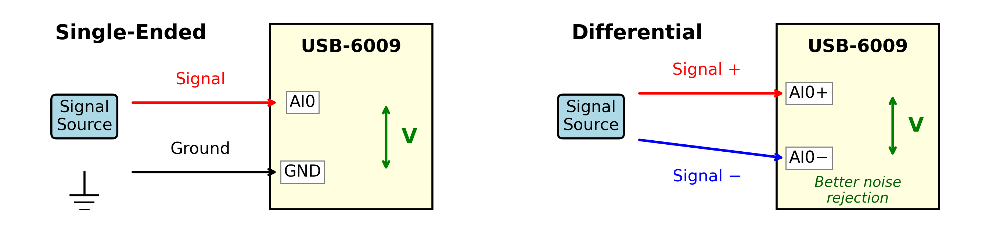
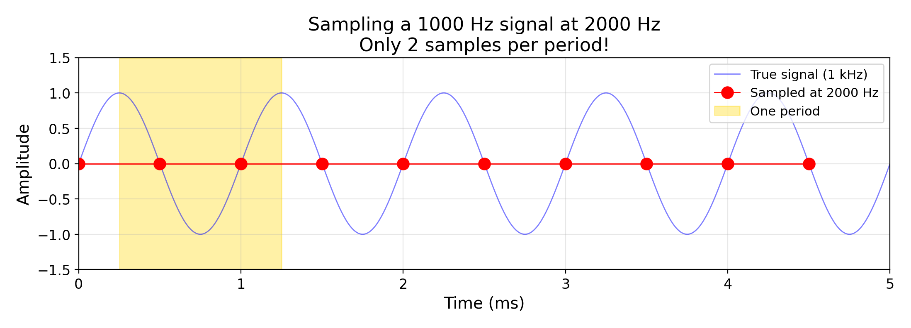
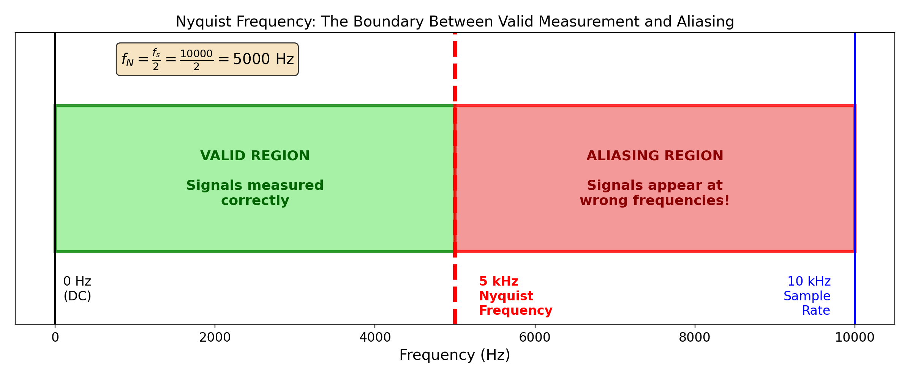
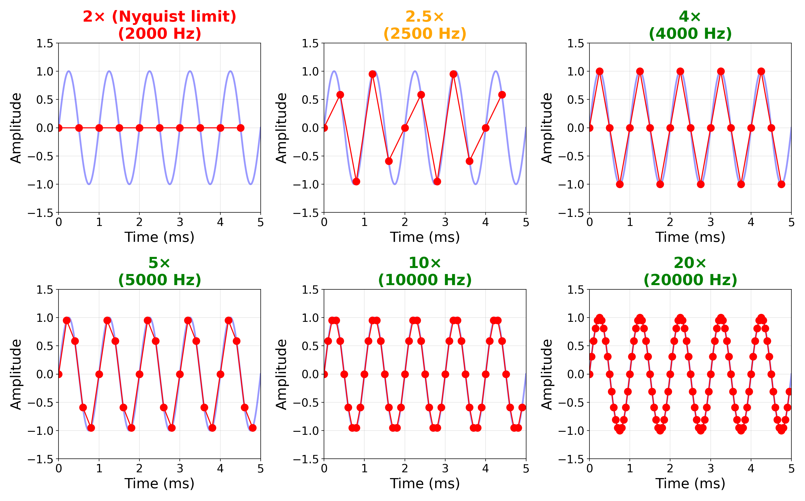
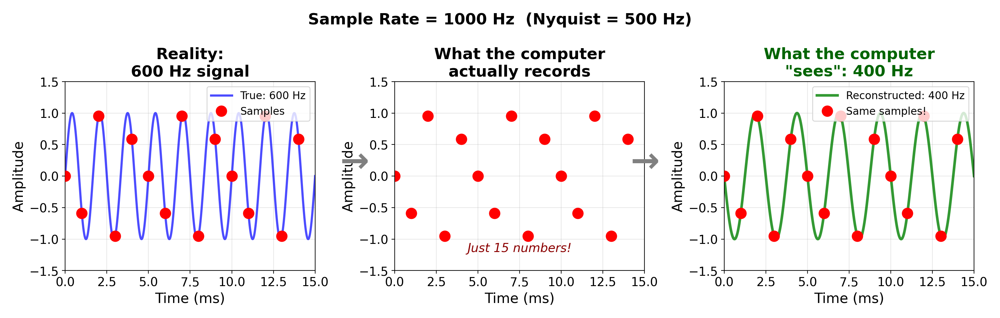
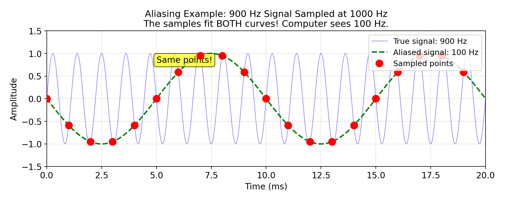
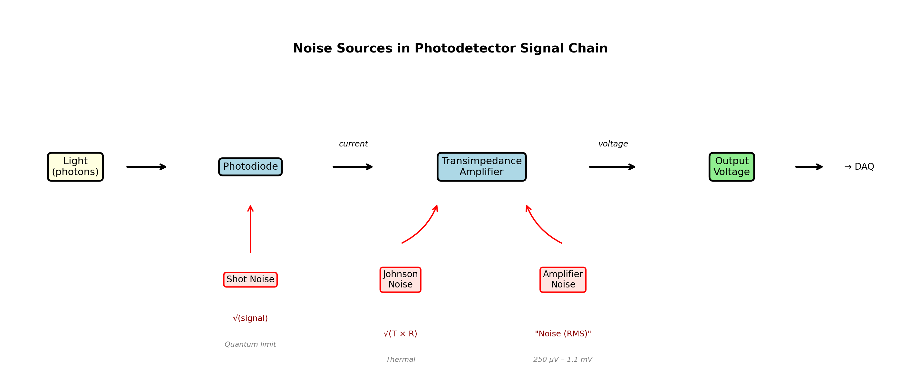

<!-- _class: title -->
<!-- _paginate: false -->

# Data Acquisition and Digital Sampling

## PHYS 4430 — Week 2 Tuesday
January 20, 2026

<!--
Total lecture time: 50 minutes
Purpose: Prepare students for Lab 2 (DAQ basics, noise characterization)
This afternoon they'll use everything covered here.
-->

---

## Learning Objectives

By the end of this lecture, you will be able to:

1. Explain what a DAQ device does and identify its key specifications
2. Interpret Python code that reads voltages using `nidaqmx`
3. State the Nyquist theorem and calculate appropriate sample rates
4. Recognize aliasing and explain why it occurs
5. Identify sources of noise in photodetector measurements
6. Calculate signal-to-noise ratio and explain its importance

---

## Opening Question

> Last week you measured beam width by reading voltages from the photodetector. **How did you actually get those voltage values into a form you could analyze?**

<!--
TIMING: ~3 minutes for intro

Let students respond. Most will mention the DMM or computer.
Use this to motivate: "Today we're going to automate that process."

Transition: Manual measurements (Week 1) → Automated acquisition (Week 2-4)
-->

---

## The Automation Path

**Transition:** Manual measurements (Week 1) → Automated acquisition (Week 2–4)

```
Photodetector → DAQ Device → Computer → Python → Analysis
```

Today's lecture prepares you for today's lab.

**Goal:** Understand the tools and concepts before you use them.

---

## What is a DAQ Device?

**Analogy:** A DAQ (Data AcQuisition device) is a "computerized voltmeter" that can take readings automatically

**Key functions:**

- **Analog-to-Digital Conversion (ADC):** Converts continuous voltage to discrete numbers
- **Timed acquisition:** Takes samples at precise intervals
- **Multiple channels:** Can read several signals simultaneously

<!--
TIMING: ~7 minutes for DAQ section

The "computerized voltmeter" analogy works well for students.
Emphasize that the DAQ does THREE things: converts, times, and multiplexes.
-->

---

## The USB-6009 Specifications

| Specification | Value | What it means |
|---------------|-------|---------------|
| Resolution | 14 bits | Voltage divided into 2¹⁴ = 16,384 levels |
| Input range | ±10 V | Full scale voltage range |
| Sample rate | 48 kS/s max | Up to 48,000 readings per second |
| Channels | 8 SE / 4 diff | How many signals at once |

<!--
BOARD WORK: Write this table on the board as you explain each row.
Students should have this as a reference.

Common question: "Why not just sample as fast as possible?"
Answer: More data = more storage, slower processing. Also, 48 kS/s is shared across channels.
-->

---

## Calculate Together

**What is the smallest voltage change the USB-6009 can detect?**

- Range = 20 V (from −10 to +10)
- Levels = 2¹⁴ = 16,384

$$\text{Resolution} = \frac{20 \text{ V}}{16384} \approx 1.2 \text{ mV}$$

This is the **theoretical resolution** — the smallest step the ADC can represent.

<!--
Walk through this calculation step by step.
This first-principles calculation is important, but we'll immediately complicate it.
-->

---

## Theory vs. Reality: Reading the Datasheet

| Specification | Value | What it means |
|---------------|-------|---------------|
| Theoretical resolution | 1.2 mV | What 14 bits *could* resolve |
| System noise (single-ended) | 5 mV RMS | Statistical fluctuations in readings |
| Absolute accuracy | ~8 mV | How close to the "true" value |

**Practical resolution ≈ 5–8 mV**, not 1.2 mV!

> The bit depth tells you the *digital* precision. Noise and accuracy limit the *actual* precision.

<!--
This is a key datasheet literacy lesson. "14-bit" sounds impressive, but the
system noise (5 mV) is 4× larger than the theoretical resolution (1.2 mV).
Students should understand that ADC bits are necessary but not sufficient.

Ask: "Is 5-8 mV still adequate for 1-3 V signals?" Yes! Still ~200-600 distinguishable levels.
-->

---

## Single-Ended vs Differential



<!--
Single-ended is simpler and gives more channels. Differential is better when:
- Signal source doesn't share ground with DAQ (floating source)
- Ground loops or electromagnetic interference are a problem
- You need better noise rejection

Let students choose based on their setup. Most photodetector measurements work fine with single-ended.
-->

---

## Python for Data Acquisition

The `nidaqmx` library:

```python
import nidaqmx
```

- National Instruments' official Python library
- Talks to NI hardware through NI-DAQmx drivers
- Handles all the low-level communication

<!--
TIMING: ~10 minutes for Python section

Students have seen Python but may not have used hardware libraries.
Emphasize: the library handles all the hard stuff, you just need to know the pattern.
-->

---

## The nidaqmx Pattern

Every nidaqmx acquisition follows the same pattern:

```
Create Task → Configure Channel → Configure Timing → Acquire Data
```

**1. Task** — A container that manages the acquisition
**2. Channel** — Which physical input to read (e.g., ai0)
**3. Timing** — How fast and how many samples
**4. Acquire** — Actually read the data

<!--
This mental model helps students understand the code structure.
Each line of code maps to one of these steps.
-->

---

## Reading a Single Voltage

```python
import nidaqmx

with nidaqmx.Task() as task:
    task.ai_channels.add_ai_voltage_chan("Dev1/ai0")
    voltage = task.read()
    print(f"Voltage: {voltage:.4f} V")
```

<!--
This is the MINIMAL working example. Students will use this pattern a lot.

Common question: "How do I know my device name (Dev1, Dev2, etc.)?"
Answer: Use NI MAX (Measurement & Automation Explorer) or we'll show them in lab.
-->

---

## Why `with`? Managing Hardware Resources

**Without `with`:** You must manually release the hardware

```python
task = nidaqmx.Task()
task.ai_channels.add_ai_voltage_chan("Dev1/ai0")
voltage = task.read()
task.close()  # Easy to forget! If you do, the DAQ stays locked.
```

**With `with`:** Python automatically releases the hardware when done

```python
with nidaqmx.Task() as task:
    task.ai_channels.add_ai_voltage_chan("Dev1/ai0")
    voltage = task.read()
# Hardware released automatically here — even if an error occurred
```

<!--
This is important! Students who forget task.close() will find their DAQ "locked"
and have to restart Python. The with statement prevents this problem entirely.
-->

---

## Reading a Single Voltage — Explained

1. `with nidaqmx.Task() as task:` — Creates a measurement task
2. `add_ai_voltage_chan("Dev1/ai0")` — Configure channel ai0 on device Dev1
3. `task.read()` — Take one reading
4. Result is a floating-point number in volts

<!--
Walk through each line slowly.
-->

---

## Reading Multiple Samples

```python
import nidaqmx
from nidaqmx.constants import AcquisitionType

SAMPLE_RATE = 1000  # Samples per second
NUM_SAMPLES = 500   # Total samples to collect

with nidaqmx.Task() as task:
    task.ai_channels.add_ai_voltage_chan("Dev1/ai0")
    task.timing.cfg_samp_clk_timing(
        rate=SAMPLE_RATE,
        sample_mode=AcquisitionType.FINITE,
        samps_per_chan=NUM_SAMPLES
    )
    data = task.read(number_of_samples_per_channel=NUM_SAMPLES)
```

<!--
This is the pattern they'll use most often in lab.
Point out the CAPITAL variable names - these are constants they'll change.
-->

---

## Key Parameters

- `rate`: How fast to sample (samples/second)
- `sample_mode`: FINITE (fixed number) or CONTINUOUS (stream until stopped)
- `samps_per_chan`: How many samples to collect

**Result:** `data` is a Python list of voltage values

---

<!-- _class: question -->

## Quick Check

What would you change in this code to collect **2 seconds** of data at **500 samples per second**?

<!--
PAUSE here - give students 30-60 seconds to think.
Can ask them to discuss with a neighbor.
-->

---

## Answer

```python
SAMPLE_RATE = 500   # 500 samples per second
NUM_SAMPLES = 1000  # 500 × 2 = 1000 samples
```

**Duration** = NUM_SAMPLES / SAMPLE_RATE = 1000 / 500 = 2 seconds

<!--
Key insight: Duration = NUM_SAMPLES / SAMPLE_RATE
This relationship is fundamental and they'll use it constantly.

OPTIONAL: If equipment available, run a live demo here:
- Connect function generator to DAQ
- Run simple acquisition script
- Plot result with matplotlib
(Pre-record or pre-stage to avoid live failures)
-->

---

## The Sampling Process



**Key insight:** We only measure the signal at discrete moments in time

<!--
TIMING: ~10 minutes for Nyquist/aliasing (Part 1)

This figure shows sampling at the Nyquist limit (2x). Only 2 samples per period!
Between samples, we have NO information. The sample rate determines what frequencies we can capture.
-->

---

## The Nyquist Theorem

> **Nyquist Theorem:** To accurately capture a signal of frequency $f$, you must sample at a rate of at least $2f$.

The **Nyquist frequency** is half the sample rate:

$$f_N = \frac{f_s}{2}$$

This is the **maximum frequency** that can be correctly measured.

<!--
This is one of the most important concepts in the course.
Emphasize "at least" - in practice we want 5-10x for good waveform reconstruction.
-->

---

## Nyquist Example

**Sample rate:** 1000 S/s

$$f_N = \frac{1000}{2} = 500 \text{ Hz}$$

✓ Can accurately measure signals up to 500 Hz

✗ Signals above 500 Hz will have problems...

---

## The Nyquist Boundary



<!--
This diagram clearly shows the valid region (below Nyquist) vs aliasing region (above Nyquist).
Emphasize: the Nyquist frequency is the BOUNDARY between accurate measurement and aliasing.
-->

---

## Sampling at Different Rates



<!--
This figure shows 6 different sample rates for the same signal.
Point out: At 10x and 20x Nyquist, the waveform is captured accurately.
At 2x (Nyquist limit), we can recover frequency but shape is poor.
-->

---

## What Happens Above Nyquist: Aliasing



**Aliasing:** High-frequency signals "masquerade" as lower frequencies

<!--
This figure shows side-by-side: 400 Hz (below Nyquist) vs 600 Hz (above Nyquist).
The 600 Hz signal aliases to 400 Hz! Same sample points fit both curves.
This is the "aha moment" for most students.
-->

---

## Aliasing Example



The **same sample points** fit both curves!

<!--
Work through this calculation explicitly:
- Signal: 900 Hz, Sample rate: 1000 S/s
- Alias frequency: |900 - 1000| = 100 Hz
The 900 Hz signal is only 100 Hz away from the sample rate,
so it "folds back" to appear at 100 Hz.
-->

---

## Practice Problems

| Signal (Hz) | Sample Rate (S/s) | Nyquist (Hz) | Appears as (Hz) |
|-------------|-------------------|--------------|-----------------|
| 100 | 1000 | 500 | 100 ✓ |
| 400 | 1000 | 500 | 400 ✓ |
| 600 | 1000 | 500 | ? |

**What does 600 Hz appear as?**

<!--
Work through the first two rows together.
For 600 Hz: Ask students to predict BEFORE revealing the answer.
Give them 30 seconds to calculate.
-->

---

## Answer: 600 Hz → 400 Hz

$$f_{\text{alias}} = |600 - 1000| = 400 \text{ Hz}$$

The 600 Hz signal **aliases** to 400 Hz!

> **Warning:** Aliased data looks completely normal. You cannot tell from the data alone that 600 Hz was aliased to 400 Hz. This is what makes aliasing dangerous.

<!--
Point out: 600 Hz and 400 Hz are "mirror images" around the Nyquist frequency (500 Hz).
This symmetry is a key insight.

IMPORTANT: Emphasize that aliased data is indistinguishable from real low-frequency data.
Students often expect aliasing to produce visible distortion - it doesn't!
-->

---

<!-- _class: question -->

## Peer Discussion

Turn to your neighbor and predict:

**A 950 Hz signal is sampled at 1000 S/s. What frequency will it appear as in your data?**

<!--
TIMING: 2 minutes for peer discussion

Give students ~60 seconds to discuss, then ask for answers.
Walk around and listen to discussions.
-->

---

## Answer: 950 Hz → 50 Hz

$$f_{\text{alias}} = |950 - 1000| = 50 \text{ Hz}$$

**Bonus:** What about exactly 1000 Hz?

Appears as **0 Hz (DC)** — the samples always catch the same point on the wave!

<!--
The 1000 Hz → 0 Hz case often surprises students.
If you sample at exactly the signal frequency, every sample catches the same phase!
-->

---

## The Key Message

> **Always sample at least 2× (preferably 5–10×) the highest frequency you care about**

<!--
TIMING: ~5 minutes for Part 2

This is the practical takeaway. In real work, 2x is the theoretical minimum;
5-10x gives you good waveform reconstruction.
-->

---

## Aliasing in This Lab

**Question:** In Lab 2, you'll measure noise. Noise contains many frequencies.

If you sample at 1000 S/s, what happens to noise at 1100 Hz?

**Answer:** It aliases down to 100 Hz and **adds to your measured noise** at that frequency.

<!--
This connects aliasing to what they'll actually do in lab.
Noise has components at ALL frequencies, so aliasing is always a concern.
-->

---

## Practical Guidance for Noise Measurements

- Noise spectrum extends to high frequencies
- Sample fast enough that aliased noise is negligible
- Or use **anti-aliasing filter** (low-pass before DAQ)

<!--
Common question: "What if my signal has frequencies I don't know about?"
Answer: Use an anti-aliasing filter (low-pass filter before the DAQ)
to remove frequencies above Nyquist.
-->

---

## Why Noise Is Different from Sine Waves

The aliasing examples used **single-frequency** sine waves. Noise is different:

- Noise contains energy at **many frequencies simultaneously**
- It's a broad spectrum, not a single peak
- When noise aliases, it folds back and **adds to** the noise you're measuring

This is why aliasing matters for noise measurements — high-frequency noise contaminates your low-frequency measurements.

<!--
This is a key conceptual bridge. Students understand single-frequency aliasing
but may not realize noise is broadband. The folding adds contamination across
the entire measured spectrum.
-->

---

## Why Noise Matters

- Your beam width measurement precision depends on voltage precision
- Noise in voltage → uncertainty in fitted beam width
- Understanding noise helps you make better measurements

<!--
TIMING: ~10 minutes for noise/SNR section

Connect back to Week 1: their beam width uncertainty came partly from voltage noise.
-->

---

## Sources of Noise in Photodetectors



<!--
This figure shows the signal chain with each noise source:
- Shot noise at the photodiode (quantum limit, √signal)
- Johnson noise at the amplifier (thermal, √(T×R))
- Amplifier noise (from datasheet, gain-dependent)
Noise accumulates through the system.
-->

---

## Fundamental Noise Sources

**Shot Noise** (most important for our measurements)
- For photocurrent: fluctuations in photon arrival times
- Proportional to $\sqrt{\text{current}}$ — SNR improves with more light
- **Fundamental quantum limit** — cannot be eliminated

**Johnson (Thermal) Noise** (usually smaller for us)
- Random electron motion
- Present even with no signal — sets the "noise floor"

<!--
Shot noise is fundamental to ANY current because charge is quantized.
For photodetectors, we often think of it as photon arrival statistics.
Key point: it scales with sqrt(I), so SNR = I/sqrt(I) = sqrt(I) improves with more light.
Johnson noise is usually smaller than shot noise at our signal levels.
-->

---

## Amplifier Noise (What You'll Measure)

- The transimpedance amplifier adds its own noise
- Specified on datasheet as **"Noise (RMS)"**
- Ranges from ~250 µV (low gain) to ~1.1 mV (70 dB gain) for PDA36A

<!--
The datasheet for the PDA36A specifies "Noise (RMS)" at each gain setting.
Students will compare their measurements to these specs in lab.

From datasheet:
- 0 dB: 300 µV    - 40 dB: 340 µV
- 10 dB: 280 µV   - 50 dB: 400 µV
- 20 dB: 250 µV   - 60 dB: 800 µV
- 30 dB: 260 µV   - 70 dB: 1.10 mV
-->

---

## The Gain-Noise Tradeoff

| Gain Setting | Voltage Gain | Signal × | Noise × | SNR |
|--------------|--------------|----------|---------|-----|
| 0 dB | 1× | 1× | 1× | baseline |
| 30 dB | ~32× | 32× | ? | ? |
| 70 dB | ~3000× | 3000× | ? | ? |

**Key question:** Does noise scale the same as signal?

<!--
Leave the ? marks to prompt discussion.
This is the central question they'll investigate in lab.
-->

---

## Answer: It's Complicated!

- Internal noise (Johnson, amplifier) gets amplified
- Shot noise depends on actual photon rate (not gain)
- The datasheet tells you the actual output noise at each gain

**You'll measure this directly in lab!**

---

## Signal-to-Noise Ratio (SNR)

$$\text{SNR} = \frac{V_{\text{signal}}}{V_{\text{noise, RMS}}}$$

**Rules of thumb:**
- SNR > 10: Signal is distinguishable from noise
- SNR > 100: Precise quantitative measurements possible
- SNR > 1000: High-precision work

<!--
SNR is THE key metric for measurement quality.
These rules of thumb are useful for quick assessments.
-->

---

## Worked Example: Calculating SNR

**Your photodetector setup:**
- RMS noise: 5 mV (measured with beam blocked)
- Expected signal: 1.5 V (beam fully on detector)

$$\text{SNR} = \frac{1.5 \text{ V}}{0.005 \text{ V}} = 300$$

**Interpretation:** SNR = 300 means your signal is 300× larger than the noise. Excellent for precise measurements!

<!--
BOARD WORK: Write out this calculation.
Emphasize: noise is measured with beam BLOCKED (dark noise).
SNR of 300 is quite good for this type of measurement.
-->

---

<!-- _class: question -->

## Think About It

If you increase the gain by 10×, and both signal and noise increase by 10×, what happens to the SNR?

<!--
Give students 30 seconds to think about this.
It's a bit of a trick question - pure scaling doesn't change SNR.
-->

---

## Answer: SNR Stays the Same

$$\text{SNR} = \frac{10 \times V_{\text{signal}}}{10 \times V_{\text{noise}}} = \frac{V_{\text{signal}}}{V_{\text{noise}}}$$

**But:** If the amplifier adds its own noise, increasing gain may actually **decrease** SNR.

This is why you'll measure it directly in lab!

<!--
Key insight: If noise scaled perfectly with signal, gain wouldn't matter for SNR.
But amplifier noise breaks this - it's why there's an optimal gain setting.
-->

---

## The Decision You'll Make

By end of lab today, choose a gain setting for Week 4.

**Constraints:**
1. Signal must not saturate (stay below ~4.5 V)
2. SNR must be high enough for precise beam width extraction
3. Higher gain → more amplified noise

**Your job:** Find the sweet spot using quantitative data!

<!--
This frames the lab objective clearly.
They need to balance three competing factors using actual measurements.
-->

---

## Key Takeaways

1. **DAQ devices** convert analog voltages to digital data at precise timing
2. **nidaqmx** provides Python control of NI hardware
3. **Nyquist theorem:** Sample at ≥2× the highest frequency of interest
4. **Aliasing** makes high frequencies appear as lower frequencies
5. **Noise sources** in photodetectors: shot, Johnson, amplifier
6. **SNR** determines measurement precision

<!--
TIMING: ~3 minutes for summary

Quick review - these map directly to the learning objectives.
-->

---

## What You'll Do This Afternoon

1. Connect DAQ and verify it works
2. Observe aliasing with function generator
3. Measure dark noise at each gain setting
4. Compare to datasheet specifications
5. Calculate SNR for your beam conditions
6. Choose and justify a gain setting

<!--
Preview of lab activities. They should feel prepared for each of these.
-->

---

## One Thing to Remember

> **Your sample rate determines what frequencies you can trust. Everything above the Nyquist frequency folds back down and contaminates your data.**

<!--
This is the single most important takeaway if they remember nothing else.
-->

---

<!-- _class: title -->
<!-- _paginate: false -->

# Questions?

## Lab starts in Duane G2B77

<!--
COMMON STUDENT QUESTIONS:

Q: Why not just always sample as fast as possible?
A: More data = more storage, slower processing. Also, 48 kS/s is shared across channels.

Q: How do I know my device name (Dev1, Dev2, etc.)?
A: Use NI MAX (Measurement & Automation Explorer) or the Python code we'll show in lab.

Q: What if my signal has frequencies I don't know about?
A: Use an anti-aliasing filter (low-pass filter before the DAQ) to remove frequencies above Nyquist.

Q: Is the photodetector noise the same as DAQ noise?
A: No! The DAQ adds its own small noise (~1 mV), but photodetector noise at high gain (tens of mV) usually dominates.

EQUIPMENT FOR DEMOS (if available):
- USB-6009 connected to instructor laptop
- Function generator
- Oscilloscope (to show "true" signal)
- Python environment with nidaqmx, numpy, matplotlib
- Pre-written demo scripts
-->
