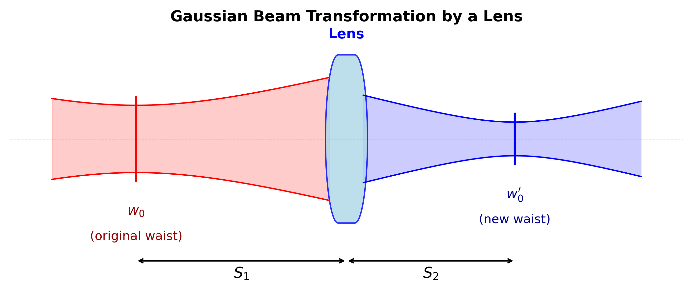

<!-- _class: title -->
<!-- _paginate: false -->

# Lenses and Gaussian Beams

## PHYS 4430 — Week 3 Thursday
January 29, 2026

<!--
Total lecture time: 50 minutes
Purpose: Prepare students for Lab 4 prelab (lens predictions, thin lens equation for Gaussian beams)
-->

---

## Learning Objectives

By the end of this lecture, you will be able to:

1. Explain how a thin lens transforms a Gaussian beam
2. Apply the thin lens equation to predict image location
3. Calculate the new beam waist position and size after a lens
4. Explain the diffraction limit on focusing
5. Make quantitative predictions for Week 4's lens experiments

---

## Where We Are

**Weeks 1–3:** Characterized the beam, automated measurements, learned error propagation

**This week (ongoing):** Automated beam profiles at multiple $z$ positions

**Next week (Lab 4):** Test Gaussian beam model AND investigate lens effects

<!--
TIMING: ~3 minutes for intro
Students are mid-way through their beam characterization work.
-->

---

## Today's Focus

You'll add a lens to your beam path next week.

**Key questions:**
1. How does a lens change a Gaussian beam?
2. Can we use the familiar thin lens equation?
3. What are the limits of this approach?

---

<!-- _class: section -->

# Part 1: The Thin Lens Equation

---

## The Ray Picture (Geometric Optics)


In geometric optics, light travels as rays. A lens bends rays to form an image.

<!--
TIMING: ~8 minutes for thin lens review
Most students have seen this before, but quick review establishes vocabulary.
-->

---

## The Thin Lens Equation

$$\boxed{\frac{1}{S_1} + \frac{1}{S_2} = \frac{1}{f}}$$

| Symbol | Meaning |
|--------|---------|
| $S_1$ | Object distance (from lens) |
| $S_2$ | Image distance (from lens) |
| $f$ | Focal length |

**Sign convention:** Distances positive when measured in direction light travels.

---

## Example Calculation

**Given:** Lens with $f = 100$ mm, object at $S_1 = 500$ mm

**Find:** Image location $S_2$

$$\frac{1}{500} + \frac{1}{S_2} = \frac{1}{100}$$

$$\frac{1}{S_2} = \frac{1}{100} - \frac{1}{500} = \frac{5-1}{500} = \frac{4}{500}$$

$$S_2 = 125 \text{ mm}$$

The image forms 125 mm beyond the lens.

---

## Special Cases to Remember

| Configuration | Object at... | Image at... |
|---------------|-------------|-------------|
| Collimated input | $S_1 = \infty$ | $S_2 = f$ (at focus) |
| Object at focus | $S_1 = f$ | $S_2 = \infty$ (collimated) |
| Object at 2f | $S_1 = 2f$ | $S_2 = 2f$ (1:1 imaging) |

---

<!-- _class: section -->

# Part 2: Gaussian Beams Through Lenses

---

## What Is the "Object" for a Gaussian Beam?

**In ray optics:** object is a point source, image is where rays converge.

**For a Gaussian beam:**
- The **"object"** is the beam waist (where $w = w_0$)
- The **"image"** is the new beam waist after the lens

<!--
TIMING: ~10 minutes for conceptual picture
This is the key insight: waist → lens → new waist
-->

---

## Gaussian Beam Transformation



The lens transforms one Gaussian beam into another Gaussian beam.

---

## What Changes, What Stays the Same

**After a lens, the beam has:**

| Changes | Stays Same |
|---------|------------|
| Waist size $w_0 \to w_0'$ | Wavelength $\lambda$ |
| Waist position $z_w \to z_w'$ | Gaussian profile |

The Gaussian form is preserved (for ideal thin lens in paraxial regime).

---

## When Does the Thin Lens Equation Apply?

The approximation works when:

| Condition | Physical Meaning |
|-----------|-----------------|
| Lens diameter $\gg w(z_{lens})$ | Beam isn't clipped |
| Beam width at lens $\gg \lambda$ | Paraxial regime |
| Focal length $\gg \lambda$ | Lens isn't microscopic |

For He-Ne laser ($\lambda = 633$ nm) and typical lenses ($f \sim 100$ mm):
**These conditions are easily satisfied!**

---

<!-- _class: section -->

# Part 3: Making Predictions

---

## Applying the Thin Lens Equation

**Treat the beam waist as the "object":**

If the waist is at distance $S_1$ from the lens, the new waist is at $S_2$:

$$\frac{1}{S_1} + \frac{1}{S_2} = \frac{1}{f}$$

> Same equation, but now "object" = waist, "image" = new waist

<!--
TIMING: ~15 minutes for quantitative predictions
This is where Tuesday's error propagation skills come in!
-->

---

## Example: Predicting New Waist Location

**Given:**
- He-Ne beam with $w_0 = 0.5$ mm at laser output
- Lens with $f = 150$ mm placed 1.0 m from laser

**Find:** Where does the new waist form?

$$S_1 = 1000 \text{ mm}$$

$$\frac{1}{S_2} = \frac{1}{150} - \frac{1}{1000} = \frac{850}{150000}$$

$$S_2 = \frac{150000}{850} \approx 176 \text{ mm}$$

---

## What About the New Waist Size?

The magnification in geometric optics: $M = -S_2/S_1$

For Gaussian beams, the new waist size is approximately:

$$\boxed{w_0' \approx \left| \frac{S_2}{S_1} \right| w_0 = |M| \cdot w_0}$$

**Continuing the example:**

$$w_0' \approx \frac{176}{1000} \times 0.5 \text{ mm} = 88 \text{ μm}$$

The beam focuses to a much smaller waist!

---

## Propagating Uncertainty

**This is where Tuesday's lecture pays off!**

```python
from uncertainties import ufloat

# Known values
S1 = ufloat(1000, 10)  # mm, ± 1 cm uncertainty
f = ufloat(150, 2)      # mm, lens spec ± 2 mm

# Calculate S2 using thin lens equation
S2 = 1 / (1/f - 1/S1)

print(f"Image distance: {S2:.1f} mm")
```

**Output:** `Image distance: 176.5+/-3.5 mm`

---

## Practice Problem

**Setup:** Lens with $f = 100 \pm 2$ mm placed 300 mm from beam waist

**Questions:**
1. Where is the new waist? ($S_2 = ?$)
2. What is the uncertainty?
3. If $w_0 = 0.3$ mm, what is $w_0'$?

<!--
Give students 2 minutes to work through this.
-->

---

## Practice Problem: Answers

1. **Where is the new waist?**
   $$\frac{1}{300} + \frac{1}{S_2} = \frac{1}{100} \implies S_2 = 150 \text{ mm}$$

2. **Uncertainty:** $\sigma_{S_2} \approx 5$ mm (from error propagation)

3. **New waist size:**
   $$w_0' \approx \frac{150}{300} \times 0.3 \text{ mm} = 0.15 \text{ mm}$$

The beam focuses to half its original waist size!

---

<!-- _class: section -->

# Part 4: Limitations and the Diffraction Limit

---

## When the Thin Lens Equation Breaks Down

The approximation is less accurate when:

| Condition | Issue |
|-----------|-------|
| $S_1 \approx z_R$ or $S_2 \approx z_R$ | Near-field effects matter |
| Lens diameter $\approx$ beam width | Clipping, aberrations |
| Thick lens | Multiple refractions inside lens |

For our experiments, expect ~few percent accuracy.

<!--
TIMING: ~7 minutes for limitations
Managing expectations for Week 4.
-->

---

## Systematic Errors You Might See

When you test the thin lens equation in Week 4:

| Observation | Possible Cause |
|-------------|----------------|
| $S_2$ smaller than predicted | Lens aberrations, thick lens |
| $S_2$ larger than predicted | Waist not where you thought |
| Large scatter in data | Vibrations, alignment drift |

**The goal:** Determine if discrepancies are measurement error or model limitations.

---

## How Small Can You Focus?

There's a fundamental limit: the **diffraction limit**.

$$\boxed{w_0^{min} \approx \frac{\lambda}{\pi \cdot NA}}$$

where **NA** (numerical aperture) characterizes the lens:

$$NA \approx \frac{D}{2f}$$

($D$ = lens diameter, $f$ = focal length)

<!--
TIMING: ~5 minutes for diffraction limit
-->

---

## Diffraction Limit Example

**Given:** He-Ne ($\lambda = 633$ nm), lens with $D = 25$ mm, $f = 50$ mm

$$NA = \frac{25}{2 \times 50} = 0.25$$

$$w_0^{min} = \frac{633 \times 10^{-9}}{\pi \times 0.25} = 0.8 \text{ μm}$$

**In practice:** Your He-Ne will focus to ~50–100 μm, limited by beam size at lens.

---

## Tradeoffs in Focusing

| Want tighter focus? | But... |
|---------------------|--------|
| Shorter focal length | Working distance shrinks |
| Larger lens diameter | More expensive, harder to mount |
| Fill more of lens aperture | Alignment more critical |

**This is why microscope objectives are complex!**

---

<!-- _class: section -->

# Part 5: Preparing for Week 4

---

## What the Prelab Asks You to Do

1. **Transfer predictions** from Week 3 (beam width vs. position)
2. **Predict lens effects** using the thin lens equation
3. **Create uncertainty budget** for your measurements

---

## The Prediction Exercise

Choose a lens ($f \approx 100–200$ mm) and predict:

| Quantity | Symbol | Method |
|----------|--------|--------|
| New waist position | $S_2$ | Thin lens equation |
| New waist size | $w_0'$ | Magnification |
| Uncertainties | $\sigma_{S_2}$, $\sigma_{w_0'}$ | Error propagation |

**Use `uncertainties` to automate the calculation!**

---

## Code Template for Predictions

```python
from uncertainties import ufloat

# Your measurements (adjust values!)
w0 = ufloat(0.5, 0.02)    # mm, from Week 3 fit
S1 = ufloat(1000, 10)     # mm, measured distance
f = ufloat(150, 2)        # mm, lens focal length

# Thin lens equation
S2 = 1 / (1/f - 1/S1)

# Magnification and new waist
M = S2 / S1
w0_new = abs(M) * w0

print(f"New waist at: {S2:.1f} mm from lens")
print(f"New waist size: {w0_new*1000:.1f} μm")
```

---

## Connecting Theory to Experiment

**In Week 4 lab, you will:**

1. Complete beam waist measurement (finish Week 3 work)
2. Add lens and measure new waist location and size
3. Compare to thin lens equation predictions
4. Investigate discrepancies

> Write predictions **before** you measure!

---

## Summary

1. **Thin lens equation** applies to Gaussian beams:
   $$\frac{1}{S_1} + \frac{1}{S_2} = \frac{1}{f}$$
   where "object" = original waist, "image" = new waist

2. **New waist size** follows magnification: $w_0' \approx |M| \cdot w_0$

3. **Uncertainty propagation** is essential for testable predictions

4. **Thin lens equation is approximate** — expect few percent discrepancy

5. **Diffraction limit** sets minimum spot size: $w_0^{min} \approx \lambda/(\pi \cdot NA)$

---

## For the Prelab

- [ ] Choose a lens (record $f$ and tolerance)
- [ ] Measure $S_1$ (distance from waist to lens position)
- [ ] Calculate predicted $S_2$ with uncertainty
- [ ] Calculate predicted $w_0'$ with uncertainty
- [ ] Prepare uncertainty budget

---

<!-- _class: title -->
<!-- _paginate: false -->

# Questions?

## Office hours and lab time available for help!

<!--
COMMON STUDENT QUESTIONS:

Q: Why doesn't the wavelength change the image location?
A: Once f is fixed, the geometry is wavelength-independent. Wavelength affects
   f through refractive index, but that's built into the lens spec.

Q: What if the beam waist is inside the laser?
A: S1 might be negative (virtual object) or you need to estimate waist position.
   Week 4 fitting will find the actual waist location.

Q: How do I know if my lens is "thin enough"?
A: For our lenses (few mm thick, f ~ 50-200 mm), thin lens is good to ~1%.

Q: Does the Gaussian beam stay Gaussian after a lens?
A: Yes, as long as no clipping and paraxial regime. This is a key property!

Q: What if I want to collimate a beam?
A: Place lens so waist is at focal point (S1 = f). Then S2 → ∞.
-->
