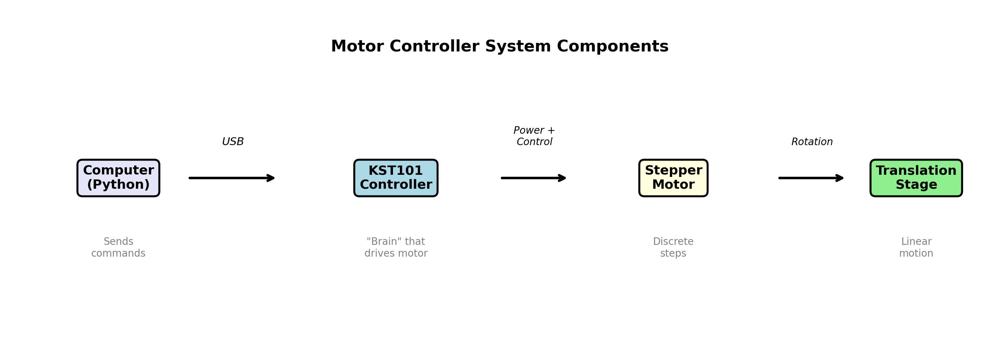
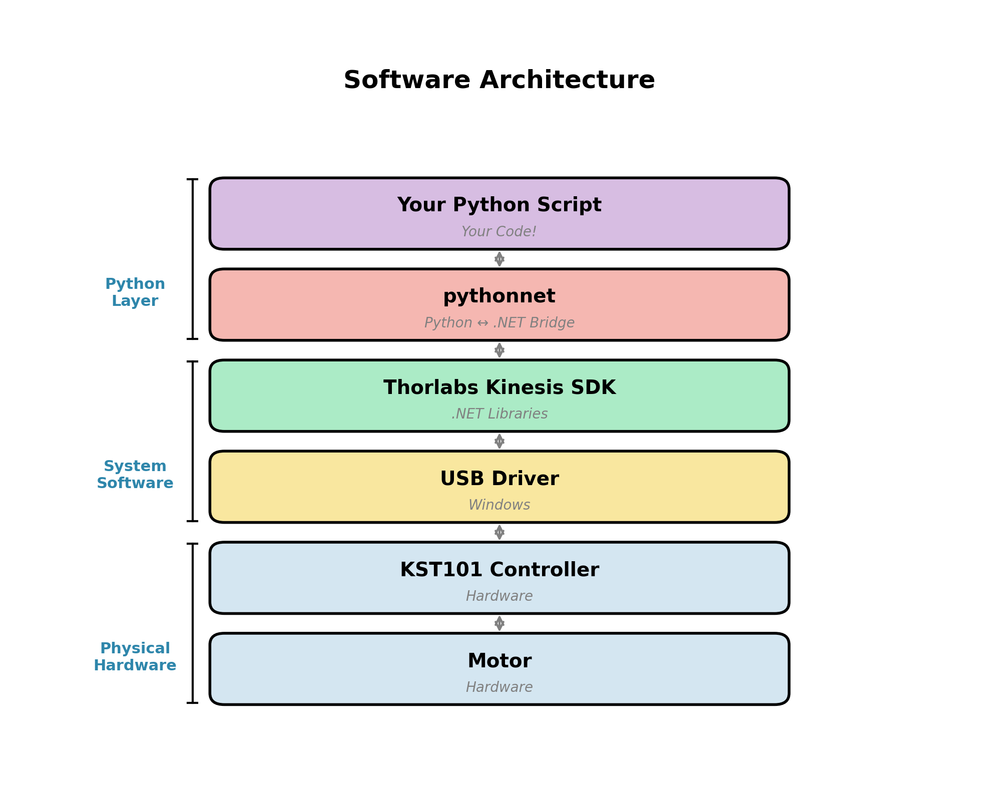

<!-- _class: title -->
<!-- _paginate: false -->

# Motor Control and Error Propagation

## PHYS 4430 — Week 3 Tuesday
January 27, 2026

<!--
Total lecture time: 50 minutes
Purpose: Prepare students for Lab 3 (motor controller setup, automated beam profiling, error propagation)
This afternoon they'll use everything covered here.
-->

---

## Learning Objectives

By the end of this lecture, you will be able to:

1. Explain the role of motor control in automated measurements
2. Describe the software architecture for controlling Thorlabs motors from Python
3. Apply the general error propagation equation to derive uncertainties
4. Use the `uncertainties` package for automatic error propagation
5. Connect measurement uncertainties to predictions for future experiments

---

## Where We Are

**Weeks 1–2:** Manual measurements, learned DAQ, characterized noise, derived Gaussian beam theory

**This week:** Connect theory to automated measurement
- Set up motor controller
- Take first automated beam profile
- Apply error propagation to make predictions

**Next week:** Test the Gaussian beam model systematically

<!--
TIMING: ~3 minutes for intro

Quick orientation. Students should see the trajectory: manual → automated → model testing.
Today's lecture directly supports this afternoon's lab.
-->

---

## Today's Two Topics

1. **Motor control** — How to automate positioning with Python
2. **Error propagation** — How to track uncertainties through calculations

Both directly support today's lab work.

---

## Why Automate?

**Manual measurements (Week 1):**
- Turn micrometer by hand
- Read position, read voltage
- Record in notebook
- Repeat

**Problems:**
- Slow and tedious
- Human error in recording
- Hard to take many data points
- Fatigue affects precision

<!--
TIMING: ~15 minutes for motor control section

Connect to their Week 1 experience. They know how tedious manual measurements are.
-->

---

## Automated Measurements (Weeks 3–4)

- Computer controls position
- Computer records data
- Can take 100+ points easily
- Reproducible and systematic

> The motor controller is the key to moving from ~20 points to ~100 points.

---

## The Hardware: Thorlabs KST101

<!--  -->

| Component | Function |
|-----------|----------|
| **KST101 Controller** | "Brain" that drives the motor |
| **ZST225B Stepper motor** | Precise rotation in discrete steps |
| **Translation stage** | Converts rotation to linear motion |
| **USB connection** | Computer ↔ Controller communication |

---

## Key Specifications for ZST225B

| Specification | Value | What it means |
|---------------|-------|---------------|
| Minimum step size | ~0.5 nm | Far better than you need! |
| Travel range | 25 mm | Total distance available |
| Velocity | 1–2 mm/s typical | Speed for beam profiling |

<center>

**The hardware is not the limiting factor for this experiment.**

</center>

---

## Software Architecture



<!--
This architecture is common for scientific instruments.
Thorlabs writes their SDK for .NET (C#/Windows).
pythonnet lets Python call .NET code.
-->

---

## Why So Many Layers?

- Thorlabs writes their SDK for **.NET** (C#/Windows)
- `pythonnet` lets Python call .NET code
- This is common for scientific instruments!

**Good news:** You only need to learn the Python interface.

**The layers below are already configured.**

---

## The Basic Pattern (in 5 Steps)

```python
import clr
import sys

# 1. Tell Python where to find Thorlabs libraries
sys.path.append(r"C:\Program Files\Thorlabs\Kinesis")
clr.AddReference("Thorlabs.MotionControl.DeviceManagerCLI")
clr.AddReference("Thorlabs.MotionControl.KCube.StepperMotorCLI")

# 2. Import the classes we need
from Thorlabs.MotionControl.DeviceManagerCLI import DeviceManagerCLI
from Thorlabs.MotionControl.KCube.StepperMotorCLI import KCubeStepper
```

<!--
This is the setup code. Students will have this in their template.
Emphasize: this only needs to be done once at the top of the script.
-->

---

## Connecting to the Device

```python
# 3. Find and connect to device
DeviceManagerCLI.BuildDeviceList()
device = KCubeStepper.CreateKCubeStepper("26004813")  # Your serial #
device.Connect("26004813")

# 4. Initialize (required sequence)
device.WaitForSettingsInitialized(5000)
device.StartPolling(50)
device.EnableDevice()
```

**Serial number:** Found on the KST101 controller.

---

## Moving and Reading Position

```python
# 5. Move!
device.MoveTo(5.0)        # Move to 5.0 mm (absolute)
device.MoveRelative(0.5)  # Move 0.5 mm forward

# Read current position
position = device.Position  # Returns position in mm

# 6. Clean up when done
device.StopPolling()
device.Disconnect()
```

---

## Common Failure Modes

| Symptom | Likely Cause | Solution |
|---------|--------------|----------|
| "Device not found" | Wrong serial number | Check display on KST101 |
| "Device not found" | Another program using it | Close Kinesis/APT software |
| Import error | Wrong Python bitness | Match 32/64-bit to Kinesis |
| Motor doesn't move | No power | Check power supply |
| Motor doesn't move | At travel limit | Home the stage |

---

## Troubleshooting Steps

**1. Is the hardware connected?**
- Check Device Manager for "Thorlabs APT Device"
- If not visible → USB/driver issue

**2. Can Python see the device?**
- Run `DeviceManagerCLI.BuildDeviceList()` and print device list
- If empty → Kinesis SDK or pythonnet issue

**3. Can Python move the device?**
- If connection works but movement fails → Check power, limits, config

---

## Part 2: Error Propagation

**The Problem:**

You measure quantities with uncertainty:
- Position: $z = 1.50 \pm 0.01$ m
- Beam size: $w = 0.52 \pm 0.03$ mm

You calculate derived quantities:
- Rayleigh range: $z_R = \pi w_0^2 / \lambda$
- Predicted beam radius at new position

**Question:** What is the uncertainty in the derived quantities?

<!--
TIMING: ~5 minutes for error propagation motivation
Connect to what they'll actually do in lab.
-->

---

## The Connection to Week 1

Recall from Week 1:

$$\sigma_z = \sqrt{\left(\frac{\partial z}{\partial a}\right)^2 \sigma_a^2 + \left(\frac{\partial z}{\partial b}\right)^2 \sigma_b^2 + \cdots}$$

**Today:** How to **apply** this efficiently, especially for complex calculations.

---

## The General Equation

For a derived quantity $z = f(a, b, c, \ldots)$:

$$\boxed{\sigma_z^2 = \left(\frac{\partial z}{\partial a}\right)^2 \sigma_a^2 + \left(\frac{\partial z}{\partial b}\right)^2 \sigma_b^2 + \left(\frac{\partial z}{\partial c}\right)^2 \sigma_c^2 + \cdots}$$

**Assumptions:**
1. Uncertainties are small (linear approximation valid)
2. Errors in $a$, $b$, $c$ are **uncorrelated** (independent)

<!--
TIMING: ~10 minutes for error propagation math
This is the core equation. Make sure it's on the board.
-->

---

## Example 1: Simple Product

**Given:** $P = IV$ where $I = 2.0 \pm 0.1$ A and $V = 5.0 \pm 0.2$ V

**Calculate $\sigma_P$:**

$$\frac{\partial P}{\partial I} = V = 5.0, \quad \frac{\partial P}{\partial V} = I = 2.0$$

$$\sigma_P = \sqrt{(5.0)^2(0.1)^2 + (2.0)^2(0.2)^2} = \sqrt{0.25 + 0.16} = 0.64 \text{ W}$$

**Result:** $P = 10.0 \pm 0.6$ W

---

## Example 2: Rayleigh Range

**Given:** $z_R = \frac{\pi w_0^2}{\lambda}$ where $w_0 = 0.10 \pm 0.01$ mm and $\lambda = 633$ nm (exact)

**Calculate $\sigma_{z_R}$:**

$$\frac{\partial z_R}{\partial w_0} = \frac{2\pi w_0}{\lambda}$$

$$z_R = \frac{\pi (0.10 \times 10^{-3})^2}{633 \times 10^{-9}} = 0.050 \text{ m} = 50 \text{ mm}$$

---

## Example 2: Rayleigh Range (continued)

$$\sigma_{z_R} = \left|\frac{2\pi w_0}{\lambda}\right| \sigma_{w_0} = \frac{2 z_R}{w_0} \sigma_{w_0}$$

$$\sigma_{z_R} = \frac{2 \times 50}{0.10} \times 0.01 = 10 \text{ mm}$$

**Result:** $z_R = 50 \pm 10$ mm (20% relative uncertainty)

> **Key insight:** The relative uncertainty **doubles** when you square!

---

## Useful Shortcut: Relative Uncertainties

For products and quotients, add relative uncertainties in quadrature:

If $z = \frac{a \cdot b}{c}$, then:

$$\frac{\sigma_z}{|z|} = \sqrt{\left(\frac{\sigma_a}{a}\right)^2 + \left(\frac{\sigma_b}{b}\right)^2 + \left(\frac{\sigma_c}{c}\right)^2}$$

For powers: If $z = a^n$, then $\frac{\sigma_z}{|z|} = |n| \frac{\sigma_a}{|a|}$

---

<!-- _class: question -->

## Quick Check

If $z_R \propto w_0^2$ and $w_0$ has 10% uncertainty, what is the relative uncertainty in $z_R$?

<!--
Give students 30 seconds to think.
Answer: 20% (the power of 2 doubles the relative uncertainty)
-->

---

## Answer: 20%

$$\frac{\sigma_{z_R}}{z_R} = |2| \times \frac{\sigma_{w_0}}{w_0} = 2 \times 10\% = 20\%$$

**When you square a quantity, the relative uncertainty doubles.**

This is why beam waist measurements need to be precise!

---

## The Problem with Manual Propagation

For complex calculations, manual error propagation is:

- **Tedious** — many partial derivatives
- **Error-prone** — easy to make mistakes

> There's a better way!

<!--
TIMING: ~12 minutes for uncertainties package
This is the practical tool they'll use in lab.
-->

---

## The `uncertainties` Package

**Automates error propagation** using calculus behind the scenes.

```python
from uncertainties import ufloat

# Create values with uncertainties
x = ufloat(5.0, 0.1)   # 5.0 ± 0.1
y = ufloat(3.0, 0.2)   # 3.0 ± 0.2

# Math operations automatically propagate uncertainty
z = x + y      # Addition
print(z)       # 8.0+/-0.22...

w = x * y      # Multiplication
print(w)       # 15.0+/-1.1...
```

**The package handles the partial derivatives for you!**

---

## Using Math Functions

```python
from uncertainties import ufloat
from uncertainties.umath import sqrt, sin, cos, exp, log

x = ufloat(2.0, 0.1)

# These all propagate uncertainty correctly
print(sqrt(x))    # sqrt(2) with propagated uncertainty
print(sin(x))     # sin(2) with propagated uncertainty
print(exp(x))     # e^2 with propagated uncertainty
```

**Important:** Use `uncertainties.umath` instead of `numpy` or `math` for uncertainty-aware functions.

---

## Example: Predicting from a Measurement

```python
from uncertainties import ufloat
from uncertainties.umath import sqrt
import numpy as np

# What you MEASURE today
w_measured = ufloat(0.52, 0.03)  # Beam size from fit (mm)
z_measured = ufloat(1.50, 0.01)  # Distance from laser (m)
wavelength = 632.8e-9            # He-Ne wavelength (m)

# ESTIMATE beam waist (far-field approximation: z >> z_R)
w0_est = z_measured * wavelength / (np.pi * w_measured * 1e-3)
print(f"Estimated waist: {w0_est*1e6:.1f} μm")

# PREDICT beam radius at new position (for Week 4)
z_new = ufloat(2.0, 0.01)
z_R = np.pi * w0_est**2 / wavelength
w_pred = w0_est * sqrt(1 + (z_new / z_R)**2)
print(f"Predicted w at z=2m: {w_pred*1e3:.2f} mm")
```

---

## Output Shows Value ± Uncertainty

```
Estimated waist: 581+/-34 μm
Predicted w at z=2m: 0.90+/-0.01 mm
```

**The propagation is automatic!**

- Measured → Estimated → Predicted: uncertainties flow through

---

## Accessing Values and Uncertainties

```python
x = ufloat(5.0, 0.1)

# Get the nominal (central) value
print(x.nominal_value)  # 5.0
print(x.n)              # 5.0 (shortcut)

# Get the uncertainty (standard deviation)
print(x.std_dev)        # 0.1
print(x.s)              # 0.1 (shortcut)
```

**Use `.n` and `.s` for quick access in calculations.**

---

## Making Predictions for Week 4

**Good experimental practice:**

1. **Predict** — Calculate expected results with uncertainties
2. **Measure** — Collect data
3. **Compare** — Do they agree within uncertainties?

If they disagree: Either measurement error, or the model is incomplete!

<!--
TIMING: ~3 minutes for predictions
Connect to what they'll actually do.
-->

---

## What You'll Do Today

1. **Measure** beam size $w$ at one position $z$
2. **Estimate** beam waist $w_0$ (with uncertainty from fit)
3. **Predict** beam radii at other positions for Week 4
4. **Record** predictions in your notebook

> Write down your predictions **before** measuring next week!

---

## Key Takeaways

1. **Motor control** enables automated, reproducible measurements
   - KST101 + pythonnet + Kinesis SDK
   - Systematic troubleshooting saves time

2. **Error propagation equation:**
   $$\sigma_z^2 = \sum_i \left(\frac{\partial z}{\partial x_i}\right)^2 \sigma_{x_i}^2$$

3. **`uncertainties` package** automates error propagation
   - `ufloat(value, uncertainty)` creates uncertain numbers
   - Use `uncertainties.umath` for functions

4. **Predict before you measure** — Then compare!

<!--
TIMING: ~2 minutes for summary
-->

---

## For Lab Today

1. Set up motor controller and verify communication
2. Take your first automated beam profile
3. Fit to extract beam size with uncertainty
4. Use `uncertainties` to predict Week 4 results

**Start with the troubleshooting steps if things don't work!**

---

<!-- _class: title -->
<!-- _paginate: false -->

# Questions?

## We are here to help!

<!--
COMMON STUDENT QUESTIONS:

Q: Why can't I just use numpy with ufloat?
A: numpy functions don't know how to propagate uncertainties. Use uncertainties.umath or unumpy for array operations.

Q: What if my errors are correlated?
A: The equation assumes uncorrelated errors. For correlated errors, you need the full covariance matrix treatment (beyond this course, but uncertainties can handle it).

Q: How does uncertainties know the partial derivatives?
A: It uses automatic differentiation — tracking how small changes in inputs affect outputs through the chain rule.

Q: Can I use uncertainties with curve_fit?
A: Not directly for fitting, but you can convert fit results to ufloats using the covariance matrix from curve_fit.

Q: What's the serial number for my motor?
A: It's displayed on the front of the KST101 controller.

EQUIPMENT FOR DEMOS (if available):
- KST101 connected to instructor laptop
- Python environment with pythonnet, uncertainties
- Pre-written demo scripts
-->
